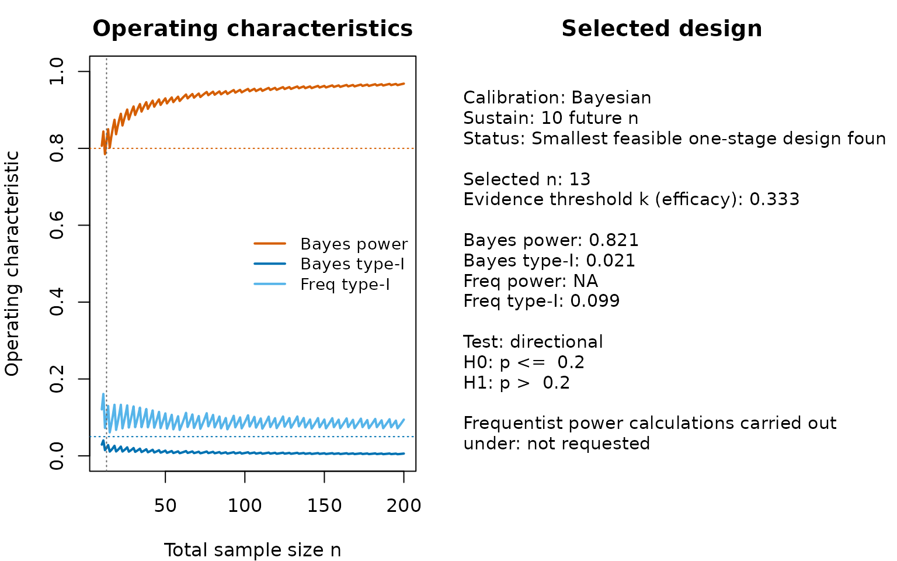
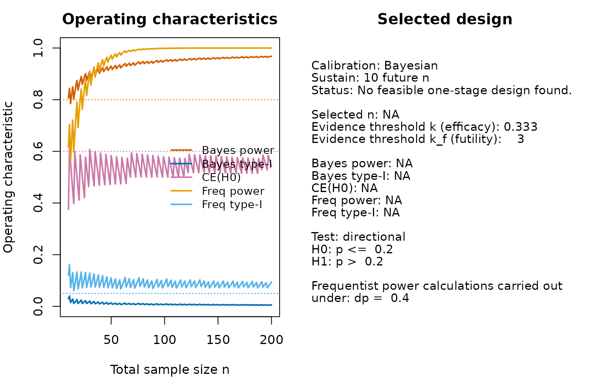
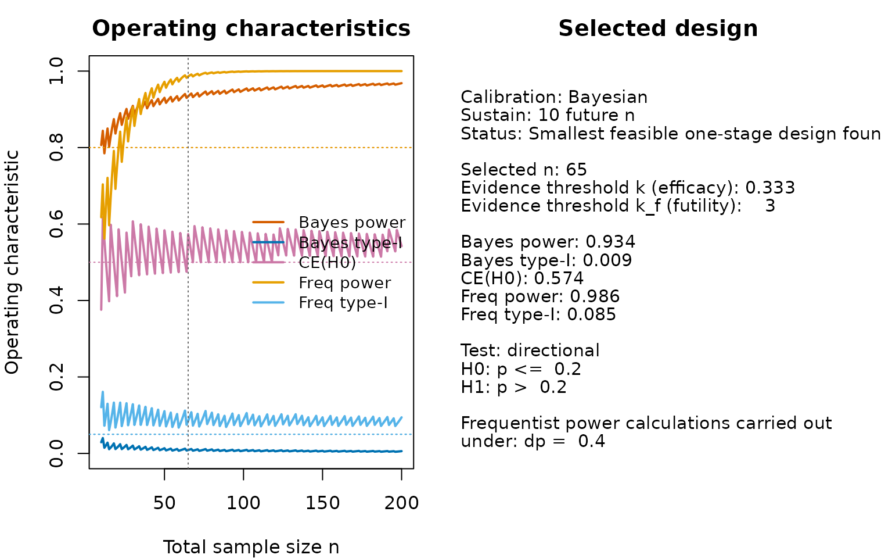
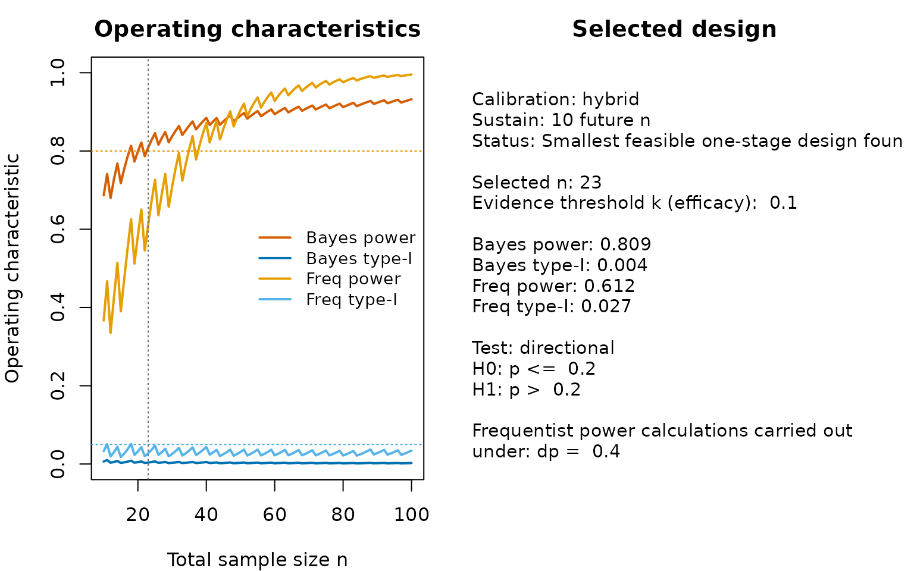
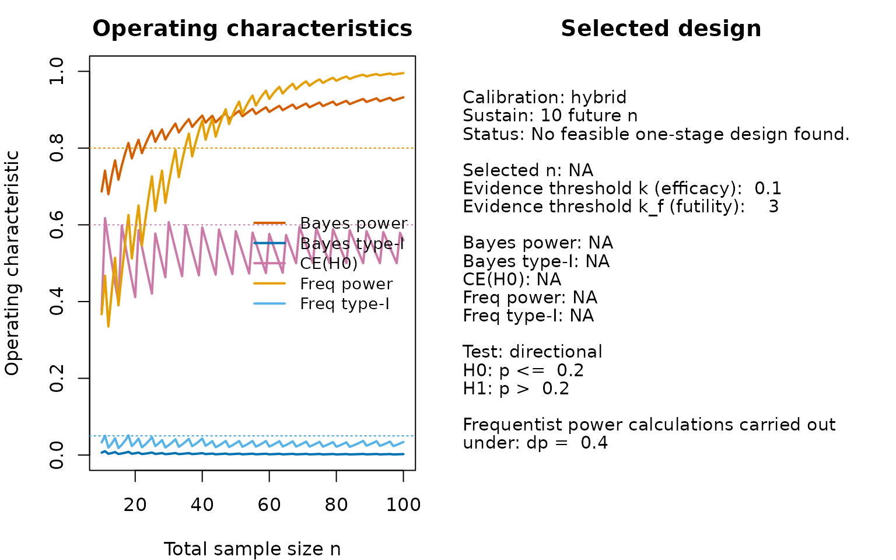
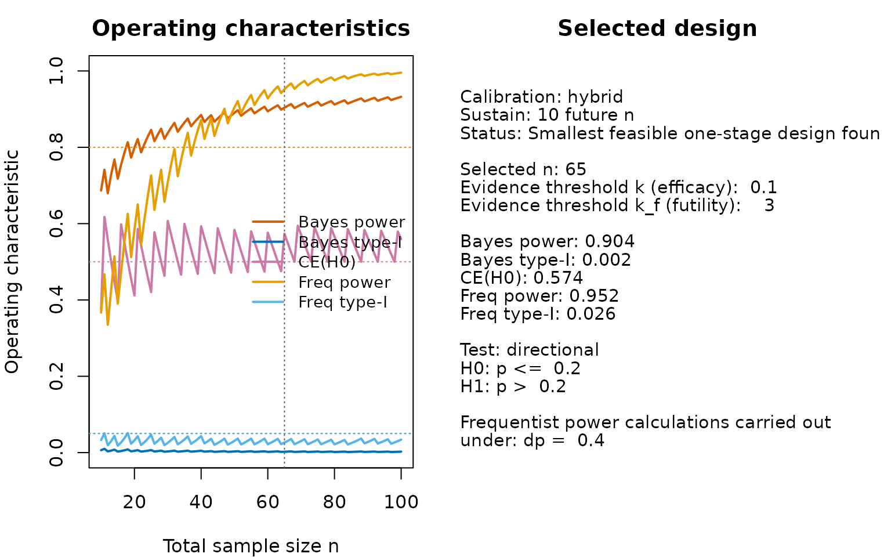

# Calibration of Bayesian one-stage designs for single-arm phase II trials with binary endpoints

## Introduction

This vignette illustrates how to calibrate a one-stage single-arm Bayes
factor design for a binary endpoint. The goal is to determine the
smallest total sample size that satisfies pre-specified Bayesian and/or
frequentist operating characteristics. The underlying statistical theory
is developed in (Kelter and Pawel 2025a), extended to the single-arm
two-stage optimal setting by (Kelter and Pawel 2025b), and further
developed to the two-arm single-stage setting by (Kelter 2026).

### How to design a Bayesian trial: Overview of the calibration algorithm

The workflow implemented in the package follows the fixed-sample Bayes
factor calibration framework proposed by (Kelter and Pawel 2025a):
Choose design and analysis priors, specify an evidence threshold on the
scale, compute operating characteristics as a function of the sample
size, and select the smallest feasible design.


Figure 1: Illustration of the calibration algorithm for an optimal
Bayesian single-arm phase II design with a binary endpoint

Figure 1 visualizes the calibration methodology in detail. Based on the
selected design and analysis priors, the prior predictive and the Bayes
factor, the critical value $`y_{crit}`$ is found via numerical root
finding (step 5. and 6. in Figure 1). Based on this critical value, in
the single-arm setting, the relationship
``` math
P(BF_{01}<1/k|H_i)=P(y>y_{crit}|H_i)
```
holds for both hypotheses $`H_i`$, $`i\in \{0,1\}`$. When $`i=0`$, this
implies one can easily calculate the Bayesian type-I-error rate as
``` math
P(BF_{01}<1/k|H_0)=P(y>y_{crit}|H_0)
```
while for $`i=1`$, the latter becomes the Bayesian power:
``` math
P(BF_{01}<1/k|H_1)=P(y>y_{crit}|H_1)
```
For specified target constraints $`\alpha \in (0,1)`$ and
$`\beta \in (0,1)`$, one can then calculate the smallest
$`n\in \mathbb{N}`$, for which
``` math
P(BF_{01}<1/k|H_0)=P(y>y_{crit}|H_0)\leq \alpha
```
and
``` math
P(BF_{01}<1/k|H_1)=P(y>y_{crit}|H_1)> 1-\beta
```
A further metric for calibration is the probability of compelling
evidence
``` math
P(BF_{01}>k_f|H_0)
```
which can likewise be calibrated to achieve at least a threshold
$`f\in (0,1)`$. Here, the event $`BF_{01}>k_f`$ can be interpreted as
the Bayes factor providing sufficient evidence $`k_f >0`$ in favour of
$`H_0`$, when $`H_0`$ is indeed true. If this probability is calibrated,
additionally to Bayesian type-I-error rate and power, one can be certain
when the trial is carried out, the event $`BF_{01}>k_f`$ is reached with
probability $`f`$ when $`H_0`$ indeed holds. Thus, when the null
hypothesis is true we will often find sufficient evidence to really
accept $`H_0`$ instead of remaining indecisive about whether $`H_0`$ or
$`H_1`$ is true.

------------------------------------------------------------------------

## Basic calibration

We consider a phase II setting with null response probability `p0 = 0.2`
and an efficacy threshold `k = 1/3` on the scale. We assume slightly
optimistic design priors via `da1 = 2.5` and `db1 = 2` under $`H_1`$, a
flat design prior under $`H_0`$, specified via `da0 = 1` and `db0 = 1`,
and flat analysis priors under both $`H_0`$ and $`H_1`$ (specified via
`a0 = 1`, `b0 = 1`, `a1 = 1` and `b1 = 1`). We test the hypotheses
``` math
H_0:p\leq 0.2 \text{ versus } H_1:p>0.2
```
against each other, so we use the argument `type = "direction"` and set
`p0 = 0.2`. We limit the sample size range to the minimum and maximum
values `n_min = 10` and `n_max = 200`, and require 80% Bayesian power,
specified via `target_power = 0.80`. Also, we require a Bayesian
type-I-error rate of 5% or less, specified via the argument
`target_type1 = 0.05`:

``` r

des_bayes <- design_singlearm_onestage_bf(
  n_min = 10,
  n_max = 200,
  k = 1/3,
  p0 = 0.2,
  a0 = 1, b0 = 1,
  a1 = 1, b1 = 1,
  da0 = 1, db0 = 1,
  da1 = 2.5, db1 = 2,
  type = "direction",
  calibration = "Bayesian",
  target_power = 0.8,
  target_type1 = 0.05
)
```

We can inspect the results as follows:

``` r

summary(des_bayes)
#> Summary: One-stage single-arm Bayes factor design
#> ------------------------------------------------
#> Calibration: Bayesian 
#> Sustain:  10  future n
#> Feasible   : TRUE 
#> Status     : Smallest feasible one-stage design found. 
#> 
#> Selected design
#>   n          : 13 
#>   k          : 0.333 
#> 
#> Operating characteristics
#>   Bayes power      : 0.821 
#>   Bayes type-I     : 0.021 
#>   CE(H0)           :   NA 
#>   Freq power       :   NA 
#>   Freq type-I      : 0.099
```

### Operating-characteristic curves

The search results can be visualized directly.

``` r

plot(des_bayes)
```



The left panel shows Bayesian power and type-I error, together with
optional frequentist overlays if a point alternative is supplied.

The right panel showsthe relevant operating characteristics of the trial
design isolated by the calibration algorithm. In this case, no
frequentist power calculations were required, so the frequentist power
is shown as NA (not available), and the lower part states that
frequentist power calculations under a point alternative were not
requested. We can quickly see that Bayesian power and type-I-error rate
are calibrated for $`n=13`$ already, so when choosing the evidence
threshold $`k=1/3`$, $`n=13`$ patients suffice to yield a calibrated
Bayesian design. Also, the output shows that this design is not
calibrated in terms of the frequentist type-I-error rate, which is
computed via a grid-search and in this case is $`9.9\%`$.

Note that the beta-binomial model induces the zig-zag shape of the
resulting curves for the operating characteristics such as power and
type-I-error rate. As a consequence, the calibration algorithm by
default requires the power not to drop below the specified target
threshold for the next ten sample sizes. This is also customisably via
the parameter `sustain_n`, which is also shown in the summary output
above in form of the text “Sustain: 10 future n”.

### Adding a constraint on the probability of compelling evidence

Next, we could add a constraint on the probability of compelling
evidence for $`H_0`$. An optional CE(H0) constraint can be imposed
through `target_ce_h0`. This is useful when one also wants the design to
have a sufficient probability of yielding compelling evidence in favour
of the null hypothesis
``` math
P(BF_01>k_f|H_0)>f
```
for some $`f\in (0,1)`$ and futility evidence threshold $`k_f>1`$. Now,
we use $`f=0.60`$ and $`k_f=3`$, specified via the arguments
`target_ce_h0 = 0.60` and `k_ce = 3`. Everything else remains the same,
but we also add the argument `dp = 0.4` to compute frequentist power
under the point alternative $`p=0.4`$:

``` r

des_bayes_ce <- design_singlearm_onestage_bf(
  n_min = 10,
  n_max = 200,
  k = 1/3,
  p0 = 0.2,
  a0 = 1, b0 = 1,
  a1 = 1, b1 = 1,
  da0 = 1, db0 = 1,
  da1 = 2.5, db1 = 2,
  type = "direction",
  calibration = "Bayesian",
  target_power = 0.8,
  target_type1 = 0.05,
  target_ce_h0 = 0.6,
  k_ce = 3,
  dp = 0.4
)
```

We inspect the results:

``` r

summary(des_bayes_ce)
#> Summary: One-stage single-arm Bayes factor design
#> ------------------------------------------------
#> Calibration: Bayesian 
#> Sustain:  10  future n
#> Feasible   : FALSE 
#> Status     : No feasible one-stage design found.
```

Now, no design could be found which fulfills our target constraints.
Before we see why, note that since we added the parameter `dp = 0.4` to
the above function call frequentist power is additionally calculated
under the point alternative $`p=0.4`$ in the single-arm case. We can
always add this to a design calibration, but the calibration mode
(specified via the argument `calibration`) decides which metric is the
benchmark for finding a feasible design (that is, a sufficiently large
sample size to meet our specified target constraints). Thus, frequentist
power is calculated here solely post-hoc for the calibrated design. The
calibrated design itself is calibrated according to the Bayesian target
power and type-I-error rate.

We can plot the resulting design:

``` r

plot(des_bayes_ce)
```



The plot shows that the factor which causes problems is the probability
of compelling evidence. In the sample size range up to $`n=200`$, it
stays below the required 60%, so no calibrated design can be found. If
we lower the requirement to, say, 50%, we get:

``` r

des_bayes_ce50 <- design_singlearm_onestage_bf(
  n_min = 10,
  n_max = 200,
  k = 1/3,
  p0 = 0.2,
  a0 = 1, b0 = 1,
  a1 = 1, b1 = 1,
  da0 = 1, db0 = 1,
  da1 = 2.5, db1 = 2,
  type = "direction",
  calibration = "Bayesian",
  target_power = 0.8,
  target_type1 = 0.05,
  target_ce_h0 = 0.5,
  k_ce = 3,
  dp = 0.4
)
```

We inspect the fit:

``` r

summary(des_bayes_ce50)
#> Summary: One-stage single-arm Bayes factor design
#> ------------------------------------------------
#> Calibration: Bayesian 
#> Sustain:  10  future n
#> Feasible   : TRUE 
#> Status     : Smallest feasible one-stage design found. 
#> 
#> Selected design
#>   n          : 65 
#>   k          : 0.333 
#>   k_ce       :    3 
#> 
#> Operating characteristics
#>   Bayes power      : 0.934 
#>   Bayes type-I     : 0.009 
#>   CE(H0)           : 0.574 
#>   Freq power       : 0.986 
#>   Freq type-I      : 0.085
```

We can plot the resulting design:

``` r

plot(des_bayes_ce50)
```


Now a calibrated design can be found, as expected.

## Full Bayes-frequentist calibration

The same interface also supports frequentist and fully joint calibration
modes. We change `calibration = "Bayesian"` to `calibration = "full"`,
and specify our target constraints for frequentist power and
type-I-error rate via the arguments `target_freq_power = 0.8` and
`target_freq_type1 = 0.05`.

``` r

des_full <- design_singlearm_onestage_bf(
  n_min = 10,
  n_max = 100,
  k = 1/3,
  p0 = 0.2,
  a0 = 1, b0 = 1,
  a1 = 1, b1 = 1,
  dp = 0.4,
  da0 = 1, db0 = 1,
  da1 = 2.5, db1 = 2,
  type = "direction",
  calibration = "full",
  target_power = 0.8,
  target_type1 = 0.05,
  target_freq_power = 0.8,
  target_freq_type1 = 0.05
)

summary(des_full)
#> Summary: One-stage single-arm Bayes factor design
#> ------------------------------------------------
#> Calibration: full 
#> Sustain:  10  future n
#> Feasible   : FALSE 
#> Status     : No feasible one-stage design found.
```

Now, given our priors and evidence thresholds no feasible one-stage
design was found in the specified sample size range. We can see the
reason for this by inspecting

``` r

head(des_full$search_results)
#>    n     power      type1 ce_h0 power_naive type1_naive erased_power
#> 1 10 0.8065237 0.02925913    NA   0.8065237  0.02925913            0
#> 2 11 0.8438969 0.04026381    NA   0.8438969  0.04026381            0
#> 3 12 0.7849683 0.01482212    NA   0.7849683  0.01482212            0
#> 4 13 0.8206335 0.02085515    NA   0.8206335  0.02085515            0
#> 5 14 0.8498421 0.02813328    NA   0.8498421  0.02813328            0
#> 6 15 0.8016997 0.01109326    NA   0.8016997  0.01109326            0
#>   erased_type1 freq_power freq_type1 freq_power_naive freq_type1_naive
#> 1            0  0.6177194 0.12087388        0.6177194       0.12087388
#> 2            0  0.7037157 0.16113920        0.7037157       0.16113920
#> 3            0  0.5618218 0.07255550        0.5618218       0.07255550
#> 4            0  0.6469582 0.09913061        0.6469582       0.09913061
#> 5            0  0.7207430 0.12983963        0.7207430       0.12983963
#> 6            0  0.5967844 0.06105143        0.5967844       0.06105143
#>   erased_freq_power erased_freq_type1 bayes_ok freq_ok hybrid_ok feasible_ce
#> 1                 0                 0     TRUE   FALSE     FALSE        TRUE
#> 2                 0                 0     TRUE   FALSE     FALSE        TRUE
#> 3                 0                 0    FALSE   FALSE     FALSE        TRUE
#> 4                 0                 0     TRUE   FALSE     FALSE        TRUE
#> 5                 0                 0     TRUE   FALSE     FALSE        TRUE
#> 6                 0                 0     TRUE   FALSE     FALSE        TRUE
#>   feasible_pointwise feasible calibration
#> 1              FALSE    FALSE        full
#> 2              FALSE    FALSE        full
#> 3              FALSE    FALSE        full
#> 4              FALSE    FALSE        full
#> 5              FALSE    FALSE        full
#> 6              FALSE    FALSE        full
```

We can quickly see that the frequentist type-I-error of all designs is
simply too large:

``` r

range(des_full$search_results$freq_type1)
#> [1] 0.06105143 0.16113920
```

Increasing the evidence threshold $`k`$ leads to the situation that it
becomes harder for the Bayes factor to accumulate evidence in favour of
$`H_1`$, thus also decreasing the type-I-error rates (both the Bayesian
and frequentist ones). Thus, we refit our design as follows by changing
`k = 1/3` to `k = 1/10`:

``` r

des_full_strong_ev <- design_singlearm_onestage_bf(
  n_min = 10,
  n_max = 100,
  k = 1/10,
  p0 = 0.2,
  a0 = 1, b0 = 1,
  a1 = 1, b1 = 1,
  dp = 0.4,
  da0 = 1, db0 = 1,
  da1 = 2.5, db1 = 2,
  type = "direction",
  calibration = "full",
  target_power = 0.8,
  target_type1 = 0.05,
  target_freq_power = 0.8,
  target_freq_type1 = 0.05
)
```

We investigate the fit:

``` r

summary(des_full_strong_ev)
#> Summary: One-stage single-arm Bayes factor design
#> ------------------------------------------------
#> Calibration: full 
#> Sustain:  10  future n
#> Feasible   : TRUE 
#> Status     : Smallest feasible one-stage design found. 
#> 
#> Selected design
#>   n          : 38 
#>   k          :  0.1 
#> 
#> Operating characteristics
#>   Bayes power      : 0.866 
#>   Bayes type-I     : 0.003 
#>   CE(H0)           :   NA 
#>   Freq power       : 0.814 
#>   Freq type-I      : 0.029
```

We plot the fit:

``` r

plot(des_full_strong_ev)
```


### Frequentist calibration

We turn to frequentist calibration of our design, and build upon the
fully calibrated design above. We change the calibration mode
accordingly to `frequentist`:

``` r

des_freq_strong_ev <- design_singlearm_onestage_bf(
  n_min = 10,
  n_max = 100,
  k = 1/10,
  p0 = 0.2,
  a0 = 1, b0 = 1,
  a1 = 1, b1 = 1,
  dp = 0.4,
  da0 = 1, db0 = 1,
  da1 = 2.5, db1 = 2,
  type = "direction",
  calibration = "frequentist",
  target_power = 0.8,
  target_type1 = 0.05,
  target_freq_power = 0.8,
  target_freq_type1 = 0.05
)

summary(des_freq_strong_ev)
#> Summary: One-stage single-arm Bayes factor design
#> ------------------------------------------------
#> Calibration: frequentist 
#> Sustain:  10  future n
#> Feasible   : TRUE 
#> Status     : Smallest feasible one-stage design found. 
#> 
#> Selected design
#>   n          : 38 
#>   k          :  0.1 
#> 
#> Operating characteristics
#>   Bayes power      : 0.866 
#>   Bayes type-I     : 0.003 
#>   CE(H0)           :   NA 
#>   Freq power       : 0.814 
#>   Freq type-I      : 0.029
```

Note in the above call, that the arguments `target_power = 0.8` and
`target_type1 = 0.05` could also be removed, as they play no role when
the calibration parameter is set to `frequentist`. `target_power` and
`target_type1` only specify the target constraints for calibration modes
which involve a Bayesian component like `calibration = "Bayesian"`,
`calibration = "hybrid"` or `calibration = "full"`.

Based on the summary output we see that the design which is calibrated
in terms of frequentist type-I-error and power is also fully calibrated.
This can also be seen from the last plot, because the Bayesian
type-I-error and power meet their respective target constraints for
already smaller sample size. The limiting factor in the fully calibrated
design thus is the frequentist power, which is only achieved for
$`n=38`$ (see the left panel in the last plot above).

### Hybrid calibration

An interesting alternative is hybrid calibration. We do not provide
detailed information here, but the core idea is to report Bayesian
power, which often is more realistic than frequentist power under a
specific point alternative, and frequentist type-I-error. Thus, from a
regulatory perspective, the frequentist type-I-error is often the
limiting or hard factor that must be met, as it constitutes a worst-case
scenario, but Bayesian power might be more realistic under a slightly
informative design prior. We set the calibration mode to `hybrid`:

``` r

des_hybrid_strong_ev <- design_singlearm_onestage_bf(
  n_min = 10,
  n_max = 100,
  k = 1/10,
  p0 = 0.2,
  a0 = 1, b0 = 1,
  a1 = 1, b1 = 1,
  dp = 0.4,
  da0 = 1, db0 = 1,
  da1 = 2.5, db1 = 2,
  type = "direction",
  calibration = "hybrid",
  target_power = 0.8,
  target_type1 = 0.05,
  target_freq_power = 0.8,
  target_freq_type1 = 0.05
)

summary(des_hybrid_strong_ev)
#> Summary: One-stage single-arm Bayes factor design
#> ------------------------------------------------
#> Calibration: hybrid 
#> Sustain:  10  future n
#> Feasible   : TRUE 
#> Status     : Smallest feasible one-stage design found. 
#> 
#> Selected design
#>   n          : 23 
#>   k          :  0.1 
#> 
#> Operating characteristics
#>   Bayes power      : 0.809 
#>   Bayes type-I     : 0.004 
#>   CE(H0)           :   NA 
#>   Freq power       : 0.612 
#>   Freq type-I      : 0.027
```

We see that now the feasible sample size to calibrate our design has
changed from $`n=38`$ to only $`n=23`$. Thus, the hybrid design required
fewer patients.

``` r

plot(des_hybrid_strong_ev)
```



The plot clearly shows that Bayesian power is the limiting factor here:
From $`n=23`$ patients on, it passes the required 80% threshold.
Bayesian and frequentist type-I-error are controlled for even smaller
sample sizes, and from our previous fully and frequentist calibration
results we know that frequentist power achieves the required 80% target
power only for $`n=38`$. Thus, shifting to a Bayesian notion of power
under the slightly informative design priors under $`H_1`$ yields a
reduction in sample size of $`15`$ patients, which is non-negligible.

We could also add a probability of compelling evidence constraint to
that design by adding the arguments `k_ce = 3` and
`target_ce_h0 = 0.60`, indicating we require at least 60% probability of
compelling evidence for $`H_0`$ based on a evidence threshold
$`k_f = 3`$:

``` r

des_hybrid_strong_ev_with_ce <- design_singlearm_onestage_bf(
  n_min = 10,
  n_max = 100,
  k = 1/10,
  k_ce = 3,
  p0 = 0.2,
  a0 = 1, b0 = 1,
  a1 = 1, b1 = 1,
  dp = 0.4,
  da0 = 1, db0 = 1,
  da1 = 2.5, db1 = 2,
  type = "direction",
  calibration = "hybrid",
  target_power = 0.8,
  target_type1 = 0.05,
  target_ce_h0 = 0.6,
  target_freq_power = 0.8,
  target_freq_type1 = 0.05
)

summary(des_hybrid_strong_ev_with_ce)
#> Summary: One-stage single-arm Bayes factor design
#> ------------------------------------------------
#> Calibration: hybrid 
#> Sustain:  10  future n
#> Feasible   : FALSE 
#> Status     : No feasible one-stage design found.
```

We see that no calibrated design could be found in the sample size range
specified. The following plot shows why:

``` r

plot(des_hybrid_strong_ev_with_ce)
```


The probability of compelling evidence simply does not reach the target
60% in the specified sample size range. Thus, we could either increase
that range by increasing `n_max` or adopting different design priors.
Alternatively, we could lower our requirement on the probability of
compelling evidence to, say, 50% as follows:

``` r

des_hybrid_strong_ev_with_ce50 <- design_singlearm_onestage_bf(
  n_min = 10,
  n_max = 100,
  k = 1/10,
  k_ce = 3,
  p0 = 0.2,
  a0 = 1, b0 = 1,
  a1 = 1, b1 = 1,
  dp = 0.4,
  da0 = 1, db0 = 1,
  da1 = 2.5, db1 = 2,
  type = "direction",
  calibration = "hybrid",
  target_power = 0.8,
  target_type1 = 0.05,
  target_ce_h0 = 0.5,
  target_freq_power = 0.8,
  target_freq_type1 = 0.05
)

summary(des_hybrid_strong_ev_with_ce50)
#> Summary: One-stage single-arm Bayes factor design
#> ------------------------------------------------
#> Calibration: hybrid 
#> Sustain:  10  future n
#> Feasible   : TRUE 
#> Status     : Smallest feasible one-stage design found. 
#> 
#> Selected design
#>   n          : 65 
#>   k          :  0.1 
#>   k_ce       :    3 
#> 
#> Operating characteristics
#>   Bayes power      : 0.904 
#>   Bayes type-I     : 0.002 
#>   CE(H0)           : 0.574 
#>   Freq power       : 0.952 
#>   Freq type-I      : 0.026
```

``` r

plot(des_hybrid_strong_ev_with_ce50)
```



### Relationship to the two-stage design

The one-stage design can be viewed as the fixed-sample baseline. In the
package, the function
[`design_singlearm_bf()`](https://rikokelter.github.io/bfbin2arm/reference/design_singlearm_bf.md)
extends this framework to a two-stage design with one interim analysis
and early stopping for futility.

### Summary

In this vignette we demonstrated how to calibrate one-stage single-arm
Bayes factor designs for phase II trials with binary endpoints using the
functions provided in the bfbin2arm package. The calibration framework
combines design and analysis priors, Bayes-factor evidence thresholds,
and target operating characteristics into a fully numerical search over
the total sample size. Within this framework, users can work in purely
Bayesian, purely frequentist, or hybrid modes, and optionally impose an
additional constraint on the probability of compelling evidence in
favour of the null hypothesis.

We illustrated how to obtain the smallest feasible design under Bayesian
calibration, and how to visualize the resulting operating-characteristic
curves via the dedicated plotting method. We also showed how to extend
the calibration by adding a probability of compelling evidence (CE)
constraint, and how the chosen futility threshold $`k_f`$ (the parameter
`k_ce`) and the target level for the probability of compelling evidence
interact with the achievable power and type-I error in a given sample
size range. Finally, we discussed the sustain parameter `sustain_n`,
which requires that the chosen design remains feasible for a number of
larger sample sizes and thus guards against local beta–binomial
oscillations in the operating characteristics.

### References

Kelter, Riko. 2026. *Power and Sample Size Calculations for Bayes
Factors in Two-Arm Clinical Phase II Trials with Binary Endpoints*.
<https://arxiv.org/abs/2603.01715>.

Kelter, Riko, and Samuel Pawel. 2025a. *Bayesian Power and Sample Size
Calculations for Bayes Factors in the Binomial Setting*.
<https://arxiv.org/abs/2502.02914>.

Kelter, Riko, and Samuel Pawel. 2025b. *The Bayesian Optimal Two-Stage
Design for Clinical Phase II Trials Based on Bayes Factors*.
<https://arxiv.org/abs/2511.23144>.
