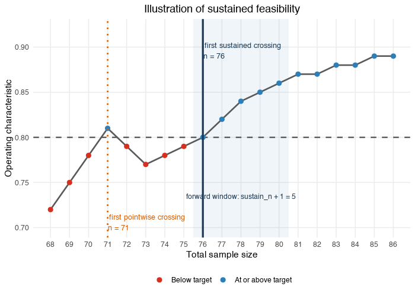

# Bayesian calibration of two-arm one-stage Bayes factor designs with binary endpoints

## Introduction and Overview

In this vignette, we illustrate how to calibrate a two-arm one stage
phase II design with binary endpoints from a Bayesian perspective.
Details on the methodology can be found in (Kelter 2026). Our main
assumption here is that the observed data in both groups are from two
random variables $`Y_1,Y_2`$ which both follow a binomial distribution
with parameters $`n_1`$ and $`n_2`$ and $`p_1`$ respectively $`p_2`$,
``` math
Y_1\sim \mathrm{Bin}(n_1,p_1), \hspace{1cm} Y_2\sim \mathrm{Bin}(n_2,p_2)
```

### Hypothesis tests

In its current form, the package implements four different hypothesis
tests for such trials:

``` math
H_0:p_1=p_2 \hspace{1cm} \text{ versus } \hspace{1cm} H_1:p_1\neq p_2
```

Alternatively, a well-known parameterization of this test introduces a
difference parameter $`\eta=p_2-p_1`$ and the grand mean
$`\zeta=\frac{1}{2}(p_1+p_2)`$. Using this parameterization, we have

``` math
p_1=\zeta-\frac{\eta}{2}, \hspace{1cm} p_2=\zeta+\frac{\eta}{2}
```

and the hypotheses can be rewritten as:

``` math
H_0:\eta = 0 \hspace{1cm} \text{ versus } \hspace{1cm} H_1:\eta \neq 0
```

Next to this two-sided test, three directional tests are available in
the package:

- 
  ``` math
  H_0:\eta \leq 0 \hspace{1cm} \text{ versus } \hspace{1cm} H_1:\eta > 0
  ```
- 
  ``` math
  H_0:\eta = 0 \hspace{1cm} \text{ versus } \hspace{1cm} H_1:\eta > 0
  ```
- 
  ``` math
  H_0:\eta = 0 \hspace{1cm} \text{ versus } \hspace{1cm} H_1:\eta < 0
  ```

For each of the four tests, a separate Bayes factor exists and can be
used. For the two-sided test, we denote the Bayes factor as $`BF_{01}`$,
and for the three directional tests above we denote the Bayes factors as
$`BF_{+-}`$, $`BF_{+0}`$ and $`BF_{-0}`$. Thus, the test of
$`H_0:\eta \leq 0`$ versus $`H_1:\eta >0`$ can also be written as
$`H_-:p_2 \leq p_1`$ versus $`H_+:p_2 > p_1`$.

### Design and analysis priors

The $`\mathrm{Beta}(a_0,b_0)`$ distribution is a conjugate prior for the
binomial likelihood, and when chosen as the prior, the posterior
$`P_{p \mid Y}`$ is also Beta-distributed. A natural choice for the
priors is the beta distribution. We assume independent Beta design
priors $`H_0`$ as follows:

``` math
p_1 =p_2 = p\mid H_0 \sim \mathrm{Beta}(a_0^d,b_0^d)
```

Thus, under $`H_0:\eta = 0`$, both probabilities are identical,
$`p_1=p_2`$, and take some value $`p\in [0,1]`$, which has a beta design
prior. Likewise, we pick independent Beta design priors under
$`H_1:\eta \neq 0`$:

``` math
p_1 \mid H_1 \sim \mathrm{Beta}(a_1^d,b_1^d), \hspace{1cm} p_2 \mid H_1 \sim \mathrm{Beta}(a_2^d,b_2^d)
```

For the analysis priors $`P_{p_1}^a`$, $`P_{p_2}^a`$ under $`H_1`$, we
also choose independent Beta priors, with possibly different values
$`a_i^a`$ and $`b_i^a`$ for $`i=1,2`$, where the superscript signals
that the hyperparameters belong to our analysis instead of design prior:

``` math
p_1 \mid H_1 \sim \mathrm{Beta}(a_1^a,b_1^a), \hspace{1cm} p_2 \mid H_1 \sim \mathrm{Beta}(a_1^a,b_1^a)
```

Lastly, for the analysis prior $`P_{p}^a`$ under $`H_0:\eta=0`$, we
choose a Dirac prior with all probability on $`\eta=p_2-p_1=0`$
conditionally on a uniform prior on $`\zeta`$, that is

``` math
p_1=p_2=p|H_0 \sim 1_{\{\eta=0\}}| \zeta \sim U(0,1)
```

for the analysis with the Bayes factor.

## Using the package

First, we load the package after installation:

``` r

library(bfbin2arm)
```

Next, we illustrate the main calibration function for a two-arm
one-stage trial by re-analyzing a phase II trial in the context of
oncology. While no Bayesian approach was used in the original
statistical analysis of the trial, the step-by-step walktrough below
showcases how a structured approach to designing and calibrating a
Bayesian two-arm one-stage phase II trial with the `bfbin2arm` package
looks like. Importantly, the trial must have two trial arms (treatment
and control) and binary endpoints. We assume further that one of the
four tests detailed above is carried out using Bayes factors as the test
criterion.

## ICT-107 Phase II Trial Overview

The ICT-107 trial (Wen et al. 2019) was a randomized phase II study in
newly diagnosed glioblastoma patients (n=124, 2:1 randomization). The
primary binary endpoint is progression status at 6 months (PFS6), and
the secondary binary endpoint immunologic status. Here, we focus on the
secondary endpoint for illustration purposes.

**Reported results** (ITT population):

- ICT-107 (n=82): 49/82 responders= **59.7% response rate**
- Control (n=42): 12/42 responders = **35.7% response rate**

### 1. Bayes Factor Analysis

We start by calculating the Bayes factor(s) for the ICT-107 trial data:

``` r

## -------------------------------------------------------------
## 2. ICT-107 trial (immunologic response)
##    Placebo (control): 12 responders, 31 non-responders
##    ICT-107 (treatment): 49 responders, 32 non-responders  
## -------------------------------------------------------------

y1_ict <- 12      # control successes
n1_ict <- 12 + 31
y2_ict <- 49      # treatment successes
n2_ict <- 49 + 32

cat("\n=== ICT-107 Trial (n1 =", n1_ict, ", n2 =", n2_ict, ") ===\n")
#> 
#> === ICT-107 Trial (n1 = 43 , n2 = 81 ) ===

# BF01
BF01_ict = twoarmbinbf01(y1_ict, y2_ict, n1_ict, n2_ict, 
                         a_0_a = 1, b_0_a = 1, 
                         a_1_a = 1, b_1_a = 1, 
                         a_2_a = 1, b_2_a = 1)

# BF+1
BFp1_ict = BFplus1(y1_ict, y2_ict, n1_ict, n2_ict, 
                   a_1_a = 1, b_1_a = 1, 
                   a_2_a = 1, b_2_a = 1)

# BF-1
BFm1_ict = BFminus1(y1_ict, y2_ict, n1_ict, n2_ict, 
                    a_1_a = 1, b_1_a = 1, 
                    a_2_a = 1, b_2_a = 1)

# BF+0
cat("=== ICT-107 Trial === Bayes factor BF+0 results in ", BFplus0(BFp1_ict, BF01_ict))
#> === ICT-107 Trial === Bayes factor BF+0 results in  186.6192

# BF+-
cat("=== ICT-107 Trial === Bayes factor BF+- results in ", BFplusMinus(BFp1_ict, BFm1_ict))
#> === ICT-107 Trial === Bayes factor BF+- results in  3702.659
```

The most relevant Bayes factor here is $`BF_{+-}`$, because it is
directional and leaves open the possibility of the placebo group having
a larger response rate than the treatment group. Note that the
hyperparameters of the beta analysis priors are specified in
`twoarmbinbf01` via `a_0_a = 1, b_0_a = 1` et cetera.

### 2. Operating characteristics for actual sample sizes

Now, a key question is which operating characteristics can be expected
based on the actual sample sizes used in the trial. The
`powertwoarmbinbf01` function can provide the answer:

``` r

ict_results <- powertwoarmbinbf01(
  n1 = n1_ict, n2 = n2_ict,
  k = 1/3, k_f = 3,
  test = "BF+-",  # H+: p2 > p1 vs H-: p2 <= p1
  a_0_d = 1, b_0_d = 1, a_0_a = 1, b_0_a = 1,
  a_1_d = 1, b_1_d = 1, a_2_d = 1, b_2_d = 1,
  a_1_a = 1, b_1_a = 1, a_2_a = 1, b_2_a = 1,
  output = "numeric",
  compute_freq_t1e = TRUE,
)
print(ict_results)
```

    Power             Type1_Error 
                  0.8788106               0.0214111 
                      CE_H0 Frequentist_Type1_Error 
                  0.8788106               0.2871811 
    attr(,"hypothesis")
    [1] "H[+]:~p[2] > p[1] ~~ vs ~~ H[-]:~p[2] <= p[1]"
    attr(,"compute_freq_t1e")
    [1] TRUE

We see that based on the actual sample sizes and a moderate evidence
threshold $`k=1/3`$, the Bayesian power is sufficiently large with
$`87.8\%`$. Still, the frequentist type-I-error rate is way too high
with $`28.7\%`$, so we increase the evidence threshold to $`k=1/10`$
(strong evidence) and use the `ntwoarmbinbf01` function to calibrate the
design based on our requirements next.

### 3. Power and sample size planning

The core working function to design a Bayesian two-arm one-stage trial
with the package is the
[`design_twoarm_onestage_bf()`](https://rikokelter.github.io/bfbin2arm/reference/design_twoarm_onestage_bf.md)
function. It searches over a grid of total sample sizes and returns a
**design object** that contains

- the selected sample sizes in each arm (`n1`, `n2`) and their sum
  (`n_total`)
- Bayesian and frequentist operating characteristics at the chosen
  design
- the full search grid with pointwise and sustained feasibility
  indicators
- the calibration targets and input priors used in the search.

Internally, the function uses the same numerical engine as the legacy
[`ntwoarmbinbf01()`](https://rikokelter.github.io/bfbin2arm/reference/ntwoarmbinbf01.md)
function, but exposes a richer, object-based interface and S3 methods
for printing, summarizing, and plotting. The old function
[`ntwoarmbinbf01()`](https://rikokelter.github.io/bfbin2arm/reference/ntwoarmbinbf01.md)
remains available as a compatibility wrapper that now returns the same
design object.

First, we perform a sample size search for an ICT-107-type trial
(balanced arms) under flat design priors and substantial evidence
thresholds, using the directional Bayes factor $`BF_{+-}`$. Note that
evidence in favour of $`H_-`$ happens when $`BF_{+-}<k`$ for $`k<1`$.
Internally, the function therefore uses the Bayes factor $`BF_{-+}`$
when calibrating the design, but for our purposes this does not matter.
Selecting $`BF_{+-}`$ will use the directional test we intend to use
when calibrating our design:

``` r

des <- design_twoarm_onestage_bf(
  n_min = 10,
  n_max = 75,
  k = 1/10,
  k_f = 10,
  test = "BF+-",
  calibration = "Bayesian",
  target_power = 0.80,
  target_type1 = 0.05,
  target_ce_h0 = 0.80,
  # design and analysis priors: flat Beta(1,1) everywhere
  a_0_d = 1, b_0_d = 1,
  a_0_a = 1, b_0_a = 1,
  a_1_d = 1, b_1_d = 1,
  a_2_d = 1, b_2_d = 1,
  a_1_a = 1, b_1_a = 1,
  a_2_a = 1, b_2_a = 1,
  # assumed true proportions for frequentist power (optional here)
  p1_power = 0.3, p2_power = 0.6,
  # equal randomisation
  alloc1 = 0.5,
  alloc2 = 0.5,
  # require sustained feasibility over the next 10 larger n
  sustain_n = 10L,
  progress = FALSE
)
```

We can summarize or print the results with the
[`print()`](https://rdrr.io/r/base/print.html) and
[`summary()`](https://rdrr.io/r/base/summary.html) methods:

``` r

summary(des)
```

    Summary: One-stage two-arm Bayes factor design
    ---------------------------------------------
    Mode:        optimal
    Status:      No feasible one-stage two-arm design found.
    Calibration: Bayesian
    Feasible:    no

    Search overview
      n evaluated          = 66
      pointwise feasible   = 0
      sustained feasible   = 0
      first pointwise n    = NA
      first sustained n    = NA

Also, we can plot the results:

``` r

plot(des, type = "old")
```


Figure 1: Visualization of the calibrated Bayesian two-arm one-stage
phase II design with a binary endpoint

The summary and plot show that for the range of sample sizes provided to
the function, under flat design priors, no sample size satisfies the
requirement of Bayesian power $`\geq 0.80`$. Thus, if we want to obtain
a calibrated design we can either increase `n_max` or choose more
informative design priors. Alternatively, we could shift to a less
stringent threshold for evidence $`k`$, e.g. $`k=1/3`$ instead of
$`k=1/10`$, so it becomes easier for the Bayes factor to accumulate
evidence in favour of $`H_+`$.

The arguments correspond closely to the conceptual requirements:

- `k` is the evidence threshold for rejecting the null (inverted Bayes
  factor). Here, `k = 1/10` corresponds to moderately strong evidence
  against the null.
- `k_f` is the threshold for compelling evidence in favour of the null
  (here, $`k_f = 10`$ in favour of $`H_-`$).
- `calibration` selects which constraints to enforce: `"Bayesian"` uses
  Bayesian power, type-I error, and CE(H0); `"frequentist"`, `"hybrid"`,
  and `"full"` add frequentist constraints. Frequentist calibration
  implies that frequentist power and type-I-error rare calibrated,
  hybrid calibration implies that Bayesian power and frequentist
  type-I-error are calibrated, and full calibration implies that both
  frequentist and Bayesian power and type-I-error are calibrated.
- `target_power`, `target_type1`, and `target_ce_h0` are the Bayesian
  calibration targets.
- `p1_power` and `p2_power` specify the assumed proportions for
  frequentist power (when used), here $`p_1 = 0.3`$ and $`p_2 = 0.6`$.
- `alloc1` and `alloc2` specify randomisation probabilities for control
  and treatment; here we use equal allocation.

The resulting object `des` shows in its print and summary output whether
a feasible design was found and, if so, which sample sizes and operating
characteristics are selected. The old three-panel plot is now available
via

``` r

plot(des, type = "old")
```

which reproduces the original `ntwoarmbinbf01(output = "plot")`
visualisation. For this default plot, it is also possible to just call

``` r

plot(des)
```

In addition, two more compact plot types are provided:

``` r

plot(des, type = "oc")          # operating characteristics across n_total
plot(des, type = "feasibility") # pointwise vs sustained feasibility across n_total
```

The old function
[`ntwoarmbinbf01()`](https://rikokelter.github.io/bfbin2arm/reference/ntwoarmbinbf01.md)
is still available for backward compatibility. It now returns the same
design object as
[`design_twoarm_onestage_bf()`](https://rikokelter.github.io/bfbin2arm/reference/design_twoarm_onestage_bf.md)
and internally calls that function. A simple compatibility call is:

``` r

des_legacy <- ntwoarmbinbf01(
  k = 1/10, k_f = 10,
  power = 0.8, alpha = 0.05, pce_H0 = 0.8,
  test = "BF+-",
  nrange = c(10, 75), n_step = 1,
  progress = FALSE,
  compute_freq_t1e = TRUE,
  p1_power = 0.3, p2_power = 0.6,
  alloc1 = 0.5, alloc2 = 0.5,
  output = "numeric"
)
```

We plot the results:

``` r

plot(des_legacy, type = "old")
```


Figure 2: Visualization of the calibrated Bayesian two-arm one-stage
phase II design with a binary endpoint

This code path is mainly intended for users with existing scripts; new
analyses should use
[`design_twoarm_onestage_bf()`](https://rikokelter.github.io/bfbin2arm/reference/design_twoarm_onestage_bf.md)
directly.

### 4. Informative design priors

The example above used flat design priors, which might be unrealistic in
a variety of settings. While it would be possible to increase the
maximum sample size `n_max` in the search range to eventually find a
calibrated trial design, a more helpful approach is to use informative
design priors. Such design priors should reflect the expectations
investigators have about the effect of a novel drug or treatment. In
particular, it is strongly recommended to use at least slightly
informative design priors, because if no expectation about the effect of
the drug or treatment (e.g. due to prior phase I trials) is made, this
might be unrealistic from a practical point of view. Not only is the
question why and whether a phase II trial should be conducted in such a
case. Using flat design priors is highly unrealistic in several aspects:

- Suppose flat design priors are assumed under $`H_1`$ for the treatment
  and the control group. We focus on the treatment group just for a
  moment. All parameter values inside the unit interval $`[0,1]`$ are
  being assigned the same prior probability density value. As a
  consequence, all parameter values (or small regions around them, as
  from a measure theoretic-point of view single parameter values have
  prior probability of exactly zero) are equally likely a priori before
  any data are observed. This implies, that e.g. success probabilities
  like $`p_2=0.99`$ are equally likely a priori as $`p_2=0.4`$, which in
  almost all phase II trials would be a very questionable assumption for
  the treatment group in the two-arm setting.
- Using flat design priors under both $`H_0`$ and $`H_1`$ implies that
  when the null hypothesis is true and $`p_1\leq p_2`$ holds, all
  parameter values $`p_1`$ (the success probability in the control
  group) less than or equal to $`p_2`$ are equally likely a priori.
  However, in most phase II trials investigators would argue that
  extremely large differences
  $`p_1 \leq p_2 \Leftrightarrow p_2-p_1 \geq 0`$ in the success
  probabilities between both trial arms are less likely a priori than
  smaller ones. As a consequence, a more informative design prior under
  $`H_0`$ which places more mass at the boundary region $`p_1=p_2`$
  could be more realistic.

Next, we therefore perform a sample size search for the ICT-107-type
trial (balanced arms) under informative design priors with very strong
evidence thresholds `k = 1/30` and `k_f = 30`. Notice the additionally
specified parameters `a_1_d = 1, b_1_d = 2` and `a_2_d = 2, b_2_d = 1`
which are the design prior hyperparameters of the Beta design priors for
$`p_1`$ and $`p_2`$ under $`H_+`$. These express slight optimism about
the treatment effect in the sense that they can be thought of as having
already observed 1 success and 2 failures in the control group and 2
successes and 1 failure in the treatment group. Also, we lower our
requirements for the probability of compelling evidence in favour of
$`H_0`$ to, say, $`60%`$. We additionally require the reporting of the
frequentist type-I-error for the calibrated design by specifying
`report_freq_type1 = TRUE` in the function call:

``` r

des_informative <- design_twoarm_onestage_bf(
  n_min = 10,
  n_max = 100,
  k = 1/30,
  k_f = 30,
  test = "BF+-",
  calibration = "Bayesian",
  target_power = 0.80,
  target_type1 = 0.05,
  target_ce_h0 = 0.60,
  # design and analysis priors: flat Beta(1,1) everywhere
  a_0_d = 1, b_0_d = 1,
  a_0_a = 1, b_0_a = 1,
  a_1_d = 1, b_1_d = 2,
  a_2_d = 2, b_2_d = 1,
  a_1_a = 1, b_1_a = 1,
  a_2_a = 1, b_2_a = 1,
  # assumed true proportions for frequentist power (optional here)
  p1_power = 0.3, p2_power = 0.6,
  # report frequentist type-I-error? (optional here)
  report_freq_type1 = TRUE,
  # equal randomisation
  alloc1 = 0.5,
  alloc2 = 0.5,
  # require sustained feasibility over the next 10 larger n
  sustain_n = 10L,
  progress = FALSE
)
```

We summarize the results:

``` r

summary(des_informative)
```

    Summary: One-stage two-arm Bayes factor design
    ---------------------------------------------
    Mode:        optimal
    Status:      Smallest feasible one-stage two-arm design found.
    Calibration: Bayesian
    Feasible:    yes

    Search overview
      n evaluated          = 91
      pointwise feasible   = 28
      sustained feasible   = 27
      first pointwise n    = 72
      first sustained n    = 74

    Selected design
      n_total = 74, n1 = 37, n2 = 37

The output shows that the first feasible sample size for which the
target constraints hold was $`n=72`$. However, as we require the next
ten sample sizes for the operating characteristics not to violate their
respective constraint (that is, power should not decrease below its
specified target threshold, type-I-error not increase above its
specified target threshold and probability of compelling evidence not
drop below its specified target threshold for the next ten
observations), the first sample size for which this holds is $`n=74`$.
This leads to the selected design with $`n_1=37`$ and $`n_2=37`$
patients in the control and treatment group.

**Details on the implementation:** For each operating characteristic we
also compute a metric‑specific sustained attainment sample size that
respects the user‑supplied sustain_n constraint. Concretely, we form
separate logical indicators over the search grid for Bayesian power (≥
target_power), Bayesian type‑I error (≤target_type1), CE(H0)
(≥target_ce_h0), and frequentist power (≥target_freq_power). Given such
an indicator vector for a particular metric, we then search for the
first total sample size $`n`$ such that the metric’s target is satisfied
not only at $`n`$, but also for all subsequent total sample sizes in the
forward window of length `sustain_n + 1`, truncated at the upper end of
the search range. The vertical reference lines in the diagnostic plots
are drawn at these metric‑specific sustained crossing points. This
ensures that the plotted “required” sample sizes reflect the same
sustained feasibility logic as the calibration itself, so that, for
example, Bayesian power may first reach its nominal threshold at
$`n=72`$, but the corresponding vertical line will only be shown at
$`n=74`$ if the power constraint fails to remain satisfied over the next
`sustain_n` total sample sizes.


The above figure illustrates the sustained feasibility logic which
currently is implemented in the calibration algorithm. For $`n=71`$ in
this toy example, and `sustain_n + 1 = 5`, even though the threshold of
80% is achieved, the sample size eventually selected is $`n=76`$. For
$`n=76`$, the next $`5`$ sample sizes up to $`n=80`$ satisfy the
operating characteristic threshold of at leat 80%, which is not the case
for $`n=71`$.

Now, back to our calibrated design. We plot the results:

``` r

plot(des_informative)
```


Figure 3: Visualization of the calibrated Bayesian two-arm one-stage
phase II design with a binary endpoint, using informative design priors
under the alternative hypothesis

We see that now the Bayesian power is calibrated for $`n=74`$ patients
per trial arm and does not drop below the required 80% for at least the
next ten sample sizes (it does not drop below the 80% for any sample
size up to $`n=100`$, as can be verified by the plot). Frequentist power
is calibrated for $`n=81`$ patients trial arm. The Bayesian type-I-error
is already calibrated for $`n=10`$, requiring only $`5`$ patients per
trial arm. Importantly, the frequentist type-I-error is also calibrated
and is $`0.034<0.05`$, as can be inspected by

``` r

print(des_informative)
```

    One-stage two-arm Bayes factor design
    ------------------------------------
    Mode: optimal
    Status: Smallest feasible one-stage two-arm design found.
    Calibration: Bayesian
    Optional freq. Type-I reporting: on
    Design: n_total = 74, n1 = 37, n2 = 37

    Operating characteristics
     Power = 0.8004
     Type-I error = 0.0021
     CE(H0) = 0.6697
     Freq. Type-I = 0.0340
     Freq. Power = 0.7778

The probability of compelling evidence for $`H_-`$ is shown in the
bottom plot. It is calibrated for $`n=49`$, so the trial design is fully
calibrated from a Bayesian perspective if $`n=74`$ patients are
recruited in total ($`n_1=37`$ in the control and $`n_2=37`$ in the
treatment group). Then, the probability of compelling evidence is also
calibrated.

Based on the above plot we can see that the probability of compelling
evidence does not reach 80% in the sample size range up to $`n=100`$
patients. However, suppose we want a trial design which achieves such a
high probability of compelling evidence for $`H_0`$, but we cannot
afford to recruit more than $`n=100`$ patients in total. A possible
solution is to modify the design priors under $`H_-`$ to express more
information about our expectation of the effect the novel drug or
treatment has.

Thus, we perform a sample size search for new ICT-107-type trial
(balanced arms) under informative design priors with very strong
evidence thresholds, and change the design prior under H- to achieve the
target probability of compelling evidence PCE(H0) for even smaller
sample sizes. Note that now, additionally, the design prior
hyperparameters of the Beta design priors for $`p_1`$ and $`p_2`$ under
$`H_-`$ are specified in `a_1_d_Hminus = 2, b_1_d_Hminus = 1` and
`a_2_d_Hminus = 1, b_2_d_Hminus = 2`. Note that we increased
`target_ce_h0 = 60` to `target_ce_h0 = 0.80`:

``` r

des_informative_higher_ce <- design_twoarm_onestage_bf(
  n_min = 10,
  n_max = 100,
  k = 1/30,
  k_f = 30,
  test = "BF+-",
  calibration = "Bayesian",
  target_power = 0.80,
  target_type1 = 0.05,
  target_ce_h0 = 0.80,
  # design and analysis priors: flat Beta(1,1) everywhere
  a_0_d = 1, b_0_d = 1,
  a_0_a = 1, b_0_a = 1,
  a_1_d = 1, b_1_d = 2,
  a_2_d = 2, b_2_d = 1,
  a_1_a = 1, b_1_a = 1,
  a_2_a = 1, b_2_a = 1,
  # design prior parameters under H_-
  a_1_d_Hminus = 2, b_1_d_Hminus = 1,
  a_2_d_Hminus = 1, b_2_d_Hminus = 2,
  # assumed true proportions for frequentist power (optional here)
  p1_power = 0.3, p2_power = 0.6,
  # report frequentist type-I-error? (optional here)
  report_freq_type1 = TRUE,
  # equal randomisation
  alloc1 = 0.5,
  alloc2 = 0.5,
  # require sustained feasibility over the next 10 larger n
  sustain_n = 10L,
  progress = FALSE
)
```

We check the results:

``` r

summary(des_informative_higher_ce)
```

    Summary: One-stage two-arm Bayes factor design
    ---------------------------------------------
    Mode:        optimal
    Status:      Smallest feasible one-stage two-arm design found.
    Calibration: Bayesian
    Feasible:    yes

    Search overview
      n evaluated          = 91
      pointwise feasible   = 28
      sustained feasible   = 27
      first pointwise n    = 72
      first sustained n    = 74

    Selected design
      n_total = 74, n1 = 37, n2 = 37

The design has not changed. Why is that? We plot the results:

``` r

plot(des_informative_higher_ce)
```


Figure 4: Visualization of the calibrated Bayesian two-arm one-stage
phase II design with a binary endpoint, using informative design priors
under both hypotheses and a stronger requirement on the probability of
compelling evidence (80% instead of only 60%)

The plot shows that the calibration sample sizes for Bayesian power,
type-I-error and frequentist power remain identical to the previous
function call. The only thing which changed are the design priors under
$`H_-`$ in the top panel, and the bottom panel for the probability of
compelling evidence. First, the design priors under $`H_-:p_2 \leq p_1`$
have a form which puts more prior probability mass to small success
probabilities in the treatment group with parameter $`p_2`$, and more
prior probability mass to large success probabilities in the control
group with parameter $`p_1`$. This is precisely expressed by
$`H_-:p_2 \leq p_1`$, and thus under $`H_0`$, we can expect that
evidence for $`H_0`$ accumulates faster. This is reflected in the bottom
panel for the probability of compelling evidence, as now $`n=74`$
patients suffice to reach 80% probability of compelling evidence for
$`H_0`$.

The result is a fully calibrated Bayesian design which meets Bayesian
power demands of 80%, Bayesian type-I-error rate requirements of less
than 5%, and our requirement of 80% on the probability of compelling
evidence for $`H_0`$ (that is, $`H_-`$ in this case).

What about the frequentist operating characteristics of this design? We
see that $`n=81`$ patients in total suffice to calibrate the design
additionally in terms of frequentist power.

``` r

print(des_informative_higher_ce)
```

    One-stage two-arm Bayes factor design
    ------------------------------------
    Mode: optimal
    Status: Smallest feasible one-stage two-arm design found.
    Calibration: Bayesian
    Optional freq. Type-I reporting: on
    Design: n_total = 74, n1 = 37, n2 = 37

    Operating characteristics
     Power = 0.8004
     Type-I error = 0.0011
     CE(H0) = 0.8004
     Freq. Type-I = 0.0340
     Freq. Power = 0.7778

The type-I-error is still calibrated, so choosing $`n=81`$ patients in
total even yields a fully calibrated design both from a Bayesian and
frequentist perspective.

The calibration function `design_twoarm_onestage_bf` reveals several
aspects. If a balanced design with equal randomization probabilities is
desired, then:

- **n=81 patients in total** (41 patients per trial arm) are needed for
  80% frequentist power at ICT-107 effect size when evidence threshold
  $`k=1/30`$ is used. Here, the assumption is that the true proportions
  are $`p_1=0.3`$ and $`p_2=0.6`$, which can easily be modified if a
  more optimistic or pessimistic assumption is warranted
- **n=74 patients in total** (37 patients per trial arm) are needed for
  80% Bayesian power at ICT-107 effect size when evidence threshold
  $`k=1/30`$ is used, and slightly informative Beta design priors are
  assumed under $`H_+`$.
- **Type-I error control** both from a frequentist perspective (≤5%
  across designs when $`k=1/30`$ is used) and from a Bayesian
  perspective, where for the latter only **$`n=10`$ patients in total**
  (5 patients per trial arm) are required.
- **High P(CE\|H-)** guarantees that under $`H_-`$ there is 80%
  probability to find a Bayes factor of at least $`k_f=30`$ in favour of
  $`H_-`$. **n=74 patients in total** (37 patients per trial arm) are
  required to assert this probability of compelling evidence for
  $`H_-`$.

### 5. Unequal randomization probabilities

In the original ICT-107 trial, $`2/3`$ of the patients was randomized
into the treatment group, while $`1/3`$ of the patients was randomized
into the control group. We can use the parameters `alloc1` and `alloc2`
to specify randomization probabilities for the control and treatment
arms and carry out the Bayesian sample size calculations based on these
randomization probabilities. As an example, we rerun the last
calibration, but use the randomization probabilities of the ICT-107
trial:

``` r

des_informative_higher_ce_uneq_alloc <- design_twoarm_onestage_bf(
  n_min = 10,
  n_max = 100,
  k = 1/30,
  k_f = 30,
  test = "BF+-",
  calibration = "Bayesian",
  target_power = 0.80,
  target_type1 = 0.05,
  target_ce_h0 = 0.80,
  # design and analysis priors: flat Beta(1,1) everywhere
  a_0_d = 1, b_0_d = 1,
  a_0_a = 1, b_0_a = 1,
  a_1_d = 1, b_1_d = 2,
  a_2_d = 2, b_2_d = 1,
  a_1_a = 1, b_1_a = 1,
  a_2_a = 1, b_2_a = 1,
  # design prior parameters under H_-
  a_1_d_Hminus = 2, b_1_d_Hminus = 1,
  a_2_d_Hminus = 1, b_2_d_Hminus = 2,
  # assumed true proportions for frequentist power (optional here)
  p1_power = 0.3, p2_power = 0.6,
  # report frequentist type-I-error? (optional here)
  report_freq_type1 = TRUE,
  # equal randomisation
  alloc1 = 1/3,
  alloc2 = 2/3,
  # require sustained feasibility over the next 10 larger n
  sustain_n = 10L,
  progress = FALSE
)
```

We summarize the results:

``` r

summary(des_informative_higher_ce_uneq_alloc)
```

    Summary: One-stage two-arm Bayes factor design
    ---------------------------------------------
    Mode:        optimal
    Status:      Smallest feasible one-stage two-arm design found.
    Calibration: Bayesian
    Feasible:    yes

    Search overview
      n evaluated          = 91
      pointwise feasible   = 18
      sustained feasible   = 18
      first pointwise n    = 83
      first sustained n    = 83

    Selected design
      n_total = 83, n1 = 28, n2 = 55

We plot the results:

``` r

plot(des_informative_higher_ce_uneq_alloc)
```


Figure 5: Visualization of the calibrated Bayesian two-arm one-stage
phase II design with a binary endpoint, using informative design priors
under both hypotheses and a stronger requirement on the probability of
compelling evidence (80% instead of only 60%). Additionally, unequal
randomization probabilities are used when calibrating the design.

Remember that the sample size shown at the x-axis in the power and
type-I-error rate plot as well as in the probability of compelling
evidence plot is the total sample size in both arms. We see that now we
need $`n=83`$ patients in total to reach Bayesian power of 80%, while
$`n=88`$ patients in total are required for frequentist power
calibration of 80%. The probability of compelling evidence reaches 80%
at $`n=83`$ patients in total. The frequentist type-I-error rate is
still below the required 5% threshold, too:

``` r

print(des_informative_higher_ce_uneq_alloc)
```

    One-stage two-arm Bayes factor design
    ------------------------------------
    Mode: optimal
    Status: Smallest feasible one-stage two-arm design found.
    Calibration: Bayesian
    Optional freq. Type-I reporting: on
    Design: n_total = 83, n1 = 28, n2 = 55

    Operating characteristics
     Power = 0.8018
     Type-I error = 0.0011
     CE(H0) = 0.8018
     Freq. Type-I = 0.0369
     Freq. Power = 0.7829

### 6. Design Recommendations based on the calibration

If the original 2:1 randomization of the ICT-107 trial is used and two
thirds of the patients are randomized into the treatment group, then:

- **n=83 patients in total** (28 patients in the control arm and 55 in
  the treatment arm) are needed for 80% Bayesian power at ICT-107 effect
  size when evidence threshold $`k=1/30`$ is used, and slightly
  informative Beta design priors are assumed under $`H_+`$.
- **Type-I error control** both from a frequentist perspective (≤5%
  across designs when $`k=1/30`$ is used) and from a Bayesian
  perspective, where for the latter only **$`n=10`$ patients in total**
  (both arms) are required.
- **High P(CE\|H-)** guarantees that under $`H_-`$ there is 80%
  probability to find a Bayes factor of at least $`k_f=30`$ in favour of
  $`H_-`$. **n=83 patients in total** (28 in the control arm and 55 in
  the treatment arm) are required to assert this probability of
  compelling evidence for $`H_-`$.
- **n=88 patients in total** (29 patients in the control arm and 59 in
  the treatment arm) are needed for 80% frequentist power at ICT-107
  effect size when evidence threshold $`k=1/30`$ is used. Here, the
  assumption is that the true proportions are $`p_1=0.3`$ and
  $`p_2=0.6`$, which can easily be modified if a more optimistic or
  pessimistic assumption is warranted

To fulfill all four requirements, it thus suffices if $`n_1=29`$
patients in the control arm and $`n_2=59`$ in the treatment arm are
enrolled in the trial, and the Bayes factor thresholds $`k=1/30`$ and
$`k_f=30`$ are used for decision making about the hypotheses $`H_+`$ and
$`H_-`$ under consideration.

For a Bayesian calibration only, it suffices if $`n_1=28`$ patients in
the control arm and $`n_2=55`$ in the treatment arm are enrolled in the
trial.

## Summary

This vignette has illustrated how to design and calibrate two‑arm
one‑stage Bayes factor trials with binary endpoints using the
`bfbin2arm` package. The core workflow starts from specifying a Bayes
factor test (two‑sided or directional), choosing coherent design and
analysis priors under the competing hypotheses, and then mapping
clinical requirements onto calibration targets for Bayesian power,
Bayesian type‑I error, and the Bayesian probability of compelling
evidence for the null (or $`H_-`$ in directional tests). The central
calibration function
[`design_twoarm_onestage_bf()`](https://rikokelter.github.io/bfbin2arm/reference/design_twoarm_onestage_bf.md)
searches over a user‑defined grid of total sample sizes and returns a
design object that contains the selected allocation $`(n_1, n_2)`$, the
corresponding total sample size $`n_{\text{total}}`$, and both Bayesian
and frequentist operating characteristics at the chosen design.

A key innovation is the use of a sustained feasibility constraint,
controlled by the argument `sustain_n`, which guards against oscillatory
behaviour of operating characteristics driven by the discreteness of the
binomial model. Instead of treating a sample size as feasible as soon as
it meets its calibration thresholds pointwise, the algorithm only
accepts a candidate $`n_{\text{total}}`$ if all relevant targets hold at
that $`n_{\text{total}}`$ and continue to hold for at least the next
`sustain_n` larger total sample sizes within the search range. The
diagnostic plots reflect this logic: for each operating characteristic
(Bayesian power, Bayesian type‑I error, CE(H0), and optional frequentist
power), the vertical reference line is drawn at the first total sample
size where the corresponding metric attains its target in this sustained
sense. As a result, the graphical summaries and numerical design
recommendations are aligned and directly interpretable as robust to
local oscillations in the operating characteristic curves.

Using the ICT‑107 phase II trial as a running example, we have shown how
flat design priors can be replaced by more informative priors that
encode realistic expectations about treatment and control response
rates. This shift often allows one (1) to achieve the desired
calibration targets at substantially smaller total sample sizes compared
to flat priors and (2) achieve higher constraints on certain operating
characteristics such as the probability of compelling evidence for
identical sample sizes, especially when strong evidence thresholds
(e.g. $`k = 1/30`$, $`k_f = 30`$) are required. The vignette has also
demonstrated how to handle equal and unequal randomization, how to
request frequentist type‑I error and power alongside the Bayesian
criteria, and how to interpret the resulting design recommendations in
terms of total sample size $`n_{\text{total}}`$ and arm‑specific
allocations. Overall, the `bfbin2arm` package provides a flexible,
unified framework in which Bayesian, frequentist, hybrid, and fully dual
calibrations can be performed and visualised in a way that is directly
tied to clinically meaningful decision thresholds.

Further details on the methodology can be found in (Kelter 2026).

### References

Kelter, Riko. 2026. *Power and Sample Size Calculations for Bayes
Factors in Two-Arm Clinical Phase II Trials with Binary Endpoints*.
<https://arxiv.org/abs/2603.01715>.

Wen, Patrick Y., David A. Reardon, Terri S. Armstrong, et al. 2019. “A
Randomized Double-Blind Placebo-Controlled Phase II Trial of Dendritic
Cell Vaccine ICT-107 in Newly Diagnosed Patients with Glioblastoma.”
*Clinical Cancer Research: An Official Journal of the American
Association for Cancer Research* 25 (19): 5799–807.
<https://doi.org/10.1158/1078-0432.CCR-19-0261>.
