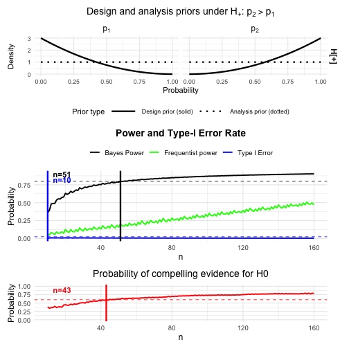

## Introduction

This vignette illustrates the use of the `optimal_twostage_2arm_bf()` function for designing two-stage two-arm binomial phase II trials based on Bayes factors. We re-analyze a clinical trial discussed in [@kelter_power_2026] and show how to construct optimal Bayesian two-stage designs in these settings. In contrast to a one-stage design, the designs we aim for in this vignette always include an interim analysis which allows stopping the trial early for futility. Thus, the principal goal of the `optimal_twostage_2arm_bf()` function is to provide a calibrated Bayesian trial design for a phase II trial in terms of power and type-I-error rate (and probability of compelling evidence for the null hypothesis), which enables to stop the trial early for futility in case there is sufficient evidence for the null hypothesis of no effect or an effect too small in magnitude to be considered clinically relevant.

The workflow of finding a calibrated design proceeds as follows. For each trial we:

1.  Specify the design and analysis priors under the null hypothesis $H_0$ and the alternative hypothesis $H_1$.
2.  Reproduce the fixed-sample (that is, one-stage) operating characteristics using the function `powertwoarmbinbf01()`. This is just for comparing the one-stage sample sizes with the ones of the two-stage design which allows to stop early for futility.
3.  Use `optimal_twostage_2arm_bf()` to find an optimal two-stage design with a single interim analysis which allows to stop early for futilty and which minimizes the expected sample size under $H_0$ while maintaining power and controlling the Bayes-factor-based type-I-error.

## Hypotheses and Bayes factors

We consider a two-arm trial with a control arm (arm 1) and a treatment arm (arm 2). Let $p_1$ and $p_2$ denote the response probabilities in the two arms. A typical hypothesis setup is:

-   $H_0: p_1 = p_2$,
-   $H_1: p_1 \neq p_2$.

The Bayes factor $BF_{01}$ compares the marginal likelihood under $H_0$ to that under $H_1$. Small values of $BF_{01}$ (e.g. $BF_{01} < 1/3$ or $BF_{01} < 1/10$) indicate evidence against $H_0$, whereas large values (e.g. $BF_{01} \ge 3$) indicate evidence in favor of $H_0$. Using the difference parameter $\eta=p_2-p_1$, other typical hypothesis setups for a phase II trial are:

- $H_0:\eta \leq 0 \hspace{1cm} \text{ versus } \hspace{1cm} H_1:\eta > 0$
- $H_0:\eta = 0 \hspace{1cm} \text{ versus } \hspace{1cm} H_1:\eta > 0$
- $H_0:\eta = 0 \hspace{1cm} \text{ versus } \hspace{1cm} H_1:\eta < 0$

For details and further explanations on each of these directional tests, see [@kelter_power_2026]. The associated Bayes factors with each of these three directional tests are denoted as $\mathrm{BF}_{+-}$, $\mathrm{BF}_{+0}$ and $\mathrm{BF}_{-0}$. Also, we denote $H_-:\eta \leq 0$ and $H_+:\eta > 0$.

## Priors: design vs analysis

The package distinguishes **design priors** used for calibrating power and type I error from **analysis priors** used inside the Bayes factor itself.

### Design priors

Design priors describe our assumptions about the response probabilities under each hypothesis when computing operating characteristics.

-   Under $H_0: p_1 = p_2$: We assume a common response probability $p$ with $$
    p \sim \mathrm{Beta}(a_{0d}, b_{0d}),
    $$ set via the parameters `a_0_d` and `b_0_d`.

-   Under $H_1: p_1 \neq p_2$: We assume independent priors for the two arms: $$
    p_1 \sim \mathrm{Beta}(a_{1d}, b_{1d}), \quad
    p_2 \sim \mathrm{Beta}(a_{2d}, b_{2d}),
    $$ set via the parameters `a_1_d, b_1_d` (for the control group) and `a_2_d, b_2_d` ( for the treatment group).

For directional tests (`test = "BF+0"`, `"BF-0"`, or `"BF+-"`), there are additional design priors under a directional-null $H_-$ (e.g. $p_2 \le p_1$), specified by `a_1_d_Hminus, b_1_d_Hminus, a_2_d_Hminus, b_2_d_Hminus`. These are used for one-sided Bayes factors but can be set to diffuse choices (e.g. Beta(1,1)) for the symmetric `test = "BF01"`. For details on the precise specification of these tests, see [@kelter_two_stage_2025].

### Analysis priors

Analysis priors are the priors used *inside* the Bayes factor for each hypothesis. When the hypothesis of interest is tested via the Bayes factor, the analysis priors is the prior used in the calculation of the Bayes factor itself.

-   Under $H_0: p_1 = p_2$, the analysis prior for the common response probability again is Beta distributed, $$
    p \sim \mathrm{Beta}(a_{0a}, b_{0a}),
    $$ specified by the parameters `a_0_a` and `b_0_a`.

-   Under $H_1: p_1 \neq p_2$, we again use independent Betas for the analysis prior: $$
    p_1 \sim \mathrm{Beta}(a_{1a}, b_{1a}), \quad
    p_2 \sim \mathrm{Beta}(a_{2a}, b_{2a}),
    $$ specified via the parameters `a_1_a, b_1_a` and `a_2_a, b_2_a`.

Typically, analysis priors are chosen to be relatively diffuse (e.g. Beta(1,1)), while design priors can express more specific beliefs about plausible response rates under each hypothesis. The design priors should express the assumptions or expectations about the effect the novel treatment or drug has, and is influencing the operating characteristics in the planning stage of the trial substantially. Even though the design priors can be highly subjective, it might still be possible to calibrate a design in terms of the resulting power and type-I-error rate. This way, even though the expectations about the effect of the novel drug or treatment might be quite optimistic, the design is legible from a regulatory agency's point of view, such as the Food and Drug Administration (FDA), see [@FDA_ComplexInnovativeDesignsDecember2020] amd [@FDA_UseOfBayesianMethodologyJanuary2026] or European Medicine Agency (EMA) [@europeanmedicinesagencyICHE20Adaptive2025]. In contrast, the analysis prior should be objective in the sense that the actual test carried out at the interim and final analysis is neither in favour of the null nor the alternative hypothesis.

## The function `optimal_twostage_2arm_bf()`

The main design function is `optimal_twostage_2arm_bf()`. For the Bayesian workflow considered in this vignette, the most important arguments are:

- `alpha`: target Bayesian type-I error.
- `beta`: target Bayesian type-II error, so that the target Bayesian power is `1 - beta`.
- `k`: efficacy threshold. Evidence against the null hypothesis is declared if the Bayes factor falls below `k`.
- `k_f`: futility threshold. Compelling evidence for the null hypothesis is declared if the Bayes factor is at least `k_f`.
- `n1_min`: vector of length 2 giving the minimal interim sample sizes in the two arms.
- `n2_max`: vector of length 2 giving the maximal final sample sizes in the two arms.
- `alloc1`, `alloc2`: allocation probabilities to the two arms.
- `power_cushion`: optional extra power margin used in step 1 when identifying a sufficient fixed-sample design.
- `pceH0`: optional lower bound on the probability of compelling evidence in favour of the null hypothesis.
- `interim_fraction`: lower and upper bounds for the interim sample sizes, expressed as fractions of the fixed-sample sizes found in step 1. Defaults to `c(0,1)`, which means all interim designs between `n1_min` and the fixed-sample size found in step 1 of the calibration algorithm are analyzed. If, for example, `interim_fraction = c(0.25,0.75)`, the minimum sample size for the interim analysis starts at 25\% of the fixed-sample size found in step 1 of the calibration algorithm, no matter which value `n1_min` takes. Likewise, the maximum sample size for the interim analysis point is 75\% of that fixed-sample size.
- `grid_step`: spacing of the interim-design grid searched in step 2.
- `coarse_step`: spacing used in the coarse fixed-sample search in step 1.
- `progress`: logical; if `TRUE`, prints progress messages during the search.
- `max_iter`: maximal number of total sample sizes explored in step 1.
- `calibration_mode`: calibration criterion. In this vignette we use `calibration_mode = "Bayesian"` throughout. Future versions of the package will include other options such as a fully frequentist calibration and a hybrid calibration mode.
- `test`: Bayes-factor test `"BF01"`, `"BF+0"`, `"BF-0"` or `"BF+-"`.

The function returns a list with the following main components:

- `design`: vector `c(n1_1, n1_2, n2_1, n2_2)` giving the interim sample sizes `n1_1` and `n1_2` and the final sample sizes `n2_1` and `n2_2`.
- `naive_oc`: fixed-sample operating characteristics from step 1.
- `occ`: corrected two-stage operating characteristics of the trial design, accounting for possible early stopping for futility.
- `priors`: list containing the prior specification and search settings.
- `conv`: convergence flag describing whether a feasible design was found. Typical values include `"converged"`, `"no_feasible_fixed"`,
`"no_interim_grid"`, and `"no_feasible_design"`. Explanations follow below in the example.
- `freq_occ`: optional frequentist operating characteristics. This component is not used in the Bayesian vignette and is therefore not discussed further here. Future versions of the package will include a fully frequentist calibration, too.

In the Bayesian workflow, the corrected operating characteristics in `occ` are the key output, because they quantify the actual two-stage design rather than the fixed-sample surrogate found in step 1 of the calibration algorithm.

## Overview of the calibration algorithm


The calibration algorithm in `optimal_twostage_2arm_bf()` proceeds in two steps:

1.  **Fixed-sample calibration (step 1)**:\
    It searches over total sample sizes to find a *sufficient* fixed-sample design $(n_2^1, n_2^2)$ that meets the target power $\Pr(\mathrm{BF}_{01}<k\mid H_1)$, type-I error $\Pr(\mathrm{BF}_{01}<k\mid H_0)$ and (optionally) the probability of compelling evidence for the null hypothesis $\Pr(\mathrm{BF}_{01}>k_f\mid H_0)$.

2.  **Two-stage calibration (step 2)**:\
    Conditional on this fixed-sample design, it considers all admissible interim sample sizes $(n_1^1, n_1^2)$ on a grid and, for each candidate, computes the corrected operating characteristics. Among those that satisfy the constraints, it selects the design that minimizes the expected sample size under $H_0$.

The **number of interim designs** considered in step 2 is

$$
\#\{\text{interim designs}\} = \#\{n_1^1\} \times \#\{n_1^2\},
$$

where each arm’s interim range is bounded below by `n1_min` (and `interim_fraction[1] * n_2^j`) and above by `n_2^j - 1` (and `interim_fraction[2] * n_2^j`), and then discretised with `grid_step`. Thus, the **larger** the sufficient fixed-sample size found in step 1, the **larger** the grid of interim designs explored in step 2, and the longer the runtime.

Several modelling choices strongly influence the runtime, and we provide details below after discussing the first example. We turn to the first detailed example now, showing how to calibrate a Bayesian phase II design in practice with the function `optimal_twostage_2arm_bf()`.

## Riociguat phase II trial: fixed-sample design and optimal two-stage design

In this section we consider the **Riociguat phase II trial** in systemic sclerosis [@khannaRiociguatPatientsEarly2020], re-analysed in [@kelter_power_2026]. We explicitly state the response rates used in the Bayes factor design example.

### Riociguat phase II trial: Setup

In the riociguat trial, the reported response rates in the two-arm binary endpoint example are


``` r
p1_riociguat <- 38/(22+38) # control arm response probability
p1_riociguat 
#> [1] 0.6333333
p2_riociguat <- 48/(48+11)  # treatment arm response probability
p2_riociguat
#> [1] 0.8135593
```

as given in Section 2.5 of [@kelter_power_2026]. The response in the treatment group is higher compared to the control group, and the test we perform is $H_0:p_1=p_2$ versus $H_+:p_1<p_2$. We thus exclude the possibility that the response probability in the control group can outperform the response probability in the treatment group. If this assumption is too optimistic, we could also perform the test of $H_-:p_2 \le p_1$ versus $H_+:p_1<p_2$ or the two-sided test.

Now, we use the following design and analysis priors for this example:


``` r
# flat design priors under H0 and H1 (Riociguat)
a_0_d_rio <- 1
b_0_d_rio <- 1

# slightly informative design prior under H1 (that is, H_+) for the control group
a_1_d_rio <- 1 
b_1_d_rio <- 3

# slightly informative design prior under H1 (that is, H_+) for the treatment group
a_2_d_rio <- 3
b_2_d_rio <- 1

# Analysis priors under H0 and H1 (Riociguat)
a_0_a_rio <- 1 # flat under H0
b_0_a_rio <- 1

a_1_a_rio <- 1 # flat under H1 for the control group
b_1_a_rio <- 1

a_2_a_rio <- 1 # flat under H1 for the treatment group
b_2_a_rio <- 1
```

We focus on the one-sided Bayes factor test `test = "BF+0"` with evidence thresholds `k = 1/10` (strong evidence for efficacy) and `k_f = 3` (moderate evidence to stop early for futility), compare [@kelter_power_2026]. We provide a brief discussion of choosing these thresholds below.

### Riociguat phase II trial: Finding a one-stage design without an interim analysis

In the one-stage reference design used in [@kelter_power_2026] for the riociguat example, the trial uses

-   $n_1 = 60$ patients in the control arm,
-   $n_2 = 59$ patients in the treatment arm,

as stated in the paper. We now compute the required sample size to achieve 80% Bayesian power, 5% type-I-error rate and 80% probability of compelling evidence for the null hypothesis. However, we first do this for the one-stage design without an interim analysis. For this fixed-sample one-stage design, we require frequentist power and type-I-error rates to be computed, too, where we assume success probabilities of `p1_power` in the control and `p2_power` in the treatment group. This design is solely calibrated in terms of Bayesian power and type-I-error rate. 

The design priors are chosen to be slightly informative, as we expect the treatment to be more effective than the placebo in the control group, expressed by the parameters `a_1_d = a_1_d_rio` and so on. The flat analysis priors are set via the parameters `a_1_a = a_1_a_rio` and so on. In the following code, set `progress = TRUE` to obtain all relevant information. It is only turned off in this vignette to avoid cluttered console output.


``` r
cat("\n--- Sample size search for riociguat-type trial ---\n")
#> 
#> --- Sample size search for riociguat-type trial ---
res_rio_onestage <- ntwoarmbinbf01(
  k = 1/10, k_f = 3,
  power = 0.8, alpha = 0.025, pce_H0 = 0.6,
  test = "BF+0",
  nrange = c(10, 160), n_step = 1,
  progress = FALSE,
  a_0_d = a_0_d_rio, b_0_d = b_0_d_rio,
  a_0_a = a_0_a_rio, b_0_a = b_0_a_rio,
  a_1_d = a_1_d_rio, b_1_d = b_1_d_rio,
  a_2_d = a_2_d_rio, b_2_d = b_2_d_rio,
  a_1_a = a_1_a_rio, b_1_a = b_1_a_rio,
  a_2_a = a_2_a_rio, b_2_a = b_2_a_rio,
  compute_freq_t1e = TRUE,
  p1_power = 0.4, p2_power = 0.6,
  output = "plot"  # Returns recommended n per group
)
```


We can access the resulting one-stage fixed-sample design via

``` r
res_rio_onestage
```
if required. A more practical way is to plot the resulting design and the function always procudes a plot when being called.

The plot shows the results of the calibrated one-stage design developed by [@kelter_power_2026], and illustrates that the one-stage design without an interim analysis requires $51$ patients in total (check `res_rio_onestage`) to reach the desired threshold for Bayesian power, while $43$ patients in total are necessary to also reach the desired probability of compelling evidence for the null hypothesis. The (Bayesian) type-I-error rate is calibrated for even $10$ patients in total (5 per trial arm). The frequentist type-I-error rate is achieved with a supremum at `0.021` (see console output when running the above code), while the frequentist power requirement of 80% is not reached (maximum of `0.509` reached at 160 patients, see console output). Now, this one-stage design does **not** include an interim analysis, but is fully calibrated from a Bayesian point of view. We could also modify the parameters `p1_power` and `p2_power` to provide frequentist power calculations under more optimistic assumptions (here, we assumed about 20% less successes in both the treatment and control than the response rates actually observed in the trial, so setting `p1_power = 0.6` and `p2_power = 0.8` might be more realistic and yield a design which also is calibrated in terms of frequentist power then). However, we turn to finding the optimal **two-stage** design in the next step now, which includes an interim analysis to stop early for futility. We only computed this fixed-sample one-stage design to compare it with the two-stage design computed next.

### Riociguat phase II trial: Finding the optimal Bayesian two-stage design

We now search for an optimal two-stage design that

- controls the Bayesian type I error at level `alpha = 0.025`,
- achieves at least power `1 - beta = 0.8`,
- achieves at least probability of compelling evidence `pceH0 = 0.60` for the null hypothesis,
- minimizes the expected total sample size under $H_0$,
- respects `n1_min = c(10, 10)` and `n2_max = c(80, 80)`, that is, the minimum number of patients in each trial arm are ten, and the maximum number of patients per trial arm are 80.
- makes use of the same design and analysis priors as before. We thus use slightly informative design and flat analysis priors.


``` r
res_rio <- optimal_twostage_2arm_bf(
  alpha = 0.025,
  beta = 0.20,
  k = 1/10,
  k_f = 3,
  n1_min = c(10, 10),
  n2_max = c(80, 80),
  alloc1 = 0.5,
  alloc2 = 0.5,
  power_cushion = 0.03,
  pceH0 = 0.60,
  interim_fraction = c(0, 1),
  ncores = 1L,
  grid_step = 1,
  progress = TRUE,
  max_iter = 500L,
  compute_freq_oc = FALSE,
  test = "BF+0",
  a_0_d = a_0_d_rio, b_0_d = b_0_d_rio,
  a_0_a = a_0_a_rio, b_0_a = b_0_a_rio,
  a_1_d = a_1_d_rio, b_1_d = b_1_d_rio,
  a_2_d = a_2_d_rio, b_2_d = b_2_d_rio,
  a_1_a = a_1_a_rio, b_1_a = b_1_a_rio,
  a_2_a = a_2_a_rio, b_2_a = b_2_a_rio
)
#> Step 1: searching for fixed-sample sufficiency (alpha=0.025, beta=0.2, cushion=0.03)...
#> Step 1: coarse fixed-sample search...
#>  Coarse grid[  1]: n_tot= 20 | n1= 10 n2= 10 | Bayes Power=0.631 | Bayes T1E=0.010 | PCE(H0)=0.449 
#>  Coarse grid[  2]: n_tot= 30 | n1= 15 n2= 15 | Bayes Power=0.703 | Bayes T1E=0.008 | PCE(H0)=0.512 
#>  Coarse grid[  3]: n_tot= 40 | n1= 20 n2= 20 | Bayes Power=0.751 | Bayes T1E=0.006 | PCE(H0)=0.565 
#>  Coarse grid[  4]: n_tot= 50 | n1= 25 n2= 25 | Bayes Power=0.786 | Bayes T1E=0.006 | PCE(H0)=0.617 
#>  Coarse grid[  5]: n_tot= 60 | n1= 30 n2= 30 | Bayes Power=0.812 | Bayes T1E=0.006 | PCE(H0)=0.646 
#>  Coarse grid[  6]: n_tot= 70 | n1= 35 n2= 35 | Bayes Power=0.834 | Bayes T1E=0.006 | PCE(H0)=0.660 
#> Refining fixed-sample search on [60, 70]...
#>  Refine n_tot= 60 | n1= 30 n2= 30 | Bayes Power=0.812 | Bayes T1E=0.006 | PCE(H0)=0.646 
#>  Refine n_tot= 62 | n1= 31 n2= 31 | Bayes Power=0.819 | Bayes T1E=0.006 | PCE(H0)=0.650 
#>  Refine n_tot= 64 | n1= 32 n2= 32 | Bayes Power=0.822 | Bayes T1E=0.005 | PCE(H0)=0.653 
#>  Refine n_tot= 66 | n1= 33 n2= 33 | Bayes Power=0.829 | Bayes T1E=0.006 | PCE(H0)=0.656 
#>  Refine n_tot= 68 | n1= 34 n2= 34 | Bayes Power=0.833 | Bayes T1E=0.006 | PCE(H0)=0.658 
#>  --> Fixed-sample size found: n_tot=68 (n1=34, n2=34, Power=0.833, T1E=0.006, PCE(H0)=0.658)
#>  => Parallelizing over 24 interim designs using 1 cores...
#> Step 2: evaluated 10 / 24 interim designs (41.7%)...
#> Step 2: evaluated 20 / 24 interim designs (83.3%)...
#> Step 2: evaluated 24 / 24 interim designs (100.0%)...
#> No two-stage design could be evaluated successfully.
```
In the console output above, the line

```r
=> Parallelizing over 24 interim designs using 9 cores...
```

refers to the size of the grid of all admissible $(n_1^{(1)}, n_1^{(2)})$ pairs for the interim analysis.

In this example, step 1 finds a fixed-sample one-stage design with $n_2^{(1)} = n_2^{(2)} = 34$. With

```r
interim_fraction = c(0, 1)
n1_min          = c(10, 10)
```

the interim sample size in each arm is allowed to range from 10 up to 33 (because the interim look must occur strictly before the final sample size). In principle this would yield

- $n_1^{(1)} \in \{10, 11, \dots, 33\}$,
- $n_1^{(2)} \in \{10, 11, \dots, 33\}$,

so a full $24 \times 24$ grid of candidate interim designs. Internally, the function filters this grid to the subset of $(n_1^{(1)}, n_1^{(2)})$ pairs that are compatible with the search settings and can be meaningfully evaluated, which is why the final message reports that it is parallelizing over 24 interim designs in this run. If we had chosen `interim_fraction = c(0.25, 0.75)`, the admissible sample sizes for the interim analysis would have been set to 25 and 75 percent of the maximum sample size `n2_max`. This serves primarily, when the interim analysis should not be too early or too late, and to improve the runtime, when the number of interim designs is very large.

The object `res_rio` contains both the fixed-sample quantities used in step 1 and the corrected two-stage operating characteristics of the final design.

- `res_rio$design` is a four-element vector `c(n1_1, n1_2, n2_1, n2_2)` that describes the optimal two-stage design. In this example the function returns
  ```r
  res_rio$design
  #>  13 13 34 34
  ```
  so the interim sample sizes are $n_1^{(1)} = n_1^{(2)} = 13$ and the final sample sizes are $n_2^{(1)} = n_2^{(2)} = 34$.

- The **maximum** total sample size of the optimal design is therefore
  \[
  N_{\max} = n_2^{(1)} + n_2^{(2)} = 68,
  \]
  while the **interim** sample size (when the interim analysis is carried out) is
  \[
  N_{\mathrm{int}} = n_1^{(1)} + n_1^{(2)} = 26.
  \]

- `res_rio$naive_oc` summarizes the fixed-sample operating characteristics of the sufficient one-stage design identified in step 1:
  ```r
  res_rio$naive_oc
  #> $n1
  #>  34
  #>
  #> $n2
  #>  34
  #>
  #> $power
  #>  0.8330918
  #>
  #> $t1e
  #>  0.005841484
  #>
  #> $pceH0
  #>  0.6581456
  ```
  These operating characteristics are less relevant for the optimal two-stage design, but are used internally by the calibration algorithm in step 1. Also, the comparison of sample sizes shows that we essentially find the same sample size when using a one-stage design to fulfill our requirements on Bayesian power, type-I-error rate and probability of compelling evidence. Thus, the introduction of an interim analysis to stop the trial early for futility comes for free (in this specific example, not in general).

- `res_rio$occ` contains the **corrected operating characteristics** of the optimal two-stage design:
  ```r
  res_rio$occ
  #>         Power   Type1_Error         CE_H0 futility_prob        E_H0_N
  #>   0.833091774   0.005841484   0.675826298   0.020654827  67.132497270
  ```
  Here:
  - `Power` is the Bayesian power under the design prior, accounting for possible early stopping for futility.
  - `Type1_Error` is the corrected Bayesian type-I error under the design prior for $H_0$.
  - `CE_H0` is the corrected probability of obtaining compelling evidence in favour of $H_0$ (either at interim or at the final analysis).
  - `futility_prob` is the probability of early stopping for futility under $H_0$.
  - `E_H0_N` is the expected total sample size under $H_0$, taking the futility probability into account.

- `res_rio$conv` indicates whether a feasible design satisfying the specified Bayesian constraints was found in the search region. In this example the convergence flag equals `"converged"`.

In summary, `res_rio$design` tells us how many patients are recruited in each arm at the interim and at the final analysis, and `res_rio$occ` reports the corresponding operating characteristics of this optimal two-stage design.

We can also plot the resulting design’s operating characteristics:


``` r
plot_twostage_2arm_bf(res_rio)
#> Error in plot_twostage_2arm_bf(res_rio): res$design must be a valid four-element design vector.
```

The plot also visualizes our expectations about the effect of the drug. The design priors indicate that smaller response probabilities close to zero are much more likely a priori in the control group than in the treatment group, whereas larger response probabilities are more likely in the treatment group (compare the dashed and solid lines in the bottom panel for the design prior under $H_+$, $p_1$ was the success probability in the control arm and $p_2$ the success probability in the treatment arm). This expectation about the effectiveness of the new treatment is independent of the analysis priors used when computing the Bayes factor $BF_{+0}$, which are flat and in that sense objective (compare the dashed and solid lines in the analysis prior panels, which overlap; therefore, under $H_+$ it looks as if only a single line is in the plot): subjectivity only enters the planning stage of the trial, not the interim or final analysis itself.

### Comparison with the fixed-sample design

Before considering the two-stage design, it is useful to look again at the
corresponding one-stage fixed-sample design that we calibrated earlier directly to the target Bayesian operating characteristics. For the riociguat example,
the function `ntwoarmbinbf01()` with `power = 0.8`, `alpha = 0.025` and
`pce_H0 = 0.6` identifies a fixed-sample one-stage design with
\(N_{\text{total}} = 51\) patients in total (about 26 patients per arm).
At this sample size the Bayesian power is approximately \(0.80\), the
Bayesian type-I error under \(H_0\) is about \(0.007\), and the probability
of obtaining compelling evidence in favour of \(H_0\) is about \(0.62\).
These values correspond to the row \texttt{n\_total = 51} in the fixed-sample
calibration console output above in Section 6.2, when setting `progress = TRUE` in the function call.

The optimal two-stage design returned by `optimal_twostage_2arm_bf()` for
the same calibration targets uses larger final sample sizes,
\(n_2^{(1)} = n_2^{(2)} = 34\), so that the maximum total sample size is
\(N_{\text{total}} = 68\). However, it introduces an interim analysis at
\((n_1^{(1)}, n_1^{(2)}) = (13, 13)\) with the option to stop early for
futility under \(H_0\). The corrected two-stage operating characteristics of
this design are close to the one-stage targets: the Bayesian power is again
about \(0.80\), the corrected Bayesian type-I error under \(H_0\) is about
\(0.006\), and the corrected probability of compelling evidence in favour of
\(H_0\) is approximately \(0.60\). At the same time, the two-stage design
stops early for futility under \(H_0\) with probability about \(0.02\), which
reduces the expected total sample size under \(H_0\) from 68 in the
corresponding one-stage design to roughly \(E_{H_0}N \approx 67.1\).

The following table summarizes the key Bayesian operating characteristics of
the fixed-sample one-stage design at \(N_{\text{total}} = 51\) and of the
optimal two-stage design with interim look at
\((n_1^{(1)}, n_1^{(2)}) = (13, 13)\) and maximum total sample size
\(N_{\text{total}} = 68\).


### Interpretation of the small futility probability

In the riociguat example, the optimal two-stage design only stops early for
futility under \(H_0\) with probability about \(0.02\), so the reduction in the
expected sample size under \(H_0\) is very modest. This behaviour is not a bug
of the algorithm, but a consequence of the modelling choices and calibration
constraints.

First, the design is calibrated to fairly strict evidence requirements:
the success threshold \(k = 1/10\), the null-evidence threshold
\(k_f = 3\), the Bayesian type-I error bound \(\alpha = 0.025\),
and the requirement \(\Pr(\mathrm{CE}\mid H_0) \ge 0.60\) together imply that
only a small fraction of \(H_0\) outcomes can be eliminated safely at the
interim look without compromising either power or the probability of
compelling evidence in favour of \(H_0\). Under such constraints, the interim
boundary cannot be very aggressive, so the early stopping probability under
\(H_0\) remains low and \(E_{H_0}(N)\) stays close to the maximum sample size.

Second, even when the interim fraction is moved and the CE\((H_0)\) target is
varied, the futility probability in this example is relatively insensitive as
long as the thresholds \(k\) and \(k_f\) and the overall calibration targets
remain fixed. Moving the interim later increases the information available at
the interim, but the futility rule still has to preserve about 80% Bayesian
power and the CE\((H_0)\) constraint, which limits how many null paths can be
stopped early. In particular, with \(k_f = 3\) already fairly liberal for
declaring strong evidence in favour of \(H_0\), further gains in early
stopping would require relaxing this threshold in a way that is not clinically
desirable here.

Third, the design priors have a pronounced effect on the expected sample size
under \(H_0\). When the design priors under \(H_1^+\) are made more informative
and more clearly separated from \(H_0\), the predictive distributions under
\(H_0\) and \(H_1^+\) diverge more quickly as the sample size grows. This leads
to a smaller sufficient fixed-sample size and, consequently, to a smaller
expected sample size under \(H_0\) in the corresponding two-stage design, even
if the interim futility probability itself changes only marginally. In the
riociguat example, this can be achieved by concentrating the design priors
slightly more around the clinically relevant success rates, while keeping the
analysis priors and Bayes factor thresholds unchanged.

To illustrate this effect, consider a modified design where the analysis priors
are left as in the original example, but the design priors under \(H_1^+\) are
made more informative, with \(\mathrm{Beta}(1, 5)\) for the control arm and
\(\mathrm{Beta}(5, 1)\) for the experimental arm. Using the call


``` r
res_rio_more_informative_design_priors <- optimal_twostage_2arm_bf(
  alpha = 0.025,
  beta = 0.20,
  k = 1/10,
  k_f = 3,
  n1_min = c(10, 10),
  n2_max = c(80, 80),
  alloc1 = 0.5,
  alloc2 = 0.5,
  power_cushion = 0.03,
  pceH0 = 0.60,
  interim_fraction = c(0.25, 0.9),
  grid_step = 1,
  progress = TRUE,
  max_iter = 500L,
  compute_freq_oc = FALSE,
  test = "BF+0",
  a_0_d = a_0_d_rio, b_0_d = b_0_d_rio,
  a_0_a = a_0_a_rio, b_0_a = b_0_a_rio,
  a_1_d = 1, b_1_d = 5,
  a_2_d = 5, b_2_d = 1,
  a_1_a = a_1_a_rio, b_1_a = b_1_a_rio,
  a_2_a = a_2_a_rio, b_2_a = b_2_a_rio
)
#> Step 1: searching for fixed-sample sufficiency (alpha=0.025, beta=0.2, cushion=0.03)...
#> Step 1: coarse fixed-sample search...
#>  Coarse grid[  1]: n_tot= 20 | n1= 10 n2= 10 | Bayes Power=0.815 | Bayes T1E=0.010 | PCE(H0)=0.449 
#>  Coarse grid[  2]: n_tot= 30 | n1= 15 n2= 15 | Bayes Power=0.870 | Bayes T1E=0.008 | PCE(H0)=0.512 
#>  Coarse grid[  3]: n_tot= 40 | n1= 20 n2= 20 | Bayes Power=0.905 | Bayes T1E=0.006 | PCE(H0)=0.565 
#>  Coarse grid[  4]: n_tot= 50 | n1= 25 n2= 25 | Bayes Power=0.925 | Bayes T1E=0.006 | PCE(H0)=0.617 
#> Refining fixed-sample search on [40, 50]...
#>  Refine n_tot= 40 | n1= 20 n2= 20 | Bayes Power=0.905 | Bayes T1E=0.006 | PCE(H0)=0.565 
#>  Refine n_tot= 42 | n1= 21 n2= 21 | Bayes Power=0.910 | Bayes T1E=0.006 | PCE(H0)=0.578 
#>  Refine n_tot= 44 | n1= 22 n2= 22 | Bayes Power=0.919 | Bayes T1E=0.007 | PCE(H0)=0.584 
#>  Refine n_tot= 46 | n1= 23 n2= 23 | Bayes Power=0.926 | Bayes T1E=0.007 | PCE(H0)=0.602 
#>  --> Fixed-sample size found: n_tot=46 (n1=23, n2=23, Power=0.926, T1E=0.007, PCE(H0)=0.602)
#>  => Parallelizing over 11 interim designs using 9 cores...
#> Step 2: evaluated 10 / 11 interim designs (90.9%)...
#> Step 2: evaluated 11 / 11 interim designs (100.0%)...
#> No two-stage design could be evaluated successfully.

plot_twostage_2arm_bf(res_rio_more_informative_design_priors)
#> Error in plot_twostage_2arm_bf(res_rio_more_informative_design_priors): res$design must be a valid four-element design vector.
```

the fixed-sample calibration in step 1 now finds a sufficient one-stage design
with \(n_2^{(1)} = n_2^{(2)} = 23\) (i.e. \(N_{\text{total}} = 46\)), with
Bayesian power about \(0.926\), Bayesian type-I error about \(0.007\), and
\(\Pr(\mathrm{CE}\mid H_0) \approx 0.602\). Conditional on this fixed-sample
anchor, the optimal two-stage design has interim and final sample sizes

\[
(n_1^{(1)}, n_1^{(2)}, n_2^{(1)}, n_2^{(2)}) = (11, 11, 23, 23),
\]

with corrected Bayesian operating characteristics

\[
\Pr(\text{Reject } H_0 \mid H_1^+) \approx 0.926,\quad
\Pr(\text{Reject } H_0 \mid H_0) \approx 0.0074,\quad
\Pr(\mathrm{CE} \mid H_0) \approx 0.619,
\]

and an early futility stop probability under \(H_0\) of about \(0.020\). The
expected total sample size under \(H_0\) is reduced to

\[
E_{H_0}N \approx 45.5,
\]

which is now substantially smaller than the maximum sample size
\(N_{\text{total}} = 46\) and also smaller than in the original riociguat
example. This illustrates that, in this family of designs, meaningful gains in
efficiency are driven primarily by how informative and well-separated the
design priors are under \(H_0\) and \(H_1^+\), rather than by aggressive
changes to the interim timing or thresholds, which would otherwise conflict
with the desired power and evidence constraints. It is important to stress that choosing a slightly more informative design prior under $H_+$ does not introduce any form of subjectivity in the eventual analysis carried out when the trial data are available: The analysis priors used in the Bayes factors remain flat and in that sense objective. The only thing that changes is our a priori expectation about the effect of the treatment or drug to a slightly more optimistic assumption (compare the design prior panels for $H_+$ in the two function calls above, in the last one the priors separate the hypotheses slightly stronger from another).

### Interpretation of the `conv` flag

The component `conv` in the output of `optimal_twostage_2arm_bf()` summarizes how the calibration algorithm terminated.

- `"converged"`  
  A fully feasible design was found: step 1 identified a fixed-sample design that meets the Bayesian constraints, and step 2 found at least one two-stage design on the interim grid whose corrected operating characteristics satisfy the specified targets. The returned design is the one that minimizes the expected sample size under $H_0$ among all such candidates.

- `"no_feasible_fixed"`  
  Step 1 could not find any fixed-sample design (within the range implied by `n1_min`, `n2_max`, `max_iter`, and the thresholds) that satisfies the Bayesian constraints. In this case step 2 is not entered at all, because there is no “sufficient” one-stage design to base a two-stage search on. Typical remedies are to relax the constraints (e.g. increase `alpha`, relax `pceH0`, or reduce `1 - beta`) or to increase `n2_max` and `max_iter`.

- `"no_interim_grid"`  
  A fixed-sample design was found in step 1, but the admissible interim-sample region implied by `n1_min`, `n2_max`, and `interim_fraction` is empty. In other words, there is no pair $(n_1^{(1)}, n_1^{(2)})$ that both lies strictly below $(n_2^{(1)}, n_2^{(2)})$ and satisfies the interim-range constraints. In this case the algorithm cannot construct any two-stage candidates. Adjusting `n1_min` or widening `interim_fraction` usually resolves this.

- `"no_feasible_design"`  
  Both step 1 and step 2 ran, and at least one interim grid was evaluated, but no two-stage design on that grid satisfies the specified constraints on power, type-I error, and (optionally) `pceH0`. The function returns `NA` for the design and corrected operating characteristics in this case. To obtain a feasible design, one can enlarge the search space (e.g. increase `n2_max` or allow a finer grid via `grid_step`) or relax the Bayesian constraints.

### How priors and thresholds affect the calibration grid (and runtime)

#### Design priors and required sample size

The design priors under $H_0$ and $H_1$ determine how quickly the Bayes factor accumulates evidence as $n$ increases.

-   **Flat design priors (e.g.** $\mathrm{Beta}(1,1)$ everywhere) spread substantial prior mass over a wide range of response rates. Under such diffuse priors, the Bayes factor tends to move more slowly away from 1, and the algorithm typically needs a **larger fixed-sample size** in step 1 to achieve the desired power and type-I error under the design priors. We strongly discourage using flat priors solely for the sake of staying objective, in particular, because the design priors do not influence the results of the Bayes factor. This is the job of the analysis prior in the planning of a trial and here, we encourage using uninformative or flat analysis priors.

-   **More informative design priors** that concentrate mass near clinically plausible values can lead to **smaller sufficient fixed-sample sizes**, because the predictive distributions under $H_0$ and $H_1$ separate more quickly.

Because a larger fixed-sample size directly expands the admissible range for $(n_1^1, n_1^2)$, using very flat design priors can lead to a **very large interim design grid** in step 2 and thus considerably longer runtimes.

A simple (non-evaluated) example illustrating the “flat vs informative” effect is:

``` r
# NOT RUN
# Very flat design priors (tend to require larger n2)
res_flat <- optimal_twostage_2arm_bf(
  alpha = 0.025, beta = 0.20, pceH0 = 0.60,
  k = 1/10, k_f = 3,
  n1_min = c(5, 5), n2_max = c(200, 200),
  alloc1 = 0.5, alloc2 = 0.5,
  interim_fraction = c(0, 1),
  grid_step = 1,
  power_cushion = 0.03,
  progress = TRUE,
  max_iter = 2000,
  test = "BF+0",
  a_0_d = 1, b_0_d = 1,
  a_0_a = 1, b_0_a = 1,
  a_1_d = 1, b_1_d = 1,
  a_2_d = 1, b_2_d = 1,
  a_1_a = 1, b_1_a = 1,
  a_2_a = 1, b_2_a = 1
)

# More informative design priors (likely smaller n2, fewer interim designs)
# res_inf <- optimal_twostage_2arm_bf(
#   alpha = 0.025, beta = 0.20, pceH0 = 0.60,
#   k = 1/10, k_f = 3,
#   n1_min = c(5, 5), n2_max = c(200, 200),
#   alloc1 = 0.5, alloc2 = 0.5,
#   interim_fraction = c(0, 1),
#   grid_step = 1,
#   power_cushion = 0.03,
#   progress = TRUE,
#   max_iter = 2000,
#   test = "BF+0",
#   a_0_d = a_0_d_rio, b_0_d = b_0_d_rio,
#   a_0_a = a_0_a_rio, b_0_a = b_0_a_rio,
#   a_1_d = a_1_d_rio, b_1_d = b_1_d_rio,
#   a_2_d = a_2_d_rio, b_2_d = b_2_d_rio,
#   a_1_a = a_1_a_rio, b_1_a = b_1_a_rio,
#   a_2_a = a_2_a_rio, b_2_a = b_2_a_rio
# )
```

In practice, one can expect `res_flat` to require a larger fixed-sample size in step 1, and hence to explore more interim designs in step 2, than a corresponding design based on more concentrated priors.

#### Evidence threshold $k$ and required sample size

The **efficacy threshold** $k$ determines how strong the evidence against $H_0$ must be before declaring success. For BF+0, success corresponds to the event “Bayes factor in favour of $H_+$ vs $H_0$ drops below $k$”.

-   If $k$ is very small (e.g. $k = 1/10$), then very strong evidence is required to reject $H_0$. This typically forces the algorithm to choose **larger fixed-sample sizes** to reach the desired power.

-   If $k$ is less extreme (e.g. $k = 1/3$), the evidence threshold is easier to reach, so **smaller fixed-sample sizes** can be sufficient.

Since the fixed-sample size from step 1 determines the upper bound for the interim sample sizes, choosing a **larger** (less stringent) $k$ tends to **reduce** the number of interim designs and the runtime of the calibration procedure; choosing a **smaller** $k$ has the opposite effect.

A simple illustration (not evaluated in the vignette) is:

``` r
# NOT RUN
# More stringent evidence threshold (k = 1/10)
res_strict <- optimal_twostage_2arm_bf(
  alpha = 0.025, beta = 0.20, pceH0 = 0.60,
  k = 1/10, k_f = 3,
  n1_min = c(5, 5), n2_max = c(150, 150),
  alloc1 = 0.5, alloc2 = 0.5,
  interim_fraction = c(0, 1),
  grid_step = 1,
  power_cushion = 0.03,
  progress = TRUE,
  max_iter = 2000,
  test = "BF+0",
  a_0_d = a_0_d_rio, b_0_d = b_0_d_rio,
  a_0_a = a_0_a_rio, b_0_a = b_0_a_rio,
  a_1_d = a_1_d_rio, b_1_d = b_1_d_rio,
  a_2_d = a_2_d_rio, b_2_d = b_2_d_rio,
  a_1_a = a_1_a_rio, b_1_a = b_1_a_rio,
  a_2_a = a_2_a_rio, b_2_a = b_2_a_rio
)

# Less stringent evidence threshold (k = 1/3)
# res_looser <- optimal_twostage_2arm_bf(
#   alpha = 0.025, beta = 0.20, pceH0 = 0.60,
#   k = 1/3, k_f = 3,
#   n1_min = c(5, 5), n2_max = c(150, 150),
#   alloc1 = 0.5, alloc2 = 0.5,
#   interim_fraction = c(0, 1),
#   grid_step = 1,
#   power_cushion = 0.03,
#   progress = TRUE,
#   max_iter = 2000,
#   test = "BF+0",
#   a_0_d = a_0_d_rio, b_0_d = b_0_d_rio,
#   a_0_a = a_0_a_rio, b_0_a = b_0_a_rio,
#   a_1_d = a_1_d_rio, b_1_d = b_1_d_rio,
#   a_2_d = a_2_d_rio, b_2_d = b_2_d_rio,
#   a_1_a = a_1_a_rio, b_1_a = b_1_a_rio,
#   a_2_a = a_2_a_rio, b_2_a = b_2_a_rio
# )
```

Here, one would expect `res_strict` to require a larger fixed-sample size and thus more interim designs than `res_looser`.

#### Probability of compelling evidence for $H_0$ and feasibility

The optional constraint on $\Pr(\mathrm{CE}\mid H_0)$ (specified via `pceH0`) is evaluated under $H_0$ and requires a sufficiently **large sample size** for the Bayes factor to accumulate strong evidence *in favour* of $H_0$. For small total sample sizes:

-   It may be impossible to reach the desired `pceH0` (even with favourable data), because the Bayes factor cannot move far enough towards $H_0$ when $n$ is small.

-   In such cases, the fixed-sample search in step 1 will typically continue to larger $n$ in an attempt to meet the `pceH0` constraint. If `n2_max` is restrictive, it may ultimately **fail** to find a design that satisfies all constraints.

This leads to an important tension:

-   **Smaller sufficient fixed-sample sizes** (e.g. from a less stringent $k$) make the step-2 search faster but can make it **hard (or impossible)** to reach a demanding `pceH0` (such as 0.8 or 0.9), because there simply is not enough information in the data to strongly favour $H_0$.

-   **Larger fixed-sample sizes** (e.g. from stricter priors or smaller $k$) make satisfying `pceH0` more feasible but increase the number of interim designs and thus the runtime.

A minimal illustration that emphasises feasibility (not evaluated) could look like:

``` r
# NOT RUN
# Modest P(CE|H0) target
res_ce60 <- optimal_twostage_2arm_bf(
  alpha = 0.025, beta = 0.20, pceH0 = 0.60,
  k = 1/10, k_f = 3,
  n1_min = c(5, 5), n2_max = c(120, 120),
  alloc1 = 0.5, alloc2 = 0.5,
  interim_fraction = c(0, 1),
  grid_step = 1,
  power_cushion = 0.03,
  progress = TRUE,
  max_iter = 2000,
  test = "BF+0",
  a_0_d = a_0_d_rio, b_0_d = b_0_d_rio,
  a_0_a = a_0_a_rio, b_0_a = b_0_a_rio,
  a_1_d = a_1_d_rio, b_1_d = b_1_d_rio,
  a_2_d = a_2_d_rio, b_2_d = b_2_d_rio,
  a_1_a = a_1_a_rio, b_1_a = b_1_a_rio,
  a_2_a = a_2_a_rio, b_2_a = b_2_a_rio
)

# More demanding P(CE|H0) target (may require larger n2 or even be infeasible)
# res_ce80 <- optimal_twostage_2arm_bf(
#   alpha = 0.025, beta = 0.20, pceH0 = 0.80,
#   k = 1/10, k_f = 3,
#   n1_min = c(5, 5), n2_max = c(120, 120),
#   alloc1 = 0.5, alloc2 = 0.5,
#   interim_fraction = c(0, 1),
#   grid_step = 1,
#   power_cushion = 0.03,
#   progress = TRUE,
#   max_iter = 2000,
#   test = "BF+0",
#   a_0_d = a_0_d_rio, b_0_d = b_0_d_rio,
#   a_0_a = a_0_a_rio, b_0_a = b_0_a_rio,
#   a_1_d = a_1_d_rio, b_1_d = b_1_d_rio,
#   a_2_d = a_2_d_rio, b_2_d = b_2_d_rio,
#   a_1_a = a_1_a_rio, b_1_a = b_1_a_rio,
#   a_2_a = a_2_a_rio, b_2_a = b_2_a_rio
# )
```

The second call with `pceH0 = 0.80` may either force `n2` to become quite large or, if `n2_max` is too restrictive, result in `conv = "no_feasible_fixed"`.

#### Practical recommendation for vignettes and examples

When using the `optimal_twostage_2arm_bf()` function for designing two-stage two-arm binomial phase II trials based on Bayes factors, it is useful to:

-   Choose **moderately informative design priors** rather than completely flat ones.
-   Avoid extremely stringent evidence thresholds and `pceH0` targets for demonstration code.
-   Use relatively modest `n2_max` and, if needed, a coarser `grid_step` (e.g. 2 or 3) to keep the number of interim designs manageable.

This keeps runtime under control.

------------------------------------------------------------------------


## Summary

This vignette demonstrated how to

-   specify design and analysis priors for two-arm binomial Bayes factor designs,
-   reproduce fixed-sample operating characteristics for given trial settings, and
-   construct optimal two-stage designs that reduce the expected sample size under $H_0$ while maintaining power and controlling Bayes-factor-based type I error,
-   interpret the output of the two-stage optimal design algorithm, in particular, the convergence flag,
-   balance computational runtime and the choice of evidence thresholds $k$ and $k_f$ for efficacy and futility, the choice of design priors, and the probability of compelling evidence target constraints

By adjusting the prior parameters, Bayes factor thresholds, and sample size constraints, `bfbin2arm` can be tailored to a wide range of two-arm phase II trial settings. Additional vignettes on frequentist and hybrid calibration will be added in future releases of the package, once these features are implemented.

## References
