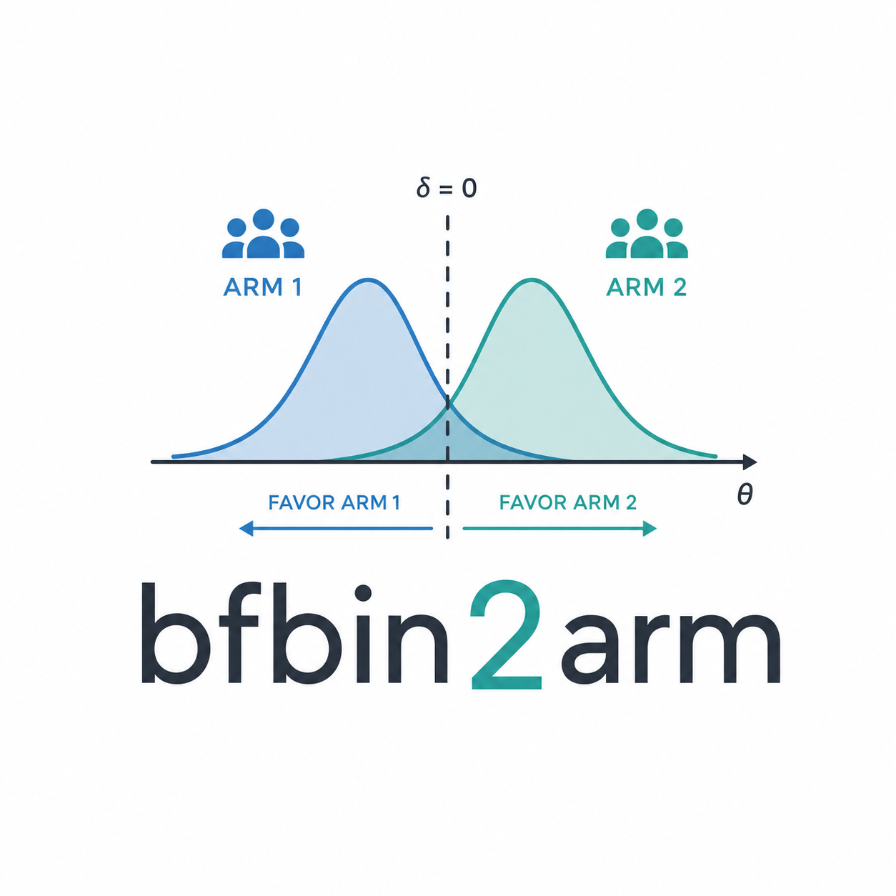

## bfbin2arm

## Sequential Bayesian trial design for clinical phase II trials

Sequential hypothesis tests are an important tool to improve the
efficiency of clinical trials. In contrast to study designs with a fixed
sample size, interim analyses are carried out which allow to stop a
trial early for futility when a novel drug or treatment is ineffective.
Often, such designs are applied in phase II proof of concept trials,
where the primary endpoint measures the binary response (success or
failure) of each enrolled patient to the novel drug or treatment. The R
software package `bfbin2arm` provides methodology and software for
planning, design and calibration of such trials, and allows to analyze
the operating-characteristic (such as the power and type-I-error) of
sequential Bayesian phase II clinical trial with binary endpoint. The
package focuses on single-arm and two-arm Bayesian designs, including
one-stage and two-stage settings, with tools for design calibration and
visualisation of trial operating behavior. Importantly, the package
allows for different calibration modes for a trial design, including
Bayesian, frequentist and hybrid calibration.

The package website collects methodological articles, worked examples,
and reference documentation intended to support both applied use and
methodological development.

## Funding

Funded by the Deutsche Forschungsgemeinschaft (DFG, German Research
Foundation) - Project number 549296018.

For any inquiries, contact Dr. Riko Kelter, <riko.kelter@uni-koeln.de>.

## Main articles

The software package `bfbin2arm` emerged from clinical trial designs for
two-arm clinical phase II trials with binary endpoints, using Bayes
factors as the primary measure of evidence. Over time, more designs were
implemented, including one- and two-stage designs, single-arm and
two-arm designs, designs for equivalence, non-inferiority and
superiority tests, optimal designs which minimize the expected sample
size under the null hypothesis, as well as different calibration modes
for the available designs such as Bayesian, frequentist or hybrid
calibration.

An overview about the implemented designs is given in:

- [Clinical trial designs in
  bfbin2arm](https://rikokelter.github.io/bfbin2arm/articles/bfbin2arm-overview.md)

Equivalence testing in single-arm one-stage designs:

- [ROPE-based trial design for single-arm one-stage phase II trials with
  binary
  endpoints](https://rikokelter.github.io/bfbin2arm/articles/bfbin2arm-rope-singlearm-onestage-design.md)
- [Frequentist and hybrid calibration of one-stage ROPE-based designs
  for single-arm phase II
  trials](https://rikokelter.github.io/bfbin2arm/articles/bfbin2arm-rope-singlearm-onestage-calibration.md)

One-stage single-arm designs:

- [Calibration of Bayesian one-stage designs for single-arm phase II
  trials with binary
  endpoints](https://rikokelter.github.io/bfbin2arm/articles/bfbin2arm-singlearm-onestage.md)

Two-stage (optimal) single-arm designs:

- [Optimal Bayesian calibration for single-arm two-stage Bayes factor
  designs](https://rikokelter.github.io/bfbin2arm/articles/bfbin2arm-singlearm-twostage_bayesian.md)
- [Optimal frequentist calibration for single-arm two-stage Bayes factor
  designs with binary
  endpoints](https://rikokelter.github.io/bfbin2arm/articles/bfbin2arm-singlearm_twostage_frequentist.md)
- [Optimal hybrid calibration for single-arm two-stage Bayes factor
  designs with binary
  endpoints](https://rikokelter.github.io/bfbin2arm/articles/bfbin2arm-singlearm_twostage_hybrid.md)
- [Optimal full calibration for single-arm two-stage Bayes factor
  designs with binary
  endpoints](https://rikokelter.github.io/bfbin2arm/articles/bfbin2arm-singlearm_twostage_full.md)

One-stage two-arm designs:

- [Bayesian calibration of two-arm one-stage Bayes factor designs with
  binary
  endpoints](https://rikokelter.github.io/bfbin2arm/articles/bfbin2arm-twoarm_onestage_Bayesian.md)

Two-stage (optimal) two-arm designs:

- [Optimal Bayesian calibration of two-arm two-stage Bayes factor
  designs with binary
  endpoints](https://rikokelter.github.io/bfbin2arm/articles/bfbin2arm-twoarm-twostage_Bayesian.md)

## Reference documentation

- [Function
  reference](https://rikokelter.github.io/bfbin2arm/reference/index.md)

## Source code

- [GitHub repository](https://github.com/rikokelter/bfbin2arm)
