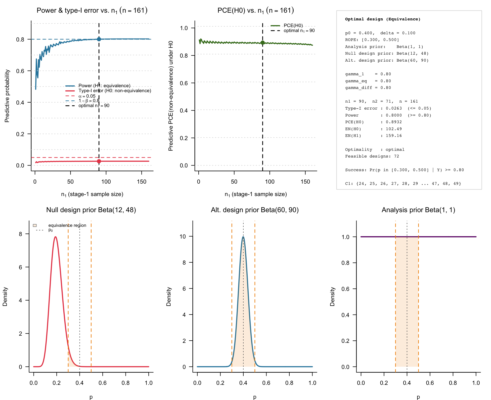
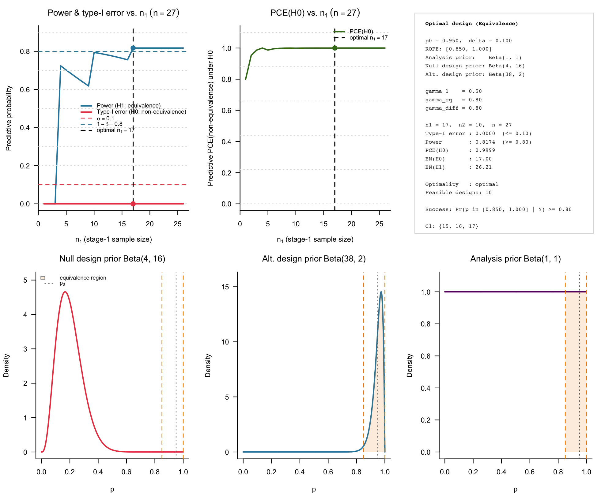

```{r setup, include = FALSE}
knitr::opts_chunk$set(
  collapse = TRUE,
  comment = "#>",
  fig.width  = 7,
  fig.height = 5,
  dpi        = 100,
  fig.retina = 1,
  dev        = "png",
  dev.args   = list(type = "cairo-png")
)

library(bfbin2arm)
```

# Introduction

This vignette introduces the calibration of two-stage ROPE-based designs for
single-arm phase II trials with binary endpoints, implemented in the function
`design_singlearm_twostage_rope()`. In these trials, the goal is to establish
practical equivalence between a standard of care with success probability
$p_0$ and a novel treatment, while allowing for a single interim analysis with
the option to stop early for futility.

As in the one-stage ROPE design, equivalence is framed via a region of practical
equivalence (ROPE) around $p_0$

$$\mathcal{R}_p = [p_0 - \delta,\; p_0 + \delta]\cap(0,1),$$

and equivalence is accepted if the posterior probability that $p$ lies inside
$\mathcal{R}_p$ exceeds a threshold $\gamma_{\mathrm{eq}}$,

$$\Pr(p \in \mathcal{R}_p \mid Y=y) \ge \gamma_{\mathrm{eq}}.$$

In addition, the two-stage design uses

- an **interim futility threshold** $\gamma_1$, formulated in terms of the
  posterior probability of non-equivalence at stage 1, and
- a **non-equivalence threshold** $\gamma_{\mathrm{diff}}$, formulated in
  terms of the posterior probability of lying outside the ROPE at the final
  analysis.

The key feature of `design_singlearm_twostage_rope()` is that it calibrates an
optimal two-stage design by:

1. determining a one-stage ROPE design that satisfies target Bayesian predictive
   power and predictive type-I error under separate design priors for equivalence
   and non-equivalence; and  
2. searching over all two-stage splits of the one-stage sample size to find a
   two-stage design that preserves these targets while minimising the expected
   sample size under the non-equivalence prior.

All operating characteristics are computed exactly via beta–binomial predictive
distributions, without Monte Carlo simulation.

# Two-stage ROPE design structure

We consider a single-arm phase II trial with a binary endpoint. Let $Y$ denote
the number of responders among $n$ enrolled patients. The trial is conducted
in two stages:

- stage 1: enroll $n_1$ patients and observe $Y_1$ responses;
- if the interim data are not strongly against equivalence, proceed to stage 2,
  enroll an additional $n_2$ patients (for a total $n = n_1 + n_2$) and
  observe a total $Y = Y_1 + Y_2$ responses.

At both stages, decision-making is based on the posterior ROPE probability
$\pi_{\mathcal{R}_p}(y,n) = \Pr(p \in \mathcal{R}_p \mid Y=y, n)$ under an
analysis prior $\mathrm{Beta}(a_A,b_A)$.

## Stage 1: Interim futility analysis

At the interim analysis, the design evaluates the posterior probability that
$p$ lies outside the ROPE. Let $\gamma_1\in(0,1)$ be the futility threshold.
The stage 1 rule can be written as

- **continue to stage 2** if
  $$Pr(p \notin \mathcal{R}_p \mid Y_1=y_1, n_1) < \gamma_1
  \quad \text{equivalently}\quad
  \pi_{\mathcal{R}_p}(y_1,n_1) > 1 - \gamma_1,$$
- **stop for futility** (non-equivalence) otherwise.

The set of interim response counts that lead to continuation is the
**continuation region** $\mathcal{C}_1 \subseteq \{0,\dots,n_1\}$. For
$y_1\in\mathcal{C}_1$, the trial proceeds to stage 2; for
$y_1 \notin\mathcal{C}_1$, it stops early.

## Stage 2: Final decision

At the final analysis, the design uses two thresholds:

- an equivalence threshold $\gamma_{\mathrm{eq}}$, and
- a non-equivalence threshold $\gamma_{\mathrm{diff}}$.

The final decision rule is:

- **declare equivalence** if
  $\pi_{\mathcal{R}_p}(y,n) \ge \gamma_{\mathrm{eq}}$,
- **declare compelling for the null hypothesis (non-equivalence)** if
  $1-\pi_{\mathcal{R}_p}(y,n) \ge \gamma_{\mathrm{diff}}$,
- **remain inconclusive** otherwise.

Thus, every possible total response count $y\in\{0,\dots,n\}$ belongs to one
of three final decision regions (equivalence, compelling non-equivalence,
inconclusive), determined by the analysis prior, the ROPE, and the thresholds
$(\gamma_{\mathrm{eq}},\gamma_{\mathrm{diff}})$.

## Predictive operating characteristics and optimality

Predictive (Bayesian) operating characteristics are defined with respect to two
distinct design priors:

- under non-equivalence $H_0: p\notin\mathcal{R}_p$, a pessimistic prior
  $\pi_0(p)$ that concentrates mass outside the ROPE;  
- under equivalence $H_1: p\in\mathcal{R}_p$, an optimistic prior
  $\pi_1(p)$ that concentrates mass inside the ROPE.

From these priors we obtain:

- **predictive type-I error**:
  $Pr(\text{equivalence declared} \mid H_0)$,
- **predictive power**:
  $Pr(\text{equivalence declared} \mid H_1)$,
- **predictive probability of compelling evidence for $H_0$**:
  the prior predictive probability (under $\pi_0$) of either interim or final
  decisions that satisfy the compelling non-equivalence criterion.

`design_singlearm_twostage_rope()` first finds a one-stage ROPE design
(i.e. an $n^\ast$) satisfying user-specified targets for predictive type-I
error and predictive power under $(\pi_0,\pi_1)$. It then evaluates all splits
$(n_1,n_2)$ with $n_1+n_2 = n^\ast$ that are consistent with a given
$\gamma_1$, and returns the two-stage design that:

- meets the predictive power and type-I constraints, and
- minimises the expected sample size under $H_0$, $\mathrm{EN}_0$.

The resulting design retains the one-stage operating characteristics while
reducing average sample size under non-equivalence via interim futility stopping.

# Example 1: Neoadjuvant talazoparib (pCR)

Our first example is the neoadjuvant talazoparib study in germline BRCA1/2-mutated, HER2-negative early-stage triple-negative breast cancer
(TNBC) [@littonNeoadjuvantTalazoparibPatients2020; @littonNeoadjuvantTalazoparibPatients2023], using a two-stage ROPE formulation for the pathological complete response (pCR) probability.

## Design specification

We take $p_0 = 0.40$ as a benchmark pCR rate for standard neoadjuvant
chemotherapy in this population and set the ROPE as

$$\mathcal{R}_p = [0.30,0.50]$$

with half-width $\delta = 0.10$. The analysis prior is a weakly informative
$\mathrm{Beta}(1,1)$. For predictive operating characteristics we use:

- under non-equivalence $H_0$: $\pi_0(p) = \mathrm{Beta}(12,48)$, mean 0.20,
- under equivalence $H_1$: $\pi_1(p) = \mathrm{Beta}(60,90)$, mean 0.40.

Thus $\pi_0$ places most mass well below the ROPE, representing clinically
relevant inferiority of talazoparib, while $\pi_1$ concentrates in the upper
half of the ROPE, reflecting the belief that equivalence, if present, is likely
to be near or slightly above the benchmark.

We choose a common threshold $\gamma = 0.80$ for interim and final evidence:

- interim futility threshold: $\gamma_1 = 0.80$,
- final equivalence threshold: $\gamma_{\mathrm{eq}} = 0.80$,
- final non-equivalence threshold: $\gamma_{\mathrm{diff}} = 0.80$.

This means we:

- continue to stage 2 if
  $\Pr(p \notin\mathcal{R}_p \mid Y_1) < 0.80$, equivalently
  $\pi_{\mathcal{R}_p}(Y_1,n_1) > 0.20$;  
- declare equivalence if
  $\pi_{\mathcal{R}_p}(Y,n) \ge 0.80$;  
- declare compelling non-equivalence if
  $1-\pi_{\mathcal{R}_p}(Y,n) \ge 0.80$.

We target 80% predictive power and 5% predictive type-I error under these
priors.

```{r tala-design, eval = FALSE}
## Historical benchmark pCR for standard chemo in gBRCA+ TNBC
p0_tala    <- 0.40      # benchmark response probability
delta_tala <- 0.10      # ROPE half-width of the ROPE [0.30, 0.50]

## Analysis prior: weakly informative Beta(1,1)
analysis_prior_tala <- c(1, 1)

## Design priors:
## - Under H0: pessimistic prior, mean = 0.20
## - Under H1: prior centred near upper half of ROPE, mean = 0.40
design_prior_h0_tala <- c(8*1.5, 32*1.5)   # mean = 0.20
design_prior_h1_tala <- c(30*2, 45*2)      # mean = 0.40

## Evidence thresholds:
gamma_1_tala    <- 0.80   # interim: continue if Pr(p in ROPE | y1, n1) > 0.20
gamma_eq_tala   <- 0.80   # final: equivalence if Pr(p in ROPE | y, n) >= 0.80
gamma_diff_tala <- 0.80   # final: compelling H0 if 1 - Pr(p in ROPE | y, n) >= 0.80

## Target operating characteristics:
alpha_tala <- 0.05       # predictive type-I error upper bound
power_tala <- 0.80       # predictive power lower bound

## Calibrate the single-arm two-stage ROPE equivalence design
tala_design <- design_singlearm_twostage_rope(
  p0              = p0_tala,
  delta           = delta_tala,
  analysis_prior  = analysis_prior_tala,
  design_prior_h0 = design_prior_h0_tala,
  design_prior_h1 = design_prior_h1_tala,
  gamma_1         = gamma_1_tala,
  gamma_eq        = gamma_eq_tala,
  gamma_diff      = gamma_diff_tala,
  alpha           = alpha_tala,
  power           = power_tala,
  nmax            = 500L,           # upper bound on fixed-sample search
  direction       = "equivalence",
  minimax         = FALSE,          # optimal design (minimise EN0)
  progress        = TRUE
)
```

The printed design object summarises the one-stage calibration, optimal split,
and predictive operating characteristics:

```{r tala-summary, eval = FALSE}
tala_design
```
```
Single-arm two-stage ROPE equivalence design
============================================ 
  Benchmark p0            : 0.4000
  ROPE half-width delta    : 0.1000
  ROPE interval           : [0.3000, 0.5000]
  Analysis prior          : Beta(1, 1)
  Null design prior       : Beta(12, 48)
  Alt. design prior       : Beta(60, 90)
  Interim threshold gamma_1   : 0.8000
  Final threshold  gamma_eq   : 0.8000
  Diff. threshold  gamma_diff : 0.8000
  Target alpha / power    : 0.0500 / 0.8000
  Optimality criterion    : optimal
  Direction               : equivalence

Optimal design
------------------------------ 
  n1 (stage 1)  : 90
  n2 (stage 2)  : 71
  n  (maximum)  : 161
  Continuation region C1 : {24, 25, 26, 27, 28, 29, 30, 31, 32, 33 ... 45, 46, 47, 48, 49}

Operating characteristics
----------------------------------------------- 
                                         1-stage 2-stage
  Predictive type-I error                 0.0265  0.0263
  Predictive power                        0.8017  0.8000
  PCE(H0) (any stage)                     0.8744  0.8932

  EN under H0 prior : 102.4929
  EN under H1 prior : 159.1634

  Success criterion : Pr(p in [0.3000, 0.5000] | Y) >= 0.80
```

We can also summarize the design:
```{r, eval = FALSE}
summary(tala_design)
```
```
Summary: Single-arm two-stage ROPE equivalence design
======================================================= 

Hypotheses
------------------------------ 
  H0 : p outside [0.3000, 0.5000]  (non-equivalence)
  H1 : p inside  [0.3000, 0.5000]  (equivalence)

Decision rules
------------------------------ 
  Interim (continue if) : Pr(p not in ROPE | y1, n1) < 0.80  (equiv. Pr(p in ROPE | y1, n1) > 0.20)
  Final   (declare equivalence if):
                          Pr(p in ROPE | y, n) >= 0.80


Single-arm two-stage ROPE equivalence design
============================================ 
  Benchmark p0            : 0.4000
  ROPE half-width delta    : 0.1000
  ROPE interval           : [0.3000, 0.5000]
  Analysis prior          : Beta(1, 1)
  Null design prior       : Beta(12, 48)
  Alt. design prior       : Beta(60, 90)
  Interim threshold gamma_1   : 0.8000
  Final threshold  gamma_eq   : 0.8000
  Diff. threshold  gamma_diff : 0.8000
  Target alpha / power    : 0.0500 / 0.8000
  Optimality criterion    : optimal
  Direction               : equivalence

Optimal design
------------------------------ 
  n1 (stage 1)  : 90
  n2 (stage 2)  : 71
  n  (maximum)  : 161
  Continuation region C1 : {24, 25, 26, 27, 28, 29, 30, 31, 32, 33 ... 45, 46, 47, 48, 49}

Operating characteristics
----------------------------------------------- 
                                         1-stage 2-stage
  Predictive type-I error                 0.0265  0.0263
  Predictive power                        0.8017  0.8000
  PCE(H0) (any stage)                     0.8744  0.8932

  EN under H0 prior : 102.4929
  EN under H1 prior : 159.1634

  Success criterion : Pr(p in [0.3000, 0.5000] | Y) >= 0.80
```

The underlying one-stage design has $n^\ast = 161$ with predictive type-I error
0.0265 and predictive power 0.8017. Among all splits satisfying the constraints,
the optimal two-stage design has $(n_1,n_2)=(90,71)$ and reduces the expected
sample size under the pessimistic prior to $\mathrm{EN}_0 \approx 102.5$,
while keeping $\mathrm{EN}_1 \approx 159.2$ close to the maximal $n$ under
equivalence.

## Operating characteristics and decision regions

We can visualise ROPE-based operating characteristics across all possible splits
of $n^\ast$ using the default plot method:

```{r tala-plot, fig.cap = "ROPE-based operating characteristics for the talazoparib two-stage design.", out.width="100%", fig.align="center", eval = FALSE}
plot(tala_design)
```
```{r echo = FALSE, out.width = "100%", fig.align = "center", fig.cap = "Figure 1: Calibrated Bayesian single-arm two-stage phase II equivalence testing design for the ROPE, obtained via `design_singlearm_twostage_rope()`. A single interim analysis is carried out, and the design is calibrated to 80% Bayesian power and 5% Bayesian type-I error."}

```

The 2×3 layout shows one-stage and two-stage predictive type-I error, predictive
power, and probability of compelling evidence for non-equivalence, as functions
of $n_1$. The chosen split $(90,71)$ is highlighted.

For the optimal split, we can inspect the interim and final decision regions:

```{r tala-panels, fig.cap = "Interim continuation and final decision regions for the talazoparib two-stage ROPE design.", out.width="100%", fig.align="center", eval = FALSE}
plot(tala_design, type = "interim")
plot(tala_design, type = "final")
```
```{r echo = FALSE, out.width = "45%", fig.align = "center", fig.show='hold', fig.cap = "Figure 2 and 3: Interim continuation and final decision regions for the talazoparib two-stage ROPE design."}
knitr::include_graphics(c("figures/singlearm-twostage-rope-fig2.png","figures/singlearm-twostage-rope-fig3.png"))
```

The interim plot displays the continuation region $\mathcal{C}_1$ in terms of
$y_1$ at $n_1=90$, together with the interim posterior ROPE probabilities and
the threshold $1-\gamma_1 = 0.20$. The final plot shows how each possible
total response count $y$ at $n=161$ is classified into equivalence,
compelling non-equivalence, or inconclusive based on the final posterior ROPE
probabilities and $(\gamma_{\mathrm{eq}},\gamma_{\mathrm{diff}})$.

In this example, interim futility stopping eliminates many clearly non-equivalent
paths under $H_0$, slightly reducing predictive type-I error relative to the
one-stage design, at the cost of a small reduction in predictive power. Under
equivalence, most trials proceed to the final stage and achieve the desired
80% predictive power to declare equivalence.

## Sensitivity of operating characteristics to \(\gamma_1\) and \(\gamma_{\mathrm{eq}}\)

To explore how the interim futility threshold \(\gamma_1\) and the final
equivalence threshold \(\gamma_{\mathrm{eq}}\) affect the ROPE-based operating
characteristics in the talazoparib example, we now perform a simple sensitivity
analysis. We vary

- \(\gamma_1\) from 0.50 to 0.90 in steps of 0.10, and  
- \(\gamma_{\mathrm{eq}}\) from 0.50 to 0.90 in steps of 0.10,

while holding all other design specifications fixed as in Example 1. For each
pair \((\gamma_1,\gamma_{\mathrm{eq}})\) we recalibrate the two-stage design via
`design_singlearm_twostage_rope()` and record:

- predictive type-I error under \(H_0\),
- predictive power under \(H_1\),
- predictive PCE(\(H_0\)) (probability of compelling non-equivalence),
- expected sample size under the pessimistic prior \(\mathrm{EN}_0\),
- expected sample size under the optimistic prior \(\mathrm{EN}_1\).

```{r tala-gamma-grid, echo = TRUE, results = "asis", eval = FALSE}
# Not run, this can take some time to finish
## Grid of gamma_1 and gamma_eq values
gamma1_grid  <- seq(0.5, 0.9, by = 0.1)
gammaeq_grid <- seq(0.5, 0.9, by = 0.1)

## Container for results
oc_grid <- data.frame(
  gamma_1   = numeric(0),
  gamma_eq  = numeric(0),
  n1        = integer(0),
  n2        = integer(0),
  n         = integer(0),
  type1_2st = numeric(0),
  power_2st = numeric(0),
  pce_2st   = numeric(0),
  EN0       = numeric(0),
  EN1       = numeric(0)
)

## Loop over grid and collect operating characteristics
for (g1 in gamma1_grid) {
  for (geq in gammaeq_grid) {
    des <- try(
      design_singlearm_twostage_rope(
        p0              = p0_tala,
        delta           = delta_tala,
        analysis_prior  = analysis_prior_tala,
        design_prior_h0 = design_prior_h0_tala,
        design_prior_h1 = design_prior_h1_tala,
        gamma_1         = g1,
        gamma_eq        = geq,
        gamma_diff      = gamma_diff_tala,
        alpha           = alpha_tala,
        power           = power_tala,
        nmax            = 500L,
        direction       = "equivalence",
        minimax         = FALSE,
        progress        = FALSE
      ),
      silent = TRUE
    )

    ## Skip infeasible combinations
    if (inherits(des, "try-error")) next

    d <- des$design
    oc_grid <- rbind(
      oc_grid,
      data.frame(
        gamma_1   = g1,
        gamma_eq  = geq,
        n1        = as.integer(d$n1),
        n2        = as.integer(d$n2),
        n         = as.integer(d$n),
        type1_2st = round(d$type1_2st, 4),
        power_2st = round(d$power_2st, 4),
        pce_2st   = round(d$pce_2st, 4),
        EN0       = round(d$EN0, 1),
        EN1       = round(d$EN1, 1)
      )
    )
  }
}

## Sort by gamma_1, then gamma_eq, then EN0
oc_grid <- oc_grid[order(oc_grid$gamma_1, oc_grid$gamma_eq, oc_grid$EN0), ]

## Print as a Markdown table
knitr::kable(
  oc_grid,
  format = "markdown",
  align  = c("c","c","c","c","c","c","c","c","c","c"),
  col.names = c(
    expression(gamma),
    expression(gamma[eq]),
    expression(n),
    expression(n),
    "n",
    "Bayes type-I",
    "Bayes power",
    "Bayes PCE(H0)",
    expression(EN),
    expression(EN)
  )
)
```
## Sensitivity of operating characteristics to \(\gamma_1\) and \(\gamma_{\mathrm{eq}}\)

We examine how the interim futility threshold \(\gamma_1\) and the final
equivalence threshold \(\gamma_{\mathrm{eq}}\) affect the calibrated ROPE-based
operating characteristics in the talazoparib example. Holding
\(p_0\), \(\delta\), the analysis prior, and the design priors fixed, we vary
\(\gamma_1\) from 0.5 to 0.9 and \(\gamma_{\mathrm{eq}}\) from 0.6 to 0.9.
For each pair \((\gamma_1,\gamma_{\mathrm{eq}})\) we record the optimal split,
Bayesian predictive type-I error, predictive power, predictive PCE(\(H_0\)),
and expected sample sizes under \(H_0\) and \(H_1\).

```{r tala-gamma-table, echo = FALSE, results = "asis"}
gamma_sensitivity <- data.frame(
  row        = 1:20,
  gamma_1    = c(
    0.5,0.5,0.5,0.5,
    0.6,0.6,0.6,0.6,
    0.7,0.7,0.7,0.7,
    0.8,0.8,0.8,0.8,
    0.9,0.9,0.9,0.9
  ),
  gamma_eq   = c(
    0.6,0.7,0.8,0.9,
    0.6,0.7,0.8,0.9,
    0.6,0.7,0.8,0.9,
    0.6,0.7,0.8,0.9,
    0.6,0.7,0.8,0.9
  ),
  n1         = c(
    73, 93,137,203,
    57, 80,124,185,
    43, 60,105,160,
    28, 50, 90,135,
    32, 32, 64, 98
  ),
  n2         = c(
    34, 19, 24, 62,
    50, 32, 37, 80,
    64, 52, 56,105,
    79, 62, 71,130,
    75, 80, 97,167
  ),
  n          = c(
    107,112,161,265,
    107,112,161,265,
    107,112,161,265,
    107,112,161,265,
    107,112,161,265
  ),
  bayes_t1e  = c(
    0.0437,0.0411,0.0263,0.0158,
    0.0453,0.0413,0.0263,0.0158,
    0.0436,0.0414,0.0263,0.0158,
    0.0447,0.0410,0.0263,0.0158,
    0.0474,0.0415,0.0263,0.0158
  ),
  bayes_power = c(
    0.8015,0.8015,0.8006,0.8000,
    0.8083,0.8029,0.8004,0.8001,
    0.8029,0.8008,0.8001,0.8000,
    0.8072,0.8005,0.8000,0.8001,
    0.8361,0.8005,0.8003,0.8000
  ),
  bayes_pce_h0 = c(
    0.7913,0.7949,0.8581,0.8906,
    0.7485,0.8155,0.8465,0.8920,
    0.7959,0.8078,0.8682,0.8826,
    0.8557,0.8699,0.8932,0.9090,
    0.8537,0.8703,0.8886,0.9123
  ),
  EN0        = c(
     76.2,  94.5, 138.7, 206.5,
     65.2,  83.9, 127.4, 191.0,
     55.3,  70.6, 112.6, 170.9,
     54.7,  65.1, 102.5, 155.1,
     66.2,  68.5,  96.5, 141.1
  ),
  EN1        = c(
    102.2,109.9,159.2,261.6,
    101.7,109.5,158.9,261.9,
    100.7,109.1,158.9,262.1,
    101.1,109.2,159.2,262.7,
    104.7,109.5,159.8,263.4
  )
)

knitr::kable(
  gamma_sensitivity,
  format = "markdown",
  align  = c("r","c","c","c","c","c","c","c","c","c","c"),
  col.names = c(
    "Row",
    expression(gamma),
    expression(gamma[eq]),
    expression(n),
    expression(n),
    "n",
    "Bayes type-I",
    "Bayes power",
    "Bayes PCE(H)",
    expression(EN),
    expression(EN)
  )
)
```

These results illustrate the trade-off between evidence thresholds and
operating characteristics: increasing \(\gamma_1\) and
\(\gamma_{\mathrm{eq}}\) tightens the futility and equivalence criteria, which
reduces Bayesian predictive type-I error and increases PCE(\(H_0\)), but
typically leads to larger maximal sample sizes and higher expected sample sizes
under both \(H_0\) and \(H_1\).

The table shows how tightening the interim futility rule (larger \(\gamma_1\)) and
raising the final equivalence threshold (larger \(\gamma_{\mathrm{eq}}\)) affects
the design:

- As \(\gamma_1\) increases, early stopping becomes more aggressive. This tends
  to reduce Bayesian type-I error and increase PCE(\(H_0\)), but also increases
  \(\mathrm{EN}_0\) and \(\mathrm{EN}_1\) because more stringent futility often
  requires larger total sample sizes to maintain power.
- As \(\gamma_{\mathrm{eq}}\) increases, equivalence is harder to declare. Both
  Bayesian type-I error and Bayesian power decrease, while PCE(\(H_0\)) increases
  and the optimal design typically shifts to larger \(n\).

Together, these patterns illustrate the trade-off between evidence thresholds
and operating characteristics: lowering frequentist or predictive type-I error
by making interim and final rules stricter inevitably pushes toward higher
sample sizes and, unless compensated by larger \(n^*\), lower power.


# Example 2: Short-course G/P in early HCV (PURGE-C)

We now illustrate a short-course antiviral regimen in early HCV (PURGE-C) [@kimShortCourseTherapy2025], where
the benchmark success probability is close to one and the ROPE is truncated at
the upper boundary.

## Design specification

For PURGE-C, the endpoint is SVR12. Standard 8–12 week G/P regimens achieve
SVR12 rates around 95–99% in similar non-cirrhotic populations, so we set
$p_0 = 0.95$ and a ROPE

$$\mathcal{R}_p = [0.85,1.00]$$

with half-width $\delta = 0.10$. The analysis prior is again Beta(1,1).

For predictive operating characteristics we choose:

- under non-equivalence $H_0$: $\pi_0(p) = \mathrm{Beta}(4,16)$, mean 0.80,
  concentrating below the ROPE and representing clinically important loss of
  efficacy;  
- under equivalence $H_1$: $\pi_1(p) = \mathrm{Beta}(38,2)$, mean 0.95,
  strongly centered inside the ROPE and compatible with standard G/P outcomes.

We set:

- $\gamma_1 = 0.50$,
- $\gamma_{\mathrm{eq}} = 0.80$,
- $\gamma_{\mathrm{diff}} = 0.80$,

and target 80% predictive power and 10% predictive type-I error.

```{r purge-design, eval = FALSE}
## Benchmark SVR12 for standard-length G/P in non-cirrhotic patients
p0_purge    <- 0.95       # benchmark SVR12
delta_purge <- 0.10       # ROPE half-width of the ROPE [0.85, 1.00]

## Analysis prior: Beta(1,1)
analysis_prior_purge <- c(1, 1)

## Design priors:
## - Under H0: prior centred below ROPE (mean = 0.80)
## - Under H1: prior centred inside ROPE (mean = 0.95)
design_prior_h0_purge <- c(4, 16)   # mean 0.80
design_prior_h1_purge <- c(38, 2)   # mean 0.95

## Evidence thresholds:
gamma_1_purge    <- 0.50   # interim continuation threshold
gamma_eq_purge   <- 0.80   # final equivalence threshold
gamma_diff_purge <- 0.80   # final H0 evidence threshold

## Target operating characteristics:
alpha_purge <- 0.10       # predictive type-I error upper bound
power_purge <- 0.80       # predictive power lower bound

## Calibrate the two-stage ROPE equivalence design
purge_design <- design_singlearm_twostage_rope(
  p0              = p0_purge,
  delta           = delta_purge,
  analysis_prior  = analysis_prior_purge,
  design_prior_h0 = design_prior_h0_purge,
  design_prior_h1 = design_prior_h1_purge,
  gamma_1         = gamma_1_purge,
  gamma_eq        = gamma_eq_purge,
  gamma_diff      = gamma_diff_purge,
  alpha           = alpha_purge,
  power           = power_purge,
  nmax            = 300L,
  direction       = "equivalence",
  minimax         = FALSE,
  progress        = TRUE
)
```

Inspecting the design:

```{r purge-summary, eval = FALSE}
purge_design
```
```
Single-arm two-stage ROPE equivalence design
============================================ 
  Benchmark p0            : 0.9500
  ROPE half-width delta    : 0.1000
  ROPE interval           : [0.8500, 1.0000]
  Analysis prior          : Beta(1, 1)
  Null design prior       : Beta(4, 16)
  Alt. design prior       : Beta(38, 2)
  Interim threshold gamma_1   : 0.5000
  Final threshold  gamma_eq   : 0.8000
  Diff. threshold  gamma_diff : 0.8000
  Target alpha / power    : 0.1000 / 0.8000
  Optimality criterion    : optimal
  Direction               : equivalence

Optimal design
------------------------------ 
  n1 (stage 1)  : 17
  n2 (stage 2)  : 10
  n  (maximum)  : 27
  Continuation region C1 : {15, 16, 17}

Operating characteristics
----------------------------------------------- 
                                         1-stage 2-stage
  Predictive type-I error                 0.0000  0.0000
  Predictive power                        0.8174  0.8174
  PCE(H0) (any stage)                     1.0000  0.9999

  EN under H0 prior : 17.0001
  EN under H1 prior : 26.2132

  Success criterion : Pr(p in [0.8500, 1.0000] | Y) >= 0.80
```

We can also summarize the design:

```{r, eval = FALSE}
summary(purge_design)
```
```
Summary: Single-arm two-stage ROPE equivalence design
======================================================= 

Hypotheses
------------------------------ 
  H0 : p outside [0.8500, 1.0000]  (non-equivalence)
  H1 : p inside  [0.8500, 1.0000]  (equivalence)

Decision rules
------------------------------ 
  Interim (continue if) : Pr(p not in ROPE | y1, n1) < 0.50  (equiv. Pr(p in ROPE | y1, n1) > 0.50)
  Final   (declare equivalence if):
                          Pr(p in ROPE | y, n) >= 0.80


Single-arm two-stage ROPE equivalence design
============================================ 
  Benchmark p0            : 0.9500
  ROPE half-width delta    : 0.1000
  ROPE interval           : [0.8500, 1.0000]
  Analysis prior          : Beta(1, 1)
  Null design prior       : Beta(4, 16)
  Alt. design prior       : Beta(38, 2)
  Interim threshold gamma_1   : 0.5000
  Final threshold  gamma_eq   : 0.8000
  Diff. threshold  gamma_diff : 0.8000
  Target alpha / power    : 0.1000 / 0.8000
  Optimality criterion    : optimal
  Direction               : equivalence

Optimal design
------------------------------ 
  n1 (stage 1)  : 17
  n2 (stage 2)  : 10
  n  (maximum)  : 27
  Continuation region C1 : {15, 16, 17}

Operating characteristics
----------------------------------------------- 
                                         1-stage 2-stage
  Predictive type-I error                 0.0000  0.0000
  Predictive power                        0.8174  0.8174
  PCE(H0) (any stage)                     1.0000  0.9999

  EN under H0 prior : 17.0001
  EN under H1 prior : 26.2132

  Success criterion : Pr(p in [0.8500, 1.0000] | Y) >= 0.80
```

The one-stage design has $n^\ast=27$ with predictive power 0.8174 and
essentially zero predictive type-I error. The optimal two-stage ROPE design has
$(n_1,n_2) = (17,10)$, with $\mathrm{EN}_0 \approx 17$ and
$\mathrm{EN}_1 \approx 26.2$, so that under non-equivalence most trials stop
after the interim, while under equivalence almost all trials proceed to full
sample size.

## Operating characteristics and decision regions

We again visualise ROPE-based operating characteristics across all splits of
$n^\ast$:

```{r purge-plot, fig.cap = "ROPE-based operating characteristics for the PURGE-C two-stage design.", out.width="100%", fig.align="center", eval = FALSE}
plot(purge_design)
```
```{r echo = FALSE, out.width = "100%", fig.align = "center", fig.cap = "Figure 4: ROPE-based operating characteristics for the PURGE-C two-stage design."}

```

For the optimal split, we inspect the interim continuation region and final
decision regions:

```{r echo = FALSE, out.width = "45%", fig.align = "center", fig.show='hold', fig.cap = "Figure 5 and 6: Interim continuation and final decision regions for the PURGE-C two-stage ROPE design."}
knitr::include_graphics(c("figures/singlearm-twostage-rope-fig5.png","figures/singlearm-twostage-rope-fig6.png"))
```

The continuation region $\mathcal{C}_1 = \{15,16,17\}$ corresponds to SVR12
rates of at least 15/17 $\approx 0.88$ at stage 1. Lower interim response counts trigger
early stopping for non-equivalence.
At the final analysis, the design declares equivalence for high total SVR12
counts consistent with short-course therapy being practically equivalent to
standard G/P, and compelling non-equivalence for low total counts, with a small
intermediate inconclusive region.

In this example, the optimal two-stage design preserves the one-stage predictive
power and type-I error almost exactly, but achieves a pronounced reduction in
expected sample size under non-equivalence: only 17 patients are typically
enrolled when the short-course regimen is truly inferior.

# Example 3: Revisiting the talazoparib trial

We return to the talazoparib-inspired example. This time, we calibrate the two-stage ROPE design not
only by predictive type-I error and predictive power, but also by a lower bound
on the predictive probability of compelling evidence for non-equivalence under
\(H_0\), denoted PCE(\(H_0\)). In addition, we impose frequentist calibration
constraints by requiring the probability of incorrectly declaring equivalence at
\(p = 0.30\) to be at most 0.10 and the probability of correctly declaring
equivalence at \(p = 0.40\) to be at least 0.80. This joint calibration allows
the design to satisfy both predictive/Bayesian and fixed-parameter frequentist
operating-characteristic requirements.
```{r, eval = FALSE}
## Historical benchmark pCR for standard chemo in gBRCA+ TNBC
p0_tala    <- 0.40
delta_tala <- 0.10   # ROPE [0.30, 0.50]

## Analysis prior: weakly informative Beta(1,1)
analysis_prior_tala <- c(1, 1)

## Design priors:
## - Under H0: pessimistic prior, mean = 0.20
## - Under H1: prior centred near upper half of ROPE, mean = 0.40
design_prior_h0_tala <- c(8 * 1.5, 32 * 1.5)   # mean = 0.20
design_prior_h1_tala <- c(30 * 2, 45 * 2)      # mean = 0.40

## Evidence thresholds
gamma_1_tala    <- 0.80
gamma_eq_tala   <- 0.80
gamma_diff_tala <- 0.80

## Target operating characteristics (predictive + frequentist)
alpha_tala        <- 0.05    # predictive type-I error upper bound
power_tala        <- 0.80    # predictive power lower bound
pce_tala          <- 0.60    # predictive PCE(H0) lower bound
alpha_tala_freq   <- 0.20    # frequentist type-I error upper bound
power_tala_freq   <- 0.80    # frequentist power lower bound
p_t1e_tala        <- 0.30    # at ROPE boundary
p_power_tala      <- 0.40    # at ROPE centre

tala_design_freq <- design_singlearm_twostage_rope(
  p0              = p0_tala,
  delta           = delta_tala,
  analysis_prior  = analysis_prior_tala,
  design_prior_h0 = design_prior_h0_tala,
  design_prior_h1 = design_prior_h1_tala,
  gamma_1         = gamma_1_tala,
  gamma_eq        = gamma_eq_tala,
  gamma_diff      = gamma_diff_tala,
  alpha           = alpha_tala,
  power           = power_tala,
  pce             = pce_tala,
  alpha_freq      = alpha_tala_freq,
  power_freq      = power_tala_freq,
  p_t1e           = p_t1e_tala,
  p_power         = p_power_tala,
  direction       = "equivalence",
  minimax         = FALSE,
  progress        = TRUE,
  nmax            = 500L
)

print(tala_design_freq)
```
```
Single-arm two-stage ROPE equivalence design
============================================ 
 Benchmark p0 : 0.4000
 ROPE half-width delta : 0.1000
 ROPE interval : [0.3000, 0.5000]
 Analysis prior : Beta(1, 1)
 Null design prior : Beta(12, 48)
 Alt. design prior : Beta(60, 90)
 Interim threshold gamma_1 : 0.8000
 Final threshold gamma_eq : 0.8000
 Diff. threshold gamma_diff : 0.8000
 Target predictive alpha : 0.0500
 Target predictive power : 0.8000
 Target predictive PCE(H0) : 0.6000
 Target frequentist type-I error : 0.2000 at p = 0.3000
 Target frequentist power : 0.8000 at p = 0.4000
 Optimality criterion : optimal
 Direction : equivalence

Optimal design
------------------------------ 
 n1 (stage 1) : 62
 n2 (stage 2) : 122
 n (maximum) : 184
 Continuation region C1 : {16, 17, 18, 19, 20, 21, 22, 23, 24, 25, 26, 27, 28, 29, 30, 31, 32, 33, 34}

Operating characteristics
----------------------------------------------- 
                                         1-stage    2-stage
 Predictive type-I error                 0.0226     0.0221
 Predictive power                        0.8109     0.8014
 PCE(H0) (any stage)                     0.8745     0.8955

 EN under H0 prior : 90.5291
 EN under H1 prior : 179.5404
 Frequentist type-I error : 0.1909  (target <= 0.2000 at p = 0.3000)
 Frequentist power : 0.9412  (target >= 0.8000 at p = 0.4000)

 Success criterion : Pr(p in [0.3000, 0.5000] | Y) >= 0.80
```

We plot the optimal design:
```{r, eval = FALSE}
plot(tala_design_freq)
```
```{r echo = FALSE, out.width = "100%", fig.align = "center", fig.show='hold', fig.cap = "Figure 7: The optimal two-stage ROPE design for the PURGE-C setting with the additional constraint of 60% probability of compelling evidence for the null hypothesis as well as 80% frequentist power at `p = 0.40` and 20% frequentist type-I-error at `p = 0.30`."}
knitr::include_graphics(c("figures/singlearm-twostage-rope-fig7.png"))
```

Next, we change the frequentist type-I-error constraint from 20% to 10%. As we can see from the last plot, that the current thresholds for calibration (`gamma_1`, `gamma_eq` and `gamma_diff`) exhaust the frequentist type-I-error rate, we need to modify them. Whenever we make the interim futility rule stricter, fewer paths can end up as a type-I-error, so increasing $\gamma_1$ decreases the Bayesian and frequentist type-I-error. Likewise, increasing $\gamma_eq$ implies that less paths establish equivalence, again reducing the Bayesian and frequentist type-I-error. We increase both parameters slightly now and refit the design under the stricter frequentist type-I-error rate constraint:
```{r, eval = FALSE}
alpha_tala_freq   <- 0.10    # frequentist type-I error upper bound
gamma_1_tala    <- 0.90
gamma_eq_tala <- 0.90

tala_design_freq_ModGamma1 <- design_singlearm_twostage_rope(
  p0              = p0_tala,
  delta           = delta_tala,
  analysis_prior  = analysis_prior_tala,
  design_prior_h0 = design_prior_h0_tala,
  design_prior_h1 = design_prior_h1_tala,
  gamma_1         = gamma_1_tala,
  gamma_eq        = gamma_eq_tala,
  gamma_diff      = gamma_diff_tala,
  alpha           = alpha_tala,
  power           = power_tala,
  pce             = pce_tala,
  alpha_freq      = alpha_tala_freq,
  power_freq      = power_tala_freq,
  p_t1e           = p_t1e_tala,
  p_power         = p_power_tala,
  direction       = "equivalence",
  minimax         = FALSE,
  progress        = TRUE,
  nmax            = 500L
)

print(tala_design_freq_ModGamma1)
```
```
Single-arm two-stage ROPE equivalence design
============================================ 
 Benchmark p0 : 0.4000
 ROPE half-width delta : 0.1000
 ROPE interval : [0.3000, 0.5000]
 Analysis prior : Beta(1, 1)
 Null design prior : Beta(12, 48)
 Alt. design prior : Beta(60, 90)
 Interim threshold gamma_1 : 0.9000
 Final threshold gamma_eq : 0.9000
 Diff. threshold gamma_diff : 0.8000
 Target predictive alpha : 0.0500
 Target predictive power : 0.8000
 Target predictive PCE(H0) : 0.1000
 Target frequentist type-I error : 0.1000 at p = 0.3000
 Target frequentist power : 0.8000 at p = 0.4000
 Optimality criterion : optimal
 Direction : equivalence

Optimal design
------------------------------ 
 n1 (stage 1) : 59
 n2 (stage 2) : 229
 n (maximum) : 288
 Continuation region C1 : {14, 15, 16, 17, 18, 19, 20, 21, 22, 23 ... 30, 31, 32, 33, 34}

Operating characteristics
----------------------------------------------- 
                                         1-stage    2-stage
 Predictive type-I error                 0.0147     0.0145
 Predictive power                        0.8079     0.8032
 PCE(H0) (any stage)                     0.9039     0.9183

 EN under H0 prior : 133.7562
 EN under H1 prior : 284.1670
 Frequentist type-I error : 0.0965  (target <= 0.1000 at p = 0.3000)
 Frequentist power : 0.9700  (target >= 0.8000 at p = 0.4000)

 Success criterion : Pr(p in [0.3000, 0.5000] | Y) >= 0.90
```

```{r, eval = FALSE}
plot(tala_design_freq_ModGamma1GammaEq)
```
```{r echo = FALSE, out.width = "100%", fig.align = "center", fig.show='hold', fig.cap = "Figure 8: The optimal two-stage ROPE design for the PURGE-C setting with the additional constraint of 60% probability of compelling evidence for the null hypothesis as well as 80% frequentist power at `p = 0.40` and 10% frequentist type-I-error at `p = 0.30`. The interim threshold `gamma_1` and the final equivalence threshold `gamma_eq` have been modified in this example."}
knitr::include_graphics(c("figures/singlearm-twostage-rope-fig8.png"))
```

# Summary

The function `design_singlearm_twostage_rope()` provides optimal two-stage
ROPE-based designs for single-arm phase II trials with a single interim futility
analysis. The design

- reuses the ROPE, analysis prior, and decision thresholds from the one-stage
  design;  
- defines predictive power, predictive type-I error, and the probability of
  compelling evidence using separate design priors under equivalence and
  non-equivalence;  
- calibrates an underlying one-stage ROPE design to meet predictive power and
  type-I targets;  
- and then searches over all two-stage splits to find a design that minimises
  expected sample size under non-equivalence while preserving these targets.

The three worked examples (talazoparib in TNBC and short-course G/P in early HCV)
illustrate how to specify priors and evidence thresholds, how to interpret the
resulting operating characteristics, and how interim futility stopping can
substantially reduce the expected number of treated patients under
non-equivalence while maintaining the desired evidence level for equivalence.
