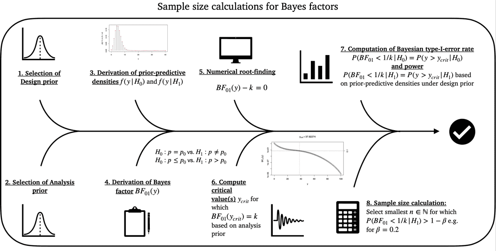
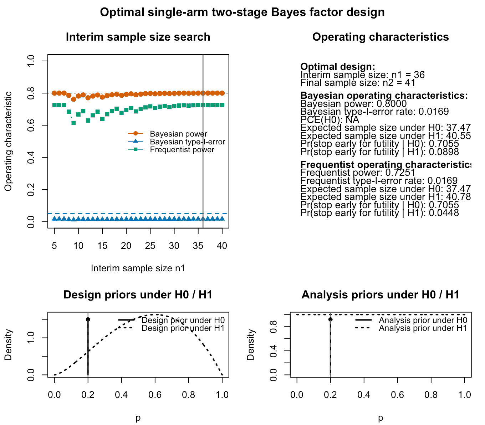
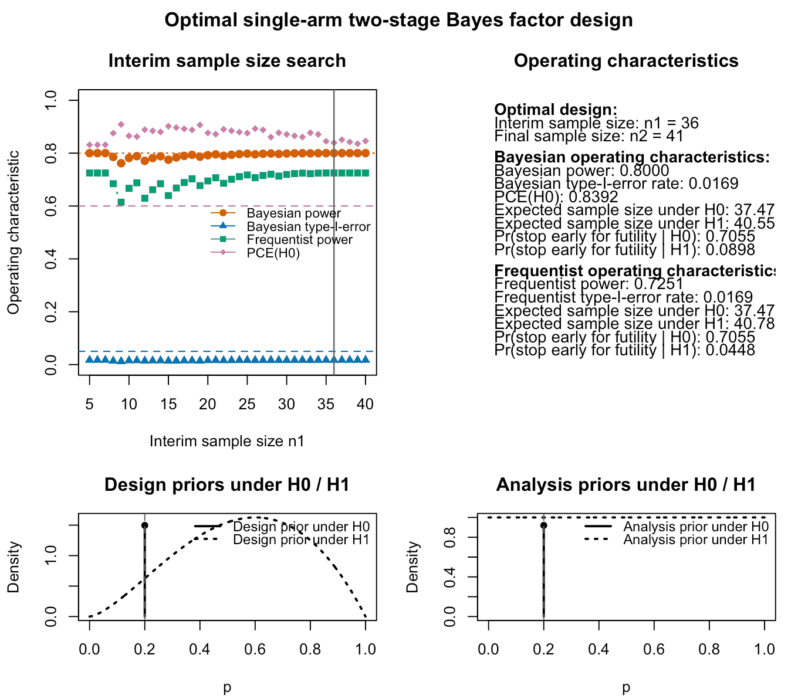
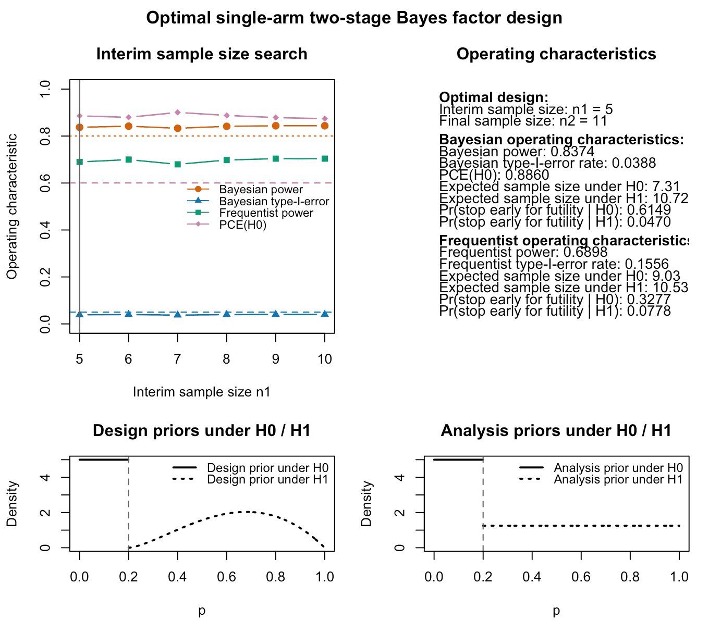

```{r setup, include = FALSE}
knitr::opts_chunk$set(
  collapse = TRUE,
  comment = "#>",
  fig.width  = 7,
  fig.height = 5,
  dpi        = 100,
  fig.retina = 1,
  dev        = "png",
  dev.args   = list(type = "cairo-png")
)

library(bfbin2arm)
```

## Introduction

This vignette illustrates how to work with optimal two-stage single-arm
Bayes factor designs for binomial phase II trials. The package provides
numerical tools for calibrating single-arm phase II designs that minimize the
expected sample size under the null hypothesis \(H_0\) while allowing early
stopping for futility.

In the single-arm setting considered here, the null hypothesis is

\[
H_0: p = p_0,
\]

where \(p\) denotes the response probability and \(p_0\) is the null response
rate. Evidence is quantified by the Bayes factor \(BF_{01}\), that is, evidence
in favour of \(H_0\) relative to \(H_1\).

The function `optimal_twostage_singlearm_bf()` calibrates a two-stage design
with one interim analysis for futility. Small values of \(BF_{01}\) indicate
evidence against \(H_0\), whereas large values indicate evidence in favour of
\(H_0\).

## Hypotheses and thresholds

The decision thresholds are:

- `k < 1` for efficacy, so that \(BF_{01} \le k\) indicates evidence against
  \(H_0\),
- `k_f > 1` for futility, so that \(BF_{01} \ge k_f\) indicates evidence in
  favour of \(H_0\).

Thus, the design allows early stopping for futility at the interim analysis if
the interim data already provide sufficiently strong evidence in favour of the
null hypothesis.

## Priors and calibration inputs

The function `optimal_twostage_singlearm_bf()` uses three conceptually distinct
types of inputs:

1. **Analysis prior**, used inside the Bayes factor.
2. **Bayesian design prior**, used for Bayesian operating characteristics.
3. **Frequentist point alternative**, used for strictly frequentist power
   calculations.

These play different roles and should not be confused.

### Analysis prior

The Bayes factor itself is computed using an analysis prior under \(H_1\). In
the notation of [@kelter_third_2025], this prior is

\[
p \mid H_1 \sim \mathrm{Beta}(a_a, b_a),
\]

and in the function interface these parameters are passed as `a` and `b`.

This prior determines how evidence is quantified at the interim and final
analyses. A common default choice is `a = 1` and `b = 1`, corresponding to a
uniform prior on \((0,1)\).

### Bayesian design prior

For Bayesian operating characteristics such as Bayesian power, Bayesian
type-I error, and the probability of compelling evidence under \(H_0\), the
design is calibrated under a **Bayesian design prior**. In the notation of the
preprint, this prior is

\[
p \mid H_1 \sim \mathrm{Beta}(a_d, b_d),
\]

and in the implementation these parameters are passed as `da` and `db`.

This prior is used only for planning and calibration. It reflects which
response probabilities are regarded as plausible under the alternative
hypothesis when Bayesian power is computed in a prior-predictive sense.

### Frequentist point alternative

In addition to the Bayesian design prior, the function also uses the parameter
`dp`. This parameter is **not** part of the Bayesian prior specification. It is
used solely for **frequentist power calculations** as a fixed point alternative.

More precisely, when power is evaluated in a strictly frequentist sense, the
response probability under the alternative is taken to be

\[
p = \texttt{dp}.
\]

Thus, `dp` defines the single point alternative at which frequentist power is
evaluated, whereas `da` and `db` define a full prior distribution under
\(H_1\) for Bayesian operating characteristics.

## Interpretation of Bayesian and frequentist power

Because the function supports both Bayesian and frequentist operating
characteristics, it is helpful to distinguish the two notions of power.

### Bayesian power

Bayesian power is computed under the design prior

\[
p \mid H_1 \sim \mathrm{Beta}(a_d, b_d),
\]

that is, by averaging over plausible response probabilities under the
alternative. It is therefore a prior-predictive probability of observing
sufficient evidence against \(H_0\).

### Frequentist power

Frequentist power is computed at the fixed point alternative

\[
p = \texttt{dp}.
\]

It is therefore the probability of crossing the efficacy boundary when the true
response probability is exactly `dp`.

## The function `design_singlearm_bf()`

The main calibration function is `design_singlearm_bf()`. The most
important arguments are:

- `n1_min`: minimal interim sample size.
- `n2_max`: maximal final sample size.
- `k`: efficacy threshold.
- `k_f`: futility threshold.
- `p0`: null response probability.
- `a0`, `b0`: analysis-prior parameters \((a_a,b_a)\) used inside the Bayes factor under $H_0$.
- `a1`, `b1`: analysis-prior parameters \((a_a,b_a)\) used inside the Bayes factor under $H_1$.
- `da0`, `db0`: Bayesian design-prior parameters \((a_d,b_d)\) used for
  Bayesian operating characteristics under $H_0$.
- `da1`, `db1`: Bayesian design-prior parameters \((a_d,b_d)\) used for
  Bayesian operating characteristics under $H_1$.
- `dp`: fixed response probability used as a point alternative for strictly
  frequentist power calculations.
- `type`: Bayes-factor type, currently `"point"` or `"direction"`.
- `target_power`: target Bayesian power.
- `target_type1`: target Bayesian type-I error.
- `target_ce_h0`: optional lower bound on the probability of compelling
   evidence under \(H_0\).
- `power_cushion`: optional additional margin used during fixed-sample
  calibration before introducing the interim analysis. Serves primarily    to allow the algorithm to find an optimal design.

The function returns an object of class `singlearm_bf_design` containing the
selected design, the corrected operating characteristics, and the search
results over candidate interim sample sizes.

## Overview of the calibration algorithm

```{r echo = FALSE, out.width = "90%", fig.align = "center", fig.cap = "Figure 1: Illustration of the calibration algorithm for an optimal Bayesian single-arm two-stage phase II design with a binary endpoint"}

```

The calibration algorithm in `optimal_twostage_singlearm_bf()` proceeds in two
steps.

1. **Fixed-sample calibration (step 1)**:
   A sufficient fixed-sample design size \(n_2\) is identified so that the
   requested operating characteristics are met at the fixed-sample level.

2. **Two-stage calibration (step 2)**:
   Conditional on this fixed-sample design, the function searches over all
   admissible interim sample sizes \(n_1 < n_2\), computes corrected two-stage
   operating characteristics, and selects the feasible design with smallest
   expected sample size under \(H_0\).

The admissible values of \(n_1\) start at `n1_min` and range up to `n2 - 1`.
Thus, the larger the sufficient fixed-sample size found in step 1, the more
candidate interim looks are evaluated in step 2.

## Interpretation of the corrected operating characteristics

The corrected operating characteristics differ from the corresponding
fixed-sample quantities because the two-stage design allows early stopping for
futility. Any data path that would have crossed the futility threshold at the
interim analysis is removed from the set of possible final outcomes.

As a consequence:

- corrected power is at most the naive fixed-sample power,
- corrected type-I error is at most the naive fixed-sample type-I error,
- corrected compelling evidence under \(H_0\) is at least the naive
  fixed-sample quantity.

These corrections are computed exactly from the prior-predictive distribution
and do not require Monte Carlo simulation.

At present, the lower-level helper `powerbinbf01seq()` allows an optional
separate threshold `k_ce` for compelling evidence in favour of \(H_0\), whereas
the higher-level search function `optimal_twostage_singlearm_bf()` exposes only
the futility threshold `k_f`. In the current implementation, whenever a
positive lower bound on compelling evidence under \(H_0\) is requested through
`target_ce_h0`, the function uses the same threshold for futility and
compelling evidence.

## Detailed example: Nonsmall cell lung cancer phase II trial

We consider a single-arm phase II trial with null response probability
\(p_0 = 0.2\) in the context of nonsmall cell lung cancer, for details see
[@kelter_third_2025]. Evidence is quantified through the Bayes factor
\(BF_{01}\), with a small threshold \(k < 1\) for efficacy and a large
threshold \(k_f > 1\) for futility. Thus, we first use the two-sided test of $H_0:p_1=p_2$ versus $H_1:p_1 \neq p_2$.

In the example below, the design is calibrated with:

- null response rate \(p_0 = 0.2\),
- efficacy threshold \(k = 1/3\),
- futility threshold \(k_f = 3\),
- target type-I error 0.05,
- target power 0.80.

The Bayesian design prior under \(H_1\) is specified by `da = 2` and `db = 2.5`, so the design prior mean is $2.5/(2.5+3)=0.4545455$ and we expect a success probability of about $45\%$.
In addition, the strictly frequentist power is evaluated at the point
alternative `dp = 0.4`, so that frequentist power refers to a true response
probability of \(p = 0.4\).

### Optimal design search

The following code searches for an optimal two-stage single-arm Bayes factor
design and returns an object of class `singlearm_bf_design`.

```{r}
res <- design_singlearm_bf(
  n1_min = 5,
  n2_max = 200,
  k = 1/3,
  k_f = 3,
  p0 = 0.2,
  a0 = 1,
  b0 = 1,
  a1 = 1,
  b1 = 1,
  dp = 0.4,
  da0 = 1,
  db0 = 1,
  da1 = 2.5,
  db1 = 2,
  type = "point",
  calibration = "Bayesian",
  target_power = 0.80,
  target_type1 = 0.05
)
```

The returned object stores the selected design, its operating characteristics,
and the search results over admissible interim sample sizes.

### Printing and summarizing the result

The design object has dedicated `print()` and `summary()` methods.

```{r}
summary(res)
```

The output reports the selected interim and final sample sizes as well
as the main operating characteristics. Also, the type of test, in this case the two-sided one, and the status is reported. The latter indicates whether an optimal feasible two-stage design could be found based on the constraints specified by the user. These include the design and analysis priors, the evidence thresholds `k` and `k_f` for efficacy and futility, the minimum and maximum sample sizes `n1_min` and `n2_max`, and the required power and type-I-error targets `target_power` and `target_type1`.

The results indicate that the optimal single-arm two-stage design is fully calibrated from a Bayesian point of view: It achieves the required 80% Bayesian power and less than 5% Bayesian type-I-error. From a frequentist perspective, the type-I-error is also calibrated with $0.0169<0.05$, but the power does not suffice: The frequentist power, calculated under the point alternative $p_1=0.4$, specified via the parameter `dp = 0.4`, achieves a power of $0.7251$, which is less than the desired 80%. Also, we can see the expected sample sizes under $H_0$ and $H_1$ for the optimal design both from a Bayesian and frequentist perspective. These differ, because the expected sample size under $H_1$ is computed as an average over the design prior for the Bayesian expected sample size, while for the frequentist one it is computed under the point-prior at `dp = 0.4`. Under the null hypothesis $H_0:p=p_0$, the design prior is a point mass at $p_0=0.2$ in this case, and therefore the Bayesian expected sample size under $H_0$ is the expected sample size at the probability $p_0=0.2$. The frequentist expected sample size under $H_0:p=p_0$ for $p_0=0.2$ also is the expected sample size at the probability $p_0=0.2$. Thus, the two values coincide here with an expected sample size of $37.47$ patients in the optimal trial design.

### Accessing and plotting the results

We can access the output of the calibration algorithm via the object `res$search_results`. Printing them as a table, for example, is possible as follows:

```{r, eval = FALSE}
if (!is.null(res$search_results) && nrow(res$search_results) > 0) {
  knitr::kable(res$search_results)
} else {
  cat("No search results are available for this fit.\n")
}
```
The design object also has a `plot()` method. It visualizes the search results
over the candidate interim sample sizes and overlays the target constraints for
power, type-I error, and, if requested, compelling evidence under \(H_0\).

```{r, eval = FALSE}
plot(res)
```
```{r echo = FALSE, out.width = "100%", fig.align = "center", fig.cap = "Figure 2: Output of the plot function for a calibrated optimal single-arm two-stage design using Bayes factors. The top left panel shows Bayesian and frequentist power, Bayesian type-I-error and probability of compelling evidence (if specified) for varying interim sample sizes. The top right panel provides information about the optimal design found by the algorithm and its Bayesian and frequentist operating characteristics. The lower left and right panels visualize the analysis and design priors under the null and alternative hypothesis. Under the null hypothesis $H_0:p=p_0$, the design and analysis priors are point masses at the specified null probability `p0`."}

```

This plot is useful for understanding the trade-off induced by the interim
analysis. In particular, it shows how power, type-I error, and compelling
evidence under \(H_0\) vary with the interim sample size \(n_1\), while the
vertical reference line marks the selected optimal design.

Several points become apparent when inspecting the results above:

- The optimal design is the one which introduces an interim analysis after 36 patients have been recruited and their outcomes are observed.
- This optimal design conducts the final analysis after 41 patients, and the expected sample size under the null hypothesis $H_0$ is $37.47$.
- The Bayesian power is $0.80$, while the frequentist power calculated under the point prior at $p_1=0.4$ is $0.7251$. Thus, the design is not fully calibrated in terms of frequentist power. The Bayesian power is calculated under the design prior shown in the bottom left panel, which averages the resulting power values under the different prior probabilities under the design prior. Note that it is currently not possible to calibrate the design both in terms of frequentist and Bayesian constraints on power and type-I-error. The frequentist operating characteristics are solely computed post-hoc, after the design is calibrated in terms of Bayesian power, type-I-error, and, if specified, probability of compelling evidence. An extension of the algorithm and existing methodology might add this feature in the future.
- The design prior is slightly optimistic about the treatment effect, as we specified `da = 2.5` and `db = 2` when calling the function. Thus, our prior assumptions can be interpreted as follows: We pretend as if we have already observed 2.5 successes and 2 failures for this drug / treatment. However, all of these assumptions are only influencing the resulting operating characteristics of the single-arm two-stage design via the **design priors**, and any analysis eventually carried out during the trial (interim analysis or final analysis) makes use of the **analysis priors**. These are shown in the bottom panels, too, and are flat under $H_1$. Under $H_0$, for the two-sided test both the design and analysis priors become point masses at the null parameter $p_0=0.2$.
- Lastly, the frequentist type-I-error is reported as $0.0169$, which here coincides with the Bayesian type-I-error. In general, these differ as the frequentist type-I-error is more conservative and a worst-case calculation. In the setting of the two-sided test of $H_0:p=p_0$ against $H_1:p \neq p_0$, however, the Bayesian type-I-error is calculated like the frequentist type-I-error under a single parameter value and thus both type-I-errors (Bayesian and frequentist) coincide, because

$$\sup_{p \in H_0}[Pr(BF_{01}(y)<k|p)]=\sup_{p = p_0}[Pr(BF_{01}(y)<k|p)]=Pr(BF_{01}(y)<k|p=p_0)$$

where the right-hand side of the above display is precisely the frequentist type-I-error under $H_0:p=p_0$. For directional tests such as $H_0:p\leq p_0$ against $H_1:p>p_0$, however, these should, in general, differ substantially. In those cases, the frequentist type-I-error is the supremum 

$$\sup_{p \in H_0}[Pr(BF_{01}(y)<k|p)]=\sup_{p\leq p_0}[Pr(BF_{01}(y)<k|p)]$$ 

while the Bayesian type-I-error is the design prior averaged probability

$$\int_{p \leq p_0}Pr(BF_{01}(y)<k|p)\pi(p)dp$$

where $\pi(p)$ denotes the design prior truncated to the parameter space of $H_0:p\leq p_0$. We turn to such an example demonstrating this phenomenon later in this vignette.

### Inspecting the result object

The selected design and operating characteristics can also be extracted
programmatically.

```{r}
res$design
```
The full operating characteristics can be accessed as follows (not shown here to avoid cluttered output):
```{r, eval = FALSE}
res$operating_characteristics
```

Likewise, if available, the full search table can be inspected as follows (also not shown here to avoid cluttered output):

```{r, eval = FALSE}
if (!is.null(res$search_results) && nrow(res$search_results) > 0) {
  utils::head(res$search_results)
} else {
  cat("No search table is available.\n")
}
```

This is useful when comparing several candidate designs or when checking why a
particular interim sample size was selected.

## Example with a constraint on compelling evidence for the null hypothesis

A compelling-evidence constraint under \(H_0\) can be added during calibration.
In that case, only designs with sufficiently large corrected probability of
compelling evidence under \(H_0\) are regarded as feasible. This implies, that when $H_0$ holds, we can assert a minimum probability to stop the trial early for futility. That minimum probability can be specified in advance of the trial during the planning stage, and formally, the trial design must then satisfy the condition

$$Pr(BF_{01}>k_f|H_0)>f$$

for some futility probability threshold $f\in (0,1)$.

As above, `da = 2.5` and `db = 2` specify the slightly optimistic Bayesian design prior, whereas
`dp = 0.4` specifies the point alternative used for frequentist power
evaluation. We specify the parameter `target_ce_h0 = 0.6` to add the requirement of 60% probability of compelling evidence for $H_0$ to our trial design:
```{r}
res_ce <- design_singlearm_bf(
  n1_min = 5,
  n2_max = 200,
  k = 1/3,
  k_f = 3,
  p0 = 0.2,
  a0 = 1,
  b0 = 1,
  a1 = 1,
  b1 = 1,
  dp = 0.4,
  da0 = 1,
  db0 = 1,
  da1 = 2.5,
  db1 = 2,
  type = "point",
  calibration = "Bayesian",
  target_power = 0.80,
  target_type1 = 0.05,
  target_ce_h0 = 0.60
)
```
We inspect the results of the calibration algorithm:
```{r}
summary(res_ce)
```
The design now requires $n_1=36$ and $n_2=41$ patients. Also, the operating characteristics like the expected sample sizes under $H_0$ and $H_1$ have changed. Of course, the probability of compelling evidence for $H_0$ now also is at least the specified 60%. In this case, it even is $0.8392$, which is much larger. The reason is that the calibration algorithm picks a two-stage design which minimizes the expected sample size under $H_0$, and if, by chance, this design has a very large probability of compelling evidence for the null hypothesis, a situation like this one can arise. Also, note that both criteria go hand in hand: If the probability of compelling evidence for $H_0$ is large, this implies that when $H_0$ holds, the trial often stops for futility. This in turn decreases the expected sample size under $H_0$, which is the criterion used to isolate the optimal Bayesian design. 

We can plot the resulting design with the probability of compelling evidence constraint now also shown in the upper left panel:
```{r, eval = FALSE}
plot(res_ce)
```

```{r echo = FALSE, out.width = "100%", fig.align = "center", fig.cap = "Figure 3: Output of the plot function for a calibrated optimal single-arm two-stage design using Bayes factors. In addition to the previous calibration requirements in terms of power and type-I-error rate, this design also adds a constraint on the probability of compelling evidence in favour of the null hypothesis $H_0$. The top left panel again shows Bayesian and frequentist power, Bayesian type-I-error and probability of compelling evidence (if specified) for varying interim sample sizes. The top right panel provides information about the optimal design found by the algorithm and its Bayesian and frequentist operating characteristics. The lower left and right panels visualize the analysis and design priors under the null and alternative hypothesis. Under the null hypothesis $H_0:p=p_0$, the design and analysis priors are point masses at the specified null probability `p0`."}

```
The upper left panel in Figure 3 shows that now the probability of compelling evidence (PCE) constraint for $H_0$ is also visible in the plot for different interim sample sizes. The horizontal dashed line at $y=0.60$ shows that essentially all two-stage designs satisfy our target constraint
$$Pr(BF_{01}>k_f|H_0)>0.60$$

## Example with a directional test

The previous two examples used the point-null Bayes factor through
`type = "point"`. In most applications, however, the clinically relevant
question is directional, namely whether the response probability exceeds the
null benchmark \(p_0\).

This directional setting corresponds to testing

\[
H_0: p \le p_0
\quad \text{against} \quad
H_1: p > p_0,
\]

with \(p_0 = 0.2\), as considered in [@kelter_third_2025] and [@kelter_two_stage_2025]. In the implementation, this
is obtained by setting `type = "direction"`.

As before, `da = 2.5` and `db = 2` specify the slightly informative Bayesian design prior, whereas
`dp = 0.4` specifies the point alternative used for frequentist power
evaluation. For now, we keep our target constraint of 60% on the probability of compelling evidence for the null hypothesis $H_0$ when calibrating the design.

```{r}
res_dir <- design_singlearm_bf(
  n1_min = 5,
  n2_max = 200,
  k = 1/3,
  k_f = 3,
  p0 = 0.2,
  a0 = 1,
  b0 = 1,
  a1 = 1,
  b1 = 1,
  dp = 0.4,
  da0 = 1,
  db0 = 1,
  da1 = 2.5,
  db1 = 2,
  type = "direction",
  calibration = "Bayesian",
  target_ce_h0 = 0.60,
  target_power = 0.80,
  target_type1 = 0.05
)
```

```{r}
summary(res_dir)
```

```{r, eval = FALSE}
plot(res_dir)
```

```{r echo = FALSE, out.width = "100%", fig.align = "center", fig.cap = "Figure 4: Output of the plot function for a calibrated optimal single-arm two-stage design using Bayes factors in the directional test setting. The top left panel again shows Bayesian and frequentist power, Bayesian type-I-error and probability of compelling evidence (if specified) for varying interim sample sizes. The top right panel provides information about the optimal design found by the algorithm and its Bayesian and frequentist operating characteristics. The lower left and right panels visualize the analysis and design priors under the null and alternative hypothesis. Under the null hypothesis $H_0:p=p_0$, the design and analysis priors are point masses at the specified null probability `p0`."}

```
This example illustrates how the optimal design and its operating
characteristics may change when the evidential assessment is based on a
directional alternative rather than a two-sided point-null comparison. Now, we could sharpen the requirement on the probability of compelling evidence from 60% to 80% again to see how the resulting optimal design and its operating characteristics change:

```{r}
res_dir_ce <- design_singlearm_bf(
  n1_min = 5,
  n2_max = 200,
  k = 1/3,
  k_f = 3,
  p0 = 0.2,
  a0 = 1,
  b0 = 1,
  a1 = 1,
  b1 = 1,
  dp = 0.4,
  da0 = 1,
  db0 = 1,
  da1 = 2.5,
  db1 = 2,
  type = "direction",
  calibration = "Bayesian",
  target_ce_h0 = 0.80,
  target_power = 0.80,
  target_type1 = 0.05
)
```

```{r}
summary(res_dir_ce)
```
The results indicate that the calibration failed. This is not a deficiency of the algorithm but our constraints are simply too demanding under our design prior assumptions. What is happening here is:

- There is substantial prior mass very close to the null boundary $p_0=0.2$, where the Bayes factor often stays in the indecisive range even for large $n$.
- Under many such near‑boundary values, the Bayes factor distribution is relatively wide; a nontrivial fraction of trajectories still end up with $BF_{01}<k_f=3$ even after 300 patients. Only for the parameter values very close to $p=0$, one will end up with trajectories yielding $BF_{01}\geq k_f=3$.

As a consequence, instead of letting the maximum sample size grow to unrealistically large values for a conductable phase II trial, it is more helpful to investigate how large the probability of compelling evidence for $H_0$ can become under the design and analysis prior choices and the selected evidence thresholds $k$ and $k_f$:

```{r, out.width = "75%", fig.align = "center", fig.cap = "Figure 5: Relationship between the probability of compelling evidence PCE(H0) and the fixed-sample size for the selected design and analysis priors and evidence thresholds in the directional test example."}
fixed_diag_full <- function(n) {
  tmp <- bfbin2arm:::singlearm_fixed_oc(
    n    = n,
    k    = 1/3,
    p0   = 0.2,
    a0   = 1, b0 = 1,
    a1   = 1, b1 = 1,
    da0  = 1, db0 = 1,
    da1  = 2.5, db1 = 2,
    dp   = 0.4,
    type = "direction",
    k_ce = 3
  )
  c(
    n          = n,
    pfineff    = tmp$pfineff,
    pfineff0   = tmp$pfineff0,
    pce0_corr  = tmp$pce0_corr,
    ok         =
      !is.na(tmp$pfineff)  &&
      !is.na(tmp$pfineff0) &&
      !is.na(tmp$pce0_corr) &&
      tmp$pfineff  >= (0.80 + 0.025) &&
      tmp$pfineff0 <= 0.05           &&
      tmp$pce0_corr >= 0.80
  )
}

n_full <- 6:200
fd_full <- t(vapply(n_full, fixed_diag_full, numeric(5)))
colnames(fd_full) <- c("n","pfineff","pfineff0","pce0_corr","ok")

plot(fd_full[, "n"], fd_full[, "pfineff"],
     type = "l", lwd = 2, col = "darkorange",
     ylim = c(0, 1),
     xlab = "n", ylab = "Value",
     main = "Fixed-sample directional OC vs n")

lines(fd_full[, "n"], fd_full[, "pfineff0"], lwd = 2, col = "steelblue")
lines(fd_full[, "n"], fd_full[, "pce0_corr"], lwd = 2, col = "darkmagenta")

abline(h = 0.80 + 0.025, lty = 2, col = "darkorange")   # target power + cushion
abline(h = 0.05,           lty = 2, col = "steelblue")   # target type-I
abline(h = 0.80,           lty = 2, col = "darkmagenta") # target CE(H0)

legend("bottomright",
       legend = c("Bayesian power", "Bayesian type-I", "CE(H0)"),
       col = c("darkorange", "steelblue", "darkmagenta"),
       lwd = 2, bty = "n")
```
We see that given our design and analysis prior choices as well as our evidence threshold choices, we cannot find a sample size for which the probability of compelling evidence achieves more than a little more than 60% in our sample size range. Possible solutions if we need a larger probability of compelling evidence include:

- Using a less stringent threshold $k_f$ to stop for futility. This makes it simpler to accumulate evidence in favour of the null hypothesis for fixed sample sizes.
- Changing the design priors under $H_0$ and $H_1$, so $H_0$ and $H_1$ become more separated by the form of the design priors. However, the design priors should still reflect a realistic assumption we make about the efficacy of the treatment before conducting the trial. Thus, simply selecting strongly separated design priors under $H_0$ and $H_1$ to achieve a calibrated design is not recommended.

More generally, the example illustrates that the triple of constraints on Bayesian power, Bayesian type‑I error, and the probability of compelling evidence under $H_0$ may simply be infeasible for a given combination of design priors and Bayes‑factor thresholds, even at large sample sizes. Before fixing strict targets, it is therefore advisable to first explore the attainable region of operating characteristics across a grid of fixed‑sample designs and only then select targets that lie inside this feasible region. This aligns with the philosophy of Bayes factor design analysis in the binomial setting.

## Summary

This vignette presents a simulation-free methodology for optimal two-stage
single-arm phase II trial designs with a binary endpoint based on Bayes
factors. The design considers a null hypothesis \(H_0: p \le p_0\) and a
directional alternative \(H_1: p > p_0\), with evidence quantified by the
Bayes factor \(BF_{01}\) in favour of \(H_0\). Small values of \(BF_{01}\)
indicate evidence against \(H_0\), whereas large values indicate evidence
in favour of \(H_0\).

Two thresholds govern the decision rule: an efficacy threshold \(k > 1\),
so that \(BF_{01} \le 1/k\) implies evidence against \(H_0\), and a
futility threshold \(k_f > 1\), so that \(BF_{01} \ge k_f\) implies
evidence in favour of \(H_0\). The design allows a single interim look at
sample size \(n_1\) with the option to stop early for futility if
\(BF_{01} \ge k_f\), and a final analysis at \(n_2\).

A key feature of the implementation is that all operating characteristics
are computed exactly from prior-predictive distributions, without Monte
Carlo simulation. The method distinguishes three types of inputs:

(1) an analysis prior under \(H_1\), used inside the Bayes factor
(2) Bayesian design priors under \(H_0\) and \(H_1\), used for prior-predictive (Bayesian) power type-I error, and the probability of
compelling evidence under \(H_0\); and 
(3) an optional frequentist point
alternative \(dp\), used solely to evaluate frequentist power and related
quantities. For directional tests, the design and analysis priors are
implemented as truncated beta distributions on the relevant parameter
spaces.

The calibration algorithm proceeds in two steps. First, a fixed-sample
design is found by increasing \(n_2\) until the requested Bayesian
constraints on power, type-I error, and, optionally, the probability of
compelling evidence under \(H_0\) are satisfied. Second, conditional on
this fixed-sample design, the method searches over admissible interim
sample sizes \(n_1\) and computes corrected two-stage operating
characteristics that account exactly for early stopping for futility.
Among all two-stage designs that respect the requested constraints, the
algorithm selects the one that minimizes the expected sample size under
\(H_0\).

The resulting `singlearm_bf_design` object provides both Bayesian and
frequentist operating characteristics. Bayesian quantities, such as
power and type-I error, are defined with respect to the design priors,
whereas frequentist power is computed at the fixed point alternative \(dp\).
The vignette illustrates how to print, summarize, and visualize design
objects, including the trade-off between operating characteristics and
interim sample size and the roles of the design and analysis priors.
Examples show that certain combinations of priors, thresholds, and target
constraints (for example, very high probability of compelling evidence
under \(H_0\) together with strict type-I error and high power) may be
infeasible even at fairly large sample sizes. In such cases, it is
recommended to explore the attainable region of operating characteristics
first and to choose targets and priors that are both scientifically
plausible and jointly achievable.

## References