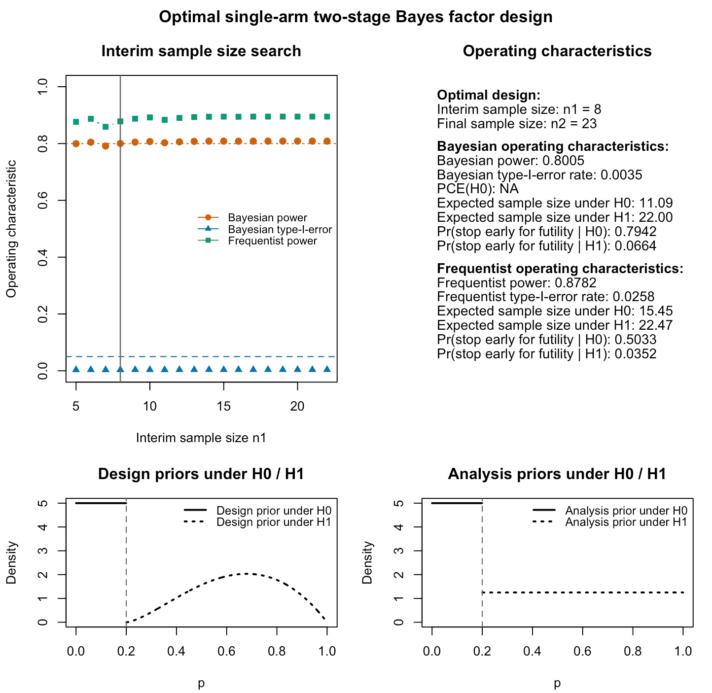

```{r setup, include = FALSE}
knitr::opts_chunk$set(
  collapse = TRUE,
  comment = "#>",
  fig.width  = 7,
  fig.height = 5,
  dpi        = 100,
  fig.retina = 1,
  dev        = "png",
  dev.args   = list(type = "cairo-png"),
  warning = FALSE,
  message = FALSE
)

library(bfbin2arm)
```

## Introduction: Hybrid and full calibration

In a Bayes-factor based design, decision rules are specified through evidence
thresholds for the Bayes factor $BF_{01}$ comparing a null hypothesis $H_0$
to an alternative $H_1$. Calibration refers to how these thresholds and the
sample sizes are chosen so that the resulting design has prespecified operating
characteristics such as type‑I error and power [@Grieve2022].

### Bayesian calibration

A **fully Bayesian calibration** chooses the design by controlling Bayesian
notions of type‑I error and power under explicit design priors on the response
probability. Both the false positive rate under $H_0$ and the power under
$H_1$ are defined as prior‑predictive probabilities with respect to these
priors. This approach has been developed for Bayes factors in binomial one- and
two‑arm settings, where closed‑form expressions and numerical integration can be
used to obtain sample sizes that satisfy Bayesian power and type‑I error targets
without Monte Carlo simulation, see [@kelter_third_2025], [@kelter_two_stage_2025] and [@kelter_power_2026]. These
methods provide a Bayesian analogue of classical power analysis for Bayes
factors and form the basis of the one‑stage calibration routines in this
package.

### Hybrid Bayes-frequentist calibration

At the same time, there is a long‑standing interest in **hybrid Bayes–frequentist designs** that use Bayesian test statistics or posterior quantities
but demand that certain frequentist operating characteristics are controlled [@grieveIdleThoughtsWellcalibrated2016].
Examples include hybrid designs in oncology trials [@lopez-reyUseBayesianApproaches2025] and general discussions about which metric to calibrate [@arjasControlTypeError2026] (see also [@Ryan2020]) in a Bayesian trial design. For a systematic review about Bayesian sample size approaches in clinical trials see [@marksSystematicReviewSample2026], who found that the most common method for sample size determination in Bayesian RCTs was a hybrid approach (58% out of 164 clinical trials which explicitly used a Bayesian trial design). Other examples include hybrid predictive
monitoring schemes for multi‑arm trials [@shiControlTypeError2019], see also [@MuehlemannEtAl2023].

Related ideas also appear in the literature on **calibrated Bayes factors**,
which seek Bayes factors whose behavior is aligned with frequentist error
control or prior‑predictive performance. This includes multiplicity‑calibrated
Bayesian hypothesis tests [@guoMultiplicitycalibratedBayesianHypothesis2010], see also [@macridemartinoElicitingPriorInformation2025].

### Current implementation

Against this backdrop, the **hybrid** and **full** calibration modes in
\{bfbin2arm\} implement Bayes–frequentist compromise designs for Bayes factors
in single‑ and two‑arm phase II trials with binary endpoints [@kelter_third_2025; @kelter_two_stage_2025; @kelter_power_2026]. In hybrid calibration, power is defined in a
Bayesian prior‑predictive sense under a design prior for $H_1$, while type‑I
error is controlled in a frequentist sense at the null boundary $p_0$. In
full calibration, both Bayesian and frequentist error metrics are constrained
simultaneously: Bayesian power and Bayesian type‑I error under the design
priors, and frequentist power and type‑I error at fixed parameter values. This
yields Bayes-factor based designs that satisfy both sets of constraints and
make explicit the trade‑offs between Bayesian and frequentist notions of error
control in phase II trial design.

## Full Bayesian and frequentist calibration

Full calibration enforces both Bayesian and frequentist constraints
simultaneously for a single-arm two-stage design based on the Bayes factor
$BF_{01}$.

In this mode, the design must satisfy:

- Bayesian power and Bayesian type-I error targets under specified design
  priors for $H_1$ and $H_0$,
- frequentist power and frequentist type-I error targets at a fixed point
  alternative $dp$ and at $p = p_0$.

This yields designs that simultaneously meet Bayesian planning criteria and
frequentist calibration requirements.

Full calibration is requested via

```r
calibration = "full"
```

in `design_singlearm_bf()`. In this mode, feasibility requires:

- Bayesian power (prior-predictive under $H_1$) to be at least
  `target_power`,
- Bayesian type-I error (averaged under $H_0$) to be at most
  `target_type1`,
- frequentist power at $p = dp$ to be at least `target_freq_power`,
- frequentist type-I error at $p = p_0$ to be at most `target_freq_type1`.

The optional `target_ce_h0` can also be used to impose a lower bound on the
Bayesian probability of compelling evidence in favour of $H_0$, computed
under the $H_0$ design prior.

## Overview of the different calibration modes

The following table shows the different calibration modes available and the use of the `power_cushion` parameter when calibrating the optimal single-arm two-stage design:
```{r, echo = FALSE}
library(knitr)
library(kableExtra)

br_at_semicolon <- function(x) {
  gsub(";\\s*", ";<br>", x)
}

power_cushion_tbl <- data.frame(
  Mode = c("Bayesian", "frequentist", "hybrid", "full"),
  Anchor = c(
    "Bayesian power >= target_power + power_cushion; Bayesian type-I <= target_type1; optional CE for H0 >= target_ce_h0",
    "Frequentist power >= target_freq_power + power_cushion; frequentist type-I <= target_freq_type1",
    "Bayesian power >= target_power + power_cushion; frequentist type-I <= target_freq_type1",
    "Bayesian power >= target_power + power_cushion; Bayesian type-I <= target_type1; frequentist power >= target_freq_power + power_cushion; frequentist type-I <= target_freq_type1; optional CE for H0 >= target_ce_h0"
  ),
  `Step 2` = c(
    "Bayesian power >= target_power; Bayesian type-I <= target_type1; optional CE for H0 >= target_ce_h0",
    "Frequentist power >= target_freq_power; frequentist type-I <= target_freq_type1",
    "Bayesian power >= target_power; frequentist type-I <= target_freq_type1",
    "Bayesian power >= target_power; Bayesian type-I <= target_type1; frequentist power >= target_freq_power; frequentist type-I <= target_freq_type1; optional CE for H0 >= target_ce_h0"
  ),
  Explanation = c(
    "The anchor is a fixed-sample design that slightly overshoots the target Bayesian power to allow for the power loss that may occur once an interim futility analysis is introduced. In step 2, the actual two-stage design only needs to satisfy the original corrected Bayesian targets.",
    "The anchor is a fixed-sample design with cushioned frequentist power at the fixed alternative dp, so that after introducing the interim analysis the resulting two-stage design still has a realistic chance of achieving the original frequentist power target. No Bayesian constraints are imposed in this mode.",
    "Hybrid calibration combines a Bayesian power requirement with a frequentist type-I requirement, but it does not constrain frequentist power. Therefore, only the Bayesian power target is cushioned in step 1; in step 2, the selected two-stage design must meet the original Bayesian power target and the frequentist type-I constraint.",
    "Full calibration enforces both Bayesian and frequentist criteria. The anchor therefore has to overshoot both power targets, so that after adding interim futility the two-stage design can still satisfy the original Bayesian and frequentist constraints."
  ),
  check.names = FALSE
)

power_cushion_tbl$Anchor <- br_at_semicolon(power_cushion_tbl$Anchor)
power_cushion_tbl$`Step 2` <- br_at_semicolon(power_cushion_tbl$`Step 2`)

kbl(
  power_cushion_tbl,
  align = "l",
  escape = FALSE,
  caption = "Use of power_cushion in the fixed-sample anchor step across calibration modes."
) %>%
  kable_styling(
    bootstrap_options = c("striped", "condensed"),
    full_width = TRUE,
    font_size = 12,
    position = "left"
  ) %>%
  column_spec(1, width = "8%") %>%
  column_spec(2, width = "24%") %>%
  column_spec(3, width = "20%") %>%
  column_spec(4, width = "48%") %>%
  scroll_box(width = "100%")
```
The first step of the calibration algorithm for an optimal single-arm two-stage design therefore always consists in finding a sufficiently large anchor sample size in the first step. Therefore, the relevant power (frequentist or Bayesian) must exceed the target constraint plus the power cushion specified as input. For Bayesian and full calibration, the probability of compelling evidence (CE) must optionally also be sufficiently large when searching the anchor sample size.

Based on this anchor sample size, step 2 of the algorithm consists in computing the corrected operating characteristics for the two-stage designs which are available based on the user input. The latter includes, in particular, the minimum and maximum sample sizes `n1_min` and `n2_max`, which limit the number of available single-arm two-stage designs to analyze regarding optimality.

## Full calibration example

We first construct a fully calibrated design with moderate targets:

```{r}
res_full <- design_singlearm_bf(
  n1_min = 5,
  n2_max = 100,
  k      = 1/10,
  k_f    = 3,
  p0     = 0.2,
  a0     = 1,
  b0     = 1,
  a1     = 1,
  b1     = 1,
  dp     = 0.5,
  da0    = 1,
  db0    = 1,
  da1    = 2.5,
  db1    = 2,
  type   = "direction",
  calibration       = "full",
  target_power      = 0.80,
  target_type1      = 0.05,
  target_freq_power = 0.80,
  target_freq_type1 = 0.1,
  power_cushion = 0.025
)
```
Note that we specified a power cushion via the parameter `power_cushion = 0.025`. Otherwise, it might be impossible to find an optimal design, for details on the underlying methodology see also the vignette on hybrid calibration and the discussion section in [@kelter_two_stage_2025]. We inspect the results produced by the calibration algorithm:
```{r}
summary(res_full)
```

The summary reports:

- the selected interim and final sample sizes (`n1`, `n2`),
- Bayesian operating characteristics: power, type-I error, expected sample
  sizes, and (optionally) compelling evidence under $H_0$,
- frequentist operating characteristics: power and type-I error at $dp$ and
  $p_0$, expected sample sizes under $H_0$ and $H_1$.

A diagnostic plot illustrates how the search over interim sample sizes
balances these constraints:

```{r, eval = FALSE}
if (isTRUE(res_full$feasible)) {
  plot(res_full)
}
```

```{r fig.align = "center", echo = FALSE, out.width = "100%", fig.cap = "Figure 1: Output of the plot function for an optimal fully calibrated single-arm two-stage design using Bayes factors. The top left panel shows Bayesian and frequentist power, Bayesian type-I-error for varying interim sample sizes. The top right panel provides information about the optimal frequentist design found by the algorithm and its Bayesian and frequentist operating characteristics. The lower left and right panels visualize the analysis and design priors under the null and alternative hypothesis. For the frequentist operating characteristics, these are irrelevant. They influence only the Bayesian operating characteristics."}

```

## Why the design is selected

In this example, several two-stage designs satisfy the full calibration
constraints. In particular, both the designs with $n_1 = 6$ and $n_1 = 8$
meet the required Bayesian and frequentist power and type-I error thresholds.
Thus, the choice of the final design is not driven by feasibility alone, but by
the optimization criterion used after feasibility has been established.

In the current implementation, the **optimal fully calibrated design** is
defined as the feasible design that minimizes the **Bayesian expected sample
size under $H_0$**. That is, among all designs satisfying the Bayesian and
frequentist operating-characteristic constraints, the selected design is the one
with the smallest value of `en_h0`.

For the present example, the design with $n_1 = 6$ is fully calibrated, but
its Bayesian expected sample size under $H_0$ is

\[
\operatorname{EN}_{H_0}^{\mathrm{Bayes}} = 13.40.
\]

The design with $n_1 = 8$ is also fully calibrated, but has the smaller value

\[
\operatorname{EN}_{H_0}^{\mathrm{Bayes}} = 11.09.
\]

Because $11.09 < 13.40$, the design with $n_1 = 8$ is preferred and is
therefore returned as the optimal fully calibrated design (see also the upper right panel in Figure 1 which reports that expected sample size of the optimal design).

This behavior reflects the current philosophy of the package: calibration
constraints determine which designs are admissible, and among these admissible
designs the optimization is performed with respect to the Bayesian expected
sample size under $H_0$. Intuitively, this favors designs that stop early
more efficiently when the null hypothesis is true, while still maintaining the
required Bayesian and frequentist error control.

Possible future extensions could allow the optimization criterion to be changed.
For example, one might instead minimize the **frequentist** expected sample size
under $H_0$, or define a compromise criterion based on a weighted average of
the Bayesian and frequentist expected sample sizes under $H_0$, such as

\[
w \cdot \operatorname{EN}_{H_0}^{\mathrm{Bayes}}
+
(1-w) \cdot \operatorname{EN}_{H_0}^{\mathrm{Freq}},
\qquad 0 \le w \le 1.
\]

Such extensions would make it possible to tailor the notion of optimality more
closely to the user’s preferred balance between Bayesian and frequentist design
perspectives.


## Comparison of calibration modes

It is often instructive to compare the designs obtained under different
calibration modes with identical thresholds and priors.

```{r}
res_bayes <- design_singlearm_bf(
  n1_min = 5,
  n2_max = 100,
  k      = 1/10,
  k_f    = 3,
  p0     = 0.2,
  a0     = 1,
  b0     = 1,
  a1     = 1,
  b1     = 1,
  dp     = 0.5,
  da0    = 1,
  db0    = 1,
  da1    = 2.5,
  db1    = 2,
  type   = "direction",
  calibration       = "Bayesian",
  target_power      = 0.80,
  target_type1      = 0.05,
  target_freq_power = 0.80,
  target_freq_type1 = 0.05,
  power_cushion = 0.025
)

res_freq <- design_singlearm_bf(
  n1_min = 5,
  n2_max = 100,
  k      = 1/10,
  k_f    = 3,
  p0     = 0.2,
  a0     = 1,
  b0     = 1,
  a1     = 1,
  b1     = 1,
  dp     = 0.5,
  da0    = 1,
  db0    = 1,
  da1    = 2.5,
  db1    = 2,
  type   = "direction",
  calibration       = "frequentist",
  target_power      = 0.80,
  target_type1      = 0.05,
  target_freq_power = 0.80,
  target_freq_type1 = 0.05,
  power_cushion = 0.025
)

res_hybrid <- design_singlearm_bf(
  n1_min = 5,
  n2_max = 100,
  k      = 1/10,
  k_f    = 3,
  p0     = 0.2,
  a0     = 1,
  b0     = 1,
  a1     = 1,
  b1     = 1,
  dp     = 0.5,
  da0    = 1,
  db0    = 1,
  da1    = 2.5,
  db1    = 2,
  type   = "direction",
  calibration       = "hybrid",
  target_power      = 0.80,
  target_type1      = 0.05,
  target_freq_power = 0.80,
  target_freq_type1 = 0.05,
  power_cushion = 0.025
)
```

We then compare the main operating characteristics:

```{r, echo = FALSE}
extract_row <- function(res, label) {
  if (is.null(res) || isFALSE(res$feasible)) {
    return(data.frame(
      calibration = label,
      n1          = NA_integer_,
      n2          = NA_integer_,
      bayes_power = NA_real_,
      bayes_type1 = NA_real_,
      freq_power  = NA_real_,
      freq_type1  = NA_real_,
      bayes_en_h0 = NA_real_,
      bayes_en_h1 = NA_real_,
      freq_en_h0  = NA_real_,
      freq_en_h1  = NA_real_
    ))
  }

  oc <- res$operating_characteristics
  data.frame(
    calibration = label,
    n1          = res$design["n1"],
    n2          = res$design["n2"],
    bayes_power = oc$power,
    bayes_type1 = oc$type1,
    freq_power  = oc$freq_power,
    freq_type1  = oc$freq_type1,
    bayes_en_h0 = oc$en_h0,
    bayes_en_h1 = oc$en_h1,
    freq_en_h0  = oc$freq_en_h0,
    freq_en_h1  = oc$freq_en_h1
  )
}

library(knitr)
library(kableExtra)

cmp <- rbind(
  extract_row(res_bayes,  "Bayesian"),
  extract_row(res_freq,   "frequentist"),
  extract_row(res_hybrid, "hybrid"),
  extract_row(res_full,   "full")
)

kbl(
  cmp,
  digits = 3,
  align  = "l",
  escape = FALSE
) %>%
  kable_styling(
    full_width = FALSE,        # <- do NOT stretch to page width
    font_size  = 10,           # <- slightly smaller font
    bootstrap_options = c("striped", "condensed"),
    position = "left"
  ) %>%
  # narrow columns for labels and n1/n2
  column_spec(1, width = "8em") %>%
  column_spec(2, width = "4em") %>%
  column_spec(3, width = "4em") %>%
  # modest widths for power/type-I columns
  column_spec(4:7, width = "6em") %>%
  # EN columns can be a bit wider but still controlled
  column_spec(8:11, width = "7em") %>%
  # keep the visible box at page width, table can scroll horizontally
  scroll_box(width = "100%", height = "auto")
```

This comparison table highlights:

- how the chosen calibration mode influences `n1`, `n2`,
- the trade-offs between Bayesian and frequentist power and type-I error,
- differences in expected sample size under $H_0$ and $H_1$.

The full calibration design will usually be more demanding in terms of sample
size than the purely Bayesian, purely frequentist, or hybrid designs, because it
must simultaneously satisfy all constraints. In this specific example, the Bayesian and hybrid optimal single-arm two-stage design is fully calibrated. That is, it also satisfies the frequentist target constraints. We can also check this manually as follows:
```{r}
summary(res_bayes)
```
which shows that the frequentist power and type-I-error rate meet our target constraints. Likewise, we see based on
```{r}
summary(res_hybrid)
```
that the same holds for the optimal hybrid single-arm two-stage design (the latter is identical to the Bayesian one in this case).

In contrast, the frequentist optimal single-arm two-stage design has different sample sizes $n_1$ and $n_2$, and also different operating characteristics:
```{r}
summary(res_freq)
```
## Practical recommendations for full calibration

Full calibration is most appropriate when:

- both Bayesian and frequentist perspectives must be satisfied, for example,
  to reconcile Bayesian planning with regulatory frequentist criteria, and
- there is sufficient flexibility in sample size (i.e. reasonably large `n2_max`)
  so that a design can exist that meets all targets.

If no feasible design is found, consider:

- relaxing at least one of the targets (often the Bayesian or frequentist power),
- increasing `n2_max` to allow more patient numbers,
- or reverting to a hybrid calibration if Bayesian power is most important but a
  strict frequentist power target at a single point alternative is not essential.
  
## References