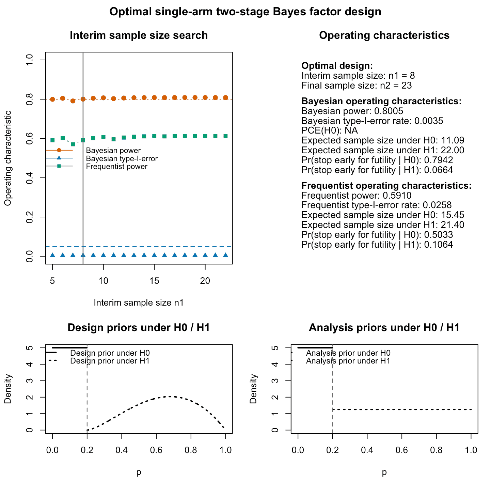
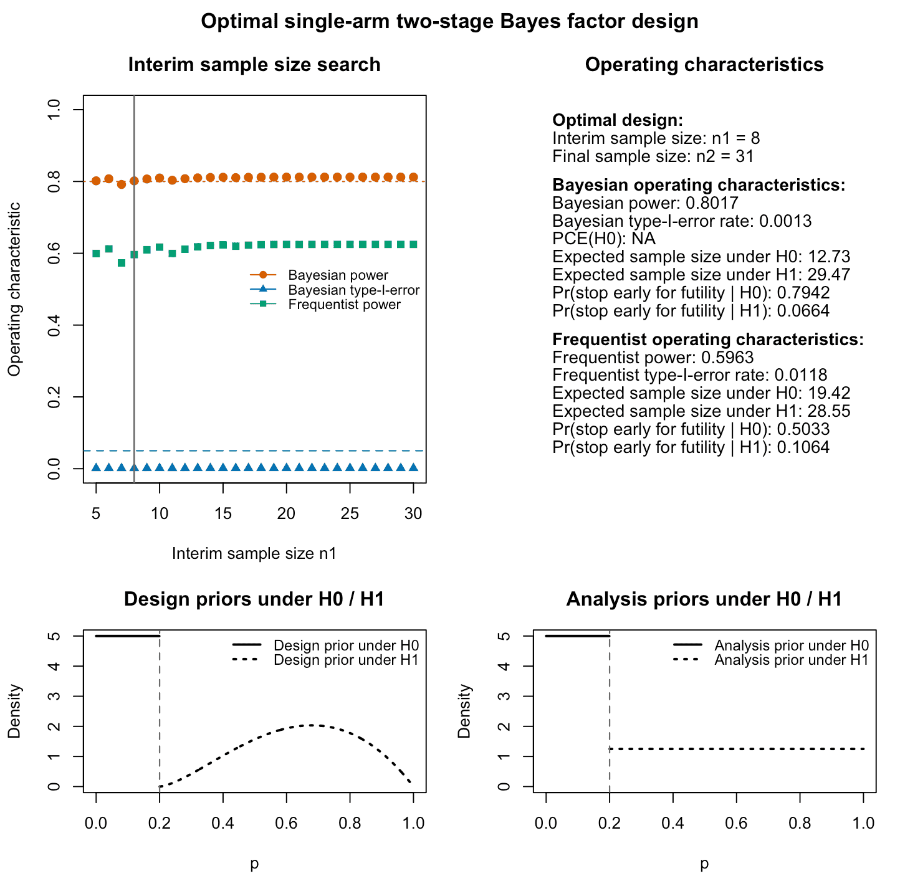

```{r setup, include = FALSE}
knitr::opts_chunk$set(
  collapse = TRUE,
  comment = "#>",
  fig.width  = 7,
  fig.height = 5,
  dpi        = 100,
  fig.retina = 1,
  dev        = "png",
  dev.args   = list(type = "cairo-png")
)

library(bfbin2arm)
```

# Hybrid calibration: Overview

Hybrid calibration combines a Bayesian notion of power with a frequentist
interpretation of type-I error. In the context of single-arm two-stage designs,
this is often attractive because it allows you to:

- treat power as a prior-predictive Bayesian quantity under a realistic design prior for
  $H_1$, and
- control type-I error in the classical frequentist sense at the null boundary $p_0$.

The decision statistic is still a Bayes factor $BF_{01}$, and the design
includes an interim analysis at $n_1$ with the possibility to stop early for
futility.

## Basics of hybrid calibration

Hybrid calibration is requested via

```r
calibration = "hybrid"
```

in `design_singlearm_bf()`. In this mode:

- *Bayesian power* is calibrated using the $H_1$ design prior, i.e. averaged
  over $p > p_0$ under a truncated Beta prior for directional tests.
- *Frequentist type-I error* is calibrated at $p = p_0$, i.e. the probability
  of incorrectly rejecting $H_0$ is controlled in the classical frequentist sense.

You must specify:

- `target_power`: the target Bayesian power,
- `target_freq_type1`: the target frequentist type-I error.

The frequentist power at a point alternative `dp` is computed and reported but
does **not** drive feasibility of a design in the hybrid calibration mode. Thus, the frequentist power is solely computed and reported post-hoc for the isolated optimal hybrid design which meets the specified target constraints on Bayesian power and frequentist type-I-error.

## Finding an optimal hybrid design

We start by constructing a hybrid-optimal design. Therefore, we consider the test of

$$H_0:p\leq 0.2 \text{ versus }H_1:p>0.2$$

for a clinical phase II trial with binary endpoints in the treatment group (success / failure). The novel treatment or drug is deemed effective if we find sufficient evidence in favour of $H_1$, when the response probability to that novel treatment or drug is larger than 20%.

We specify slightly optimistic design priors via `da1 = 2.5` and `db1 = 2` under $H_1$, and remain uninformative via the design prior parameters `da0 = 1` and `db0 = 1` under $H_0$. The evidence threshold $k$ is set to $1/10$, which implies we use the standard threshold for strong evidence [@jeffreysTheoryProbability1961], whereas we use the less stringent threshold $k_f=3$ to stop early for futility. The analysis prior parameters for the analysis prior used when computing the Bayes factor $BF_{01}$ are specified via the arguments `a = 1` and `b = 1`: 
```{r}
res_hybrid <- design_singlearm_bf(
  n1_min = 5,
  n2_max = 100,
  k      = 1/10,
  k_f    = 3,
  p0     = 0.2,
  a0     = 1,
  b0     = 1,
  a1     = 1,
  b1     = 1,
  dp     = 0.4,
  da0    = 1,
  db0    = 1,
  da1    = 2.5,
  db1    = 2,
  type   = "direction",
  calibration       = "hybrid",
  target_power      = 0.80,
  target_freq_type1 = 0.05,
  power_cushion = 0.025
)
```
We inspect the resulting output of the hybrid calibration algorithm as follows:
```{r}
summary(res_hybrid)
```

The output shows:

- the selected interim and final sample sizes (`n1`, `n2`),
- Bayesian power and Bayesian type-I error,
- frequentist type-I error and frequentist power at `dp`,
- expected sample sizes under $H_0$ and $H_1$,
- feasibility and a status message.

The search results can be plotted, too:

```{r, eval = FALSE}
plot(res_hybrid)
```
```{r fig.align = "center", echo = FALSE, out.width = "100%", fig.cap = "Figure 1: Output of the plot function for an optimal hybrid single-arm two-stage design using Bayes factors. The top left panel shows Bayesian and frequentist power, Bayesian type-I-error for varying interim sample sizes. The top right panel provides information about the optimal frequentist design found by the algorithm and its Bayesian and frequentist operating characteristics. The lower left and right panels visualize the analysis and design priors under the null and alternative hypothesis. For the frequentist operating characteristics, these are irrelevant. They influence only the Bayesian operating characteristics."}

```
## Interpretation of hybrid calibration

The result shown in Figure 1 visualizes the most relevant aspects about the isolated optimal trial design. In the hybrid mode:

- The Bayesian power target ensures that, on average under the $H_1$ design prior, the design has at least the specified probability of producing evidence against $H_0$. In this case, the plot shows both the Bayesian and frequentist power of the isolated optimal design. Note that while the Bayesian power meets the target constraint of 80% power, the frequentist power of the optimal hybrid design isolated by the algorithm is only about 59%.
- The frequentist type-I error target ensures that when $p = p_0$, the
  probability of erroneously rejecting $H_0$ is bounded in the usual sense. We see from the plot that the frequentist type-I-error rate is below the target threshold of 5%.
- The probabilities to stop early for futility are also shown as well as the expected sample sizes under $H_0$ and $H_1$ from a frequentist and Bayesian point of view. The next subsection explains why the expected sample sizes differ, in general, from a Bayesian and frequentist point of view.

## Bayesian and frequentist expected sample sizes
For a fixed two-stage design with interim sample size \(n_1\) and final sample
size \(n_2\), the expected sample size can be written in terms of the
probability of early stopping for futility.

Let
- \(N(p)\) be the total sample size when the true response probability is \(p\),
- \(\pi_{\text{fut}}(p)\) be the probability of stopping early for futility at
  the interim analysis when the true response probability is \(p\).

By construction,

\[
N(p) = n_1 \cdot \pi_{\text{fut}}(p) + n_2 \cdot \{1 - \pi_{\text{fut}}(p)\},
\]

because the trial enrolls \(n_1\) patients if it stops early, and \(n_2\)
patients otherwise.

### Frequentist expected sample size

The frequentist expected sample size at a fixed true probability \(p\) is
simply

\[
\operatorname{E}_p(N) =
n_1 \cdot \pi_{\text{fut}}(p) + n_2 \cdot \{1 - \pi_{\text{fut}}(p)\}.
\]

In the implementation, this is computed for \(p = p_0\) (under \(H_0\)) and
\(p = dp\) (under the frequentist alternative), and returned as

- `nexp_freq0` for \(\operatorname{E}_{p_0}(N)\), and
- `nexp_freq` for \(\operatorname{E}_{dp}(N)\).

### Bayesian expected sample size

The Bayesian expected sample size averages the same quantity over a design
prior for \(p\).

Under a design prior density \(g(p)\) with support \(I\) (for example, a
truncated beta prior), the Bayesian expected sample size under \(H_1\) is

\[
\operatorname{E}_g(N) =
\int_I \left\{ n_1 \cdot \pi_{\text{fut}}(p) +
               n_2 \cdot \bigl(1 - \pi_{\text{fut}}(p)\bigr) \right\}
\, g(p)\, \mathrm{d}p.
\]

Analogously, under a design prior \(g_0(p)\) on the null region \(I_0\), the
Bayesian expected sample size under \(H_0\) is

\[
\operatorname{E}_{g_0}(N) =
\int_{I_0} \left\{ n_1 \cdot \pi_{\text{fut}}(p) +
                  n_2 \cdot \bigl(1 - \pi_{\text{fut}}(p)\bigr) \right\}
\, g_0(p)\, \mathrm{d}p.
\]

In the implementation, these integrals are approximated numerically using a
grid over the support of the design prior, and returned as

- `nexp` (or `en_h1`) for \(\operatorname{E}_g(N)\) under \(H_1\), and
- `nexp0` (or `en_h0`) for \(\operatorname{E}_{g_0}(N)\) under \(H_0\).

Thus, the **structure** of the expected sample size,
\(n_1 \pi_{\text{fut}}(p) + n_2 \{1 - \pi_{\text{fut}}(p)\}\), is the same in
both frequentist and Bayesian calculations. The difference is purely in how the
expectation is taken:

- frequentist: at a fixed point \(p\),
- Bayesian: averaged over a design prior on \(p\).

In the example above, we can see that the frequentist expected sample size is about four patients more than the Bayesian one under $H_0$ precisely due to these underlying difference: The frequentist expected sample size assumes $p_0=0.2$, which increases the expected sample size because the trial is stopped less often due to futility compared to the Bayesian expected sample size, which averages over the (in this case, flat) design prior under $H_0$ and includes less optimistic parameter values $p\leq 0.2$ for which the trial stops more often for futility.

## Sensitivity to the $H_1$ design prior

Hybrid calibration naturally depends on the $H_1$ design prior because
Bayesian power is a prior-predictive quantity. We can explore this by varying
`da1` and `db1` while keeping other settings fixed.

```{r}
prior_grid <- list(
  list(da1 = 1.5, db1 = 1.0, label = "weakly informative"),
  list(da1 = 2.5, db1 = 2.0, label = "moderately informative"),
  list(da1 = 4.0, db1 = 2.5, label = "more concentrated")
)

extract_row <- function(res, label) {
  if (is.null(res) || isFALSE(res$feasible)) {
    return(data.frame(
      prior_label = label,
      feasible    = FALSE,
      n1          = NA_integer_,
      n2          = NA_integer_,
      power       = NA_real_,
      type1       = NA_real_,
      freq_power  = NA_real_,
      freq_type1  = NA_real_,
      en_h0       = NA_real_,
      en_h1       = NA_real_
    ))
  }

  oc <- res$operating_characteristics
  data.frame(
    prior_label = label,
    feasible    = res$feasible,
    n1          = res$design["n1"],
    n2          = res$design["n2"],
    power       = oc$power,
    type1       = oc$type1,
    freq_power  = oc$freq_power,
    freq_type1  = oc$freq_type1,
    en_h0       = oc$en_h0,
    en_h1       = oc$en_h1
  )
}

hybrid_sensitivity <- lapply(prior_grid, function(pr) {
  fit <- tryCatch(
    design_singlearm_bf(
      n1_min = 5,
      n2_max = 100,
      k      = 1/10,
      k_f    = 3,
      p0     = 0.2,
      a0     = 1,
      b0     = 1,
      a1     = 1,
      b1     = 1,
      dp     = 0.4,
      da0    = 1,
      db0    = 1,
      da1    = pr$da1,
      db1    = pr$db1,
      type   = "direction",
      calibration       = "hybrid",
      target_power      = 0.80,
      target_freq_type1 = 0.05,
      power_cushion = 0.025
    ),
    error = function(e) NULL
  )

  extract_row(fit, pr$label)
})

hybrid_sensitivity <- do.call(rbind, hybrid_sensitivity)
knitr::kable(hybrid_sensitivity, digits = 3)
```

This table shows how the optimal design and its operating characteristics change
with the $H_1$ design prior. In particular:

- more concentrated priors around optimistic response rates can lead to smaller
  sample sizes and higher Bayesian power,
- priors with substantial mass near $p_0$ may require larger sample sizes to reach the same power target.

## Adding a compelling-evidence constraint under $H_0$

Hybrid calibration can also be combined with a constraint on the probability of
compelling evidence in favour of $H_0$. In formulas, this implies we require the additional target constraint

$$Pr(BF_{01}<k_f)>f$$

for the optimal hybrid two-stage design, next to our Bayesian power and frequentist type-I-error requirements. Here, $f\in (0,1)$ is the threshold we set for the probability of compelling evidence for $H_0$. In the implementation, this is tied
to the futility threshold `k_f`.

```{r}
res_hybrid_ce <- design_singlearm_bf(
  n1_min = 5,
  n2_max = 180,
  k      = 1/10,
  k_f    = 3,
  p0     = 0.2,
  a0     = 1,
  b0     = 1,
  a1     = 1,
  b1     = 1,
  dp     = 0.4,
  da0    = 1,
  db0    = 1,
  da1    = 2.5,
  db1    = 2,
  type   = "direction",
  calibration       = "hybrid",
  target_power      = 0.80,
  target_freq_type1 = 0.025,
  target_ce_h0      = 0.60
)
```
We inspect the results of the calibration algorithm:
```{r}
summary(res_hybrid_ce)
```
We see that the algorithm did not find an optimal hybrid two-stage design which fulfills all of our target constraints. The fixed-sample size isolated in the first step of the algorithm is $n_2 = 25$, which is the sample size that achieves at least sufficient power of 80% in a one-stage design to yield reasonable candidate two-stage designs which have $n_2 = 25$.

In some settings, no design can satisfy all three constraints (Bayesian power,
frequentist type-I error, compelling evidence under $H_0$). In that case, the
function returns a message explaining that no feasible design was found.

# Power cushions in hybrid calibration

A practically important issue in two-stage calibration is that the first step of
the algorithm identifies a fixed-sample anchor size and the second step then
introduces an interim futility analysis. Once such an interim analysis is added,
the corrected power can decrease because some trajectories that would eventually
lead to efficacy at the final analysis are stopped early for futility.

This means that a fixed-sample anchor that just meets the target power need not
yield any feasible two-stage design at the same final sample size. The argument
`power_cushion` is intended to address exactly this problem: in the fixed-sample
anchor search, it requires a power target slightly above the nominal target,
creating a buffer against the power loss induced by the interim futility rule.

We illustrate this with a hybrid calibration example.

```{r}
res_no_cushion <- design_singlearm_bf(
  n1_min = 5,
  n2_max = 100,
  k = 1/30,
  k_f = 3,
  p0 = 0.2,
  a0 = 1, b0 = 1,
  a1 = 1, b1 = 1,
  da0 = 1, db0 = 1,
  da1 = 2.5, db1 = 2,
  dp = 0.4,
  type = "direction",
  calibration = "hybrid",
  target_power = 0.80,
  target_freq_type1 = 0.025
)
summary(res_no_cushion)
```

In this example, no feasible two-stage design is found. The search results show
why.

```{r}
head(res_no_cushion$search_results[, c(
  "n1", "n2", "power", "power_naive",
  "erased_power", "freq_type1", "hybrid_ok", "feasible"
)], 12)

range(res_no_cushion$search_results$power)
range(res_no_cushion$search_results$freq_type1)
```

The frequentist type-I error requirement is comfortably satisfied, but the
corrected Bayesian power remains slightly below the required target of 0.80 for
all candidate interim analyses. In other words, the fixed-sample anchor found in
step 1 is not large enough to absorb the power loss induced by early stopping
for futility.

We now repeat the same calibration with a power cushion of 2.5 percentage
points, specified via the additional argument `power_cushion = 0.025`:

```{r}
res_with_cushion <- design_singlearm_bf(
  n1_min = 5,
  n2_max = 100,
  k = 1/30,
  k_f = 3,
  p0 = 0.2,
  a0 = 1, b0 = 1,
  a1 = 1, b1 = 1,
  da0 = 1, db0 = 1,
  da1 = 2.5, db1 = 2,
  dp = 0.4,
  type = "direction",
  calibration = "hybrid",
  target_power = 0.80,
  target_freq_type1 = 0.025,
  power_cushion = 0.025
)

summary(res_with_cushion)
```

With the power cushion, a feasible two-stage design is found. The algorithm now
chooses a larger fixed-sample anchor in step 1, so that after introduction of
the interim futility analysis there exists a two-stage design whose corrected
power still meets the original 0.80 requirement.

```{r}
res_with_cushion$design
res_with_cushion$operating_characteristics
```

## Interpretation of the `power_cushion` parameter

The argument `power_cushion` modifies only the first step of the optimization,
that is, the fixed-sample anchor search. If `target_power = 0.80` and
`power_cushion = 0.025`, then the anchor search uses a power target of 0.825.
The final feasibility check for the actual two-stage design still uses the
original target power of 0.80.

Thus, `power_cushion` should not be interpreted as changing the scientific power
requirement. Rather, it is a numerical planning device that protects against the
expected power loss caused by introducing interim futility stopping after the
anchor size has been chosen. It serves as a methodological airbag against isolating a final sample size which is too small in the first step of the calibration algorithm.

The following table shows the different calibration modes available and the use of the `power_cushion` parameter when calibrating the optimal single-arm two-stage design:
```{r, echo = FALSE}
library(knitr)
library(kableExtra)

br_at_semicolon <- function(x) {
  gsub(";\\s*", ";<br>", x)
}

power_cushion_tbl <- data.frame(
  Mode = c("Bayesian", "frequentist", "hybrid", "full"),
  Anchor = c(
    "Bayesian power >= target_power + power_cushion; Bayesian type-I <= target_type1; optional CE for H0 >= target_ce_h0",
    "Frequentist power >= target_freq_power + power_cushion; frequentist type-I <= target_freq_type1",
    "Bayesian power >= target_power + power_cushion; frequentist type-I <= target_freq_type1",
    "Bayesian power >= target_power + power_cushion; Bayesian type-I <= target_type1; frequentist power >= target_freq_power + power_cushion; frequentist type-I <= target_freq_type1; optional CE for H0 >= target_ce_h0"
  ),
  `Step 2` = c(
    "Bayesian power >= target_power; Bayesian type-I <= target_type1; optional CE for H0 >= target_ce_h0",
    "Frequentist power >= target_freq_power; frequentist type-I <= target_freq_type1",
    "Bayesian power >= target_power; frequentist type-I <= target_freq_type1",
    "Bayesian power >= target_power; Bayesian type-I <= target_type1; frequentist power >= target_freq_power; frequentist type-I <= target_freq_type1; optional CE for H0 >= target_ce_h0"
  ),
  Explanation = c(
    "The anchor is a fixed-sample design that slightly overshoots the target Bayesian power to allow for the power loss that may occur once an interim futility analysis is introduced. In step 2, the actual two-stage design only needs to satisfy the original corrected Bayesian targets.",
    "The anchor is a fixed-sample design with cushioned frequentist power at the fixed alternative dp, so that after introducing the interim analysis the resulting two-stage design still has a realistic chance of achieving the original frequentist power target. No Bayesian constraints are imposed in this mode.",
    "Hybrid calibration combines a Bayesian power requirement with a frequentist type-I requirement, but it does not constrain frequentist power. Therefore, only the Bayesian power target is cushioned in step 1; in step 2, the selected two-stage design must meet the original Bayesian power target and the frequentist type-I constraint.",
    "Full calibration enforces both Bayesian and frequentist criteria. The anchor therefore has to overshoot both power targets, so that after adding interim futility the two-stage design can still satisfy the original Bayesian and frequentist constraints."
  ),
  check.names = FALSE
)

power_cushion_tbl$Anchor <- br_at_semicolon(power_cushion_tbl$Anchor)
power_cushion_tbl$`Step 2` <- br_at_semicolon(power_cushion_tbl$`Step 2`)

kbl(
  power_cushion_tbl,
  align = "l",
  escape = FALSE,
  caption = "Use of power_cushion in the fixed-sample anchor step across calibration modes."
) %>%
  kable_styling(
    bootstrap_options = c("striped", "condensed"),
    full_width = TRUE,
    font_size = 12,
    position = "left"
  ) %>%
  column_spec(1, width = "8%") %>%
  column_spec(2, width = "24%") %>%
  column_spec(3, width = "20%") %>%
  column_spec(4, width = "48%") %>%
  scroll_box(width = "100%")
```

## Practical guidance

In practice, the following strategy is often useful:

- Start with `power_cushion = 0`.
- If no feasible two-stage design is found, inspect the search results.
- If the corrected power is systematically just below the target, while the
  other constraints are satisfied, increase `power_cushion` modestly, for
  example to 0.01, 0.02, or 0.025.
- Refit the design and check whether a feasible two-stage solution appears.

A useful rule of thumb is that `power_cushion` is most helpful when the
candidate two-stage designs miss the target only narrowly, as in the present
example. If the power shortfall is substantial, increasing `n2_max`, changing
the evidence thresholds, or revisiting the design prior under `H1` may be more
appropriate.

We can again visualize the final design like before:

```{r, eval = FALSE}
plot(res_with_cushion)
```
```{r fig.align = "center", echo = FALSE, out.width = "100%", fig.cap = "Figure 2: Output of the plot function for an optimal hybrid single-arm two-stage design using Bayes factors after adding a power cushion to the calibration algorithm call. The top left panel shows Bayesian and frequentist power, Bayesian type-I-error for varying interim sample sizes. The top right panel provides information about the optimal frequentist design found by the algorithm and its Bayesian and frequentist operating characteristics. The lower left and right panels visualize the analysis and design priors under the null and alternative hypothesis. For the frequentist operating characteristics, these are irrelevant. They influence only the Bayesian operating characteristics."}

```
The `power_cushion` argument is useful because the fixed-sample anchor found in
the first step of the optimization may have little or no margin above the
nominal target power. Once an interim futility analysis is introduced, corrected
power can decrease, and a previously sufficient fixed-sample anchor may no
longer support any feasible two-stage design. By requiring a slightly larger
power in the anchor step, `power_cushion` creates a buffer that can preserve
feasibility after early stopping is incorporated.

We return to the example with a constraint on the probability of compelling evidence above, where the algorithm found no optimal hybrid two-stage design. Now, we add a small power cushion and see whether the algorithm now isolates an optimal hybrid design for us:
```{r}
res_hybrid_ce_with_power_cushion <- design_singlearm_bf(
  n1_min = 5,
  n2_max = 180,
  k      = 1/10,
  k_f    = 3,
  p0     = 0.2,
  a0     = 1,
  b0     = 1,
  a1     = 1,
  b1     = 1,
  dp     = 0.4,
  da0    = 1,
  db0    = 1,
  da1    = 2.5,
  db1    = 2,
  type   = "direction",
  calibration       = "hybrid",
  target_power      = 0.80,
  target_freq_type1 = 0.05,
  target_ce_h0      = 0.60,
  power_cushion = 0.025
)
```
We inspect the results of the calibration algorithm:
```{r}
summary(res_hybrid_ce_with_power_cushion)
```
We see that now an optimal design is found, and we can inspect the details of all two-stage designs analyzed by the algorithm further by calling
```{r, eval = FALSE}
res_hybrid_ce_with_power_cushion
```
The example exemplifies that is is recommended to always use a small power cushion to isolate optimal designs reliably with the two-step algorithm underlying the function. For further details, see also @kelter_third_2025 and @kelter_two_stage_2025.

## Practical recommendations for hybrid calibration

When using the hybrid mode in practice:

- Choose the $H_1$ design prior to reflect realistic expectations about the
  treatment effect; it directly impacts Bayesian power.
- Keep the frequentist type-I error target in line with regulatory or scientific
  standards for early-phase trials (often 0.1, 0.05 or 0.025).
- Use the optional `target_ce_h0` only when a minimum probability of compelling
  evidence under $H_0$ is truly required; otherwise, omit it to avoid
  overconstraining the problem.
  
## References