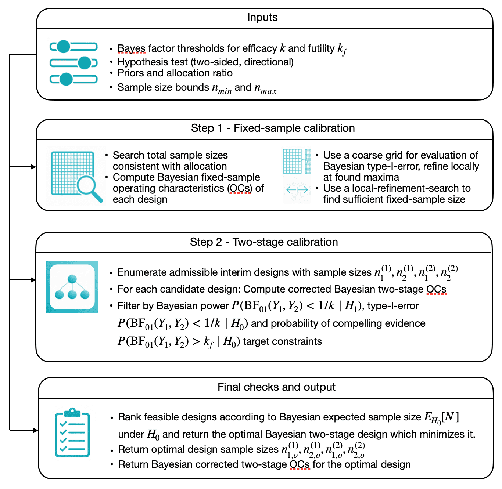
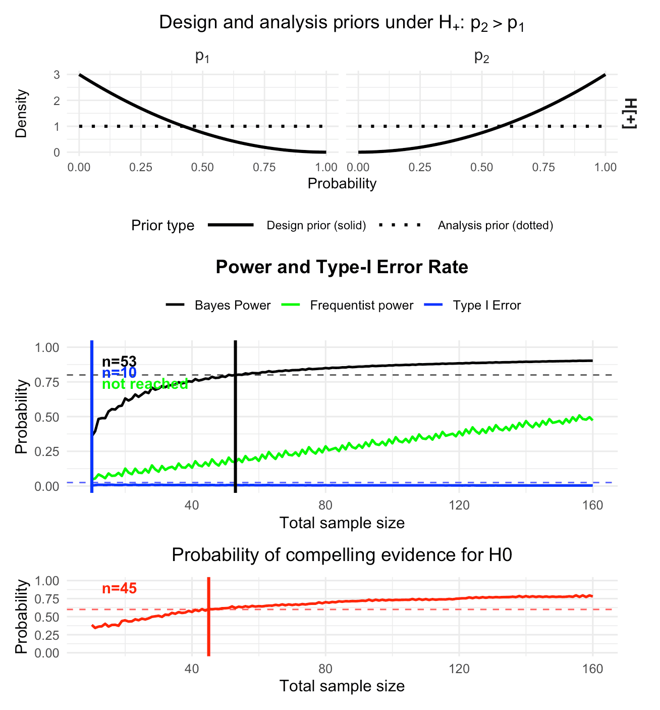
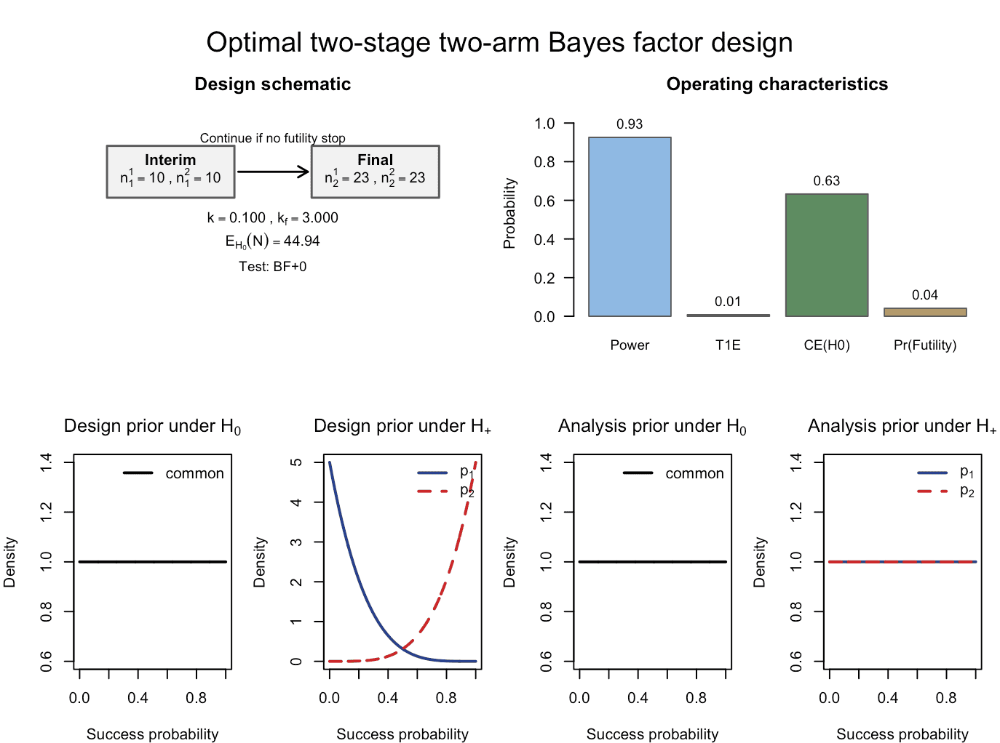
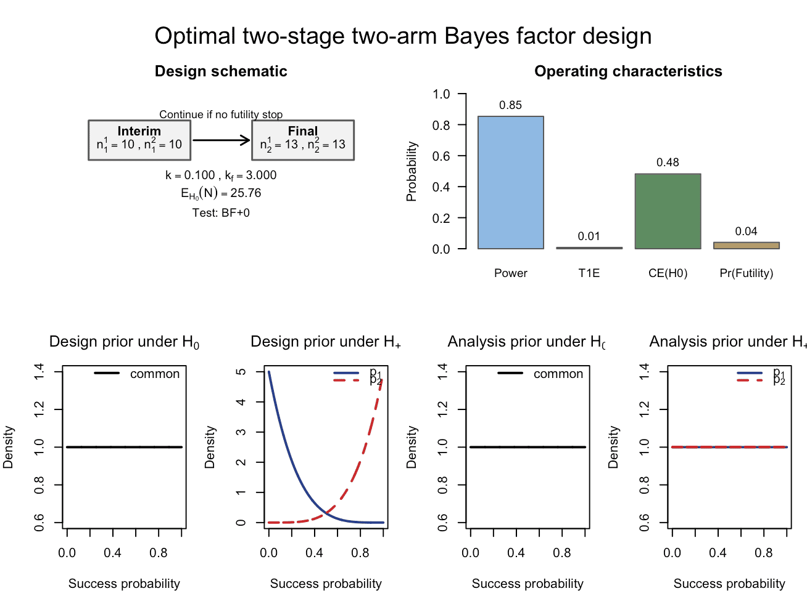
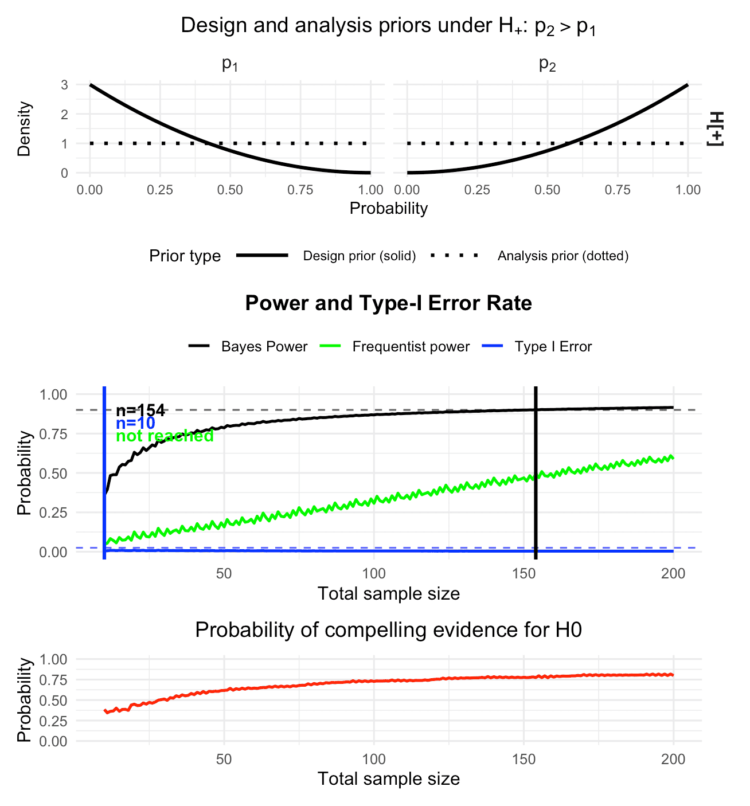
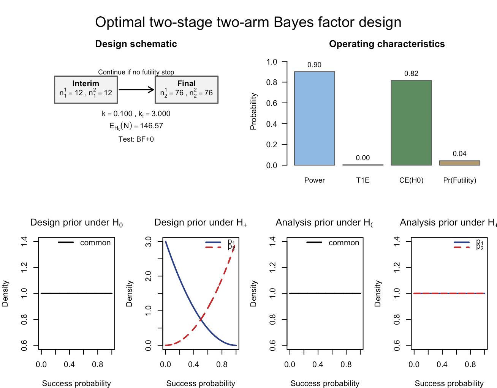

```{r setup, include = FALSE}
knitr::opts_chunk$set(
  collapse = TRUE,
  comment  = "#>",
  fig.width = 7,
  fig.height = 5,
  echo = TRUE,
  eval = TRUE,      # default, but heavy chunks override with eval = FALSE
  message = FALSE,
  warning = FALSE
)
options(bfbin2arm.ncores = 1L)
library(bfbin2arm)
```

## Introduction

This vignette illustrates the use of the `design_twoarm_twostage_bf()` function for designing two-stage two-arm binomial phase II trials based on Bayes factors. We re-analyze a clinical trial discussed in [@kelter_power_2026] and show how to construct optimal Bayesian two-stage designs in these settings. In contrast to a one-stage design, where power and sample size calculations have been developed by Kelter and Pawel [-@kelter_third_2025; -@kelter_two_stage_2025], and the designs we aim for in this vignette always include an interim analysis which allows stopping the trial early for futility. The corresponding single-stage design without such an interim analysis is provided in [@kelter_power_2026]. The methodology for the two-stage two-arm design is developed in [@kelterOptimalSequentialTwostage2026].

Thus, the principal goal of the `design_twoarm_twostage_bf()` function is to provide a calibrated Bayesian trial design for a phase II trial in terms of power and type-I-error rate (and probability of compelling evidence for the null hypothesis), which enables to stop the trial early for futility in case there is sufficient evidence for the null hypothesis of no effect or an effect too small in magnitude to be considered clinically relevant.

## Hypotheses and Bayes factors

We consider a two-arm trial with a control arm (arm 1) and a treatment arm (arm 2). Let $p_1$ and $p_2$ denote the response probabilities in the two arms. A typical hypothesis setup is:

-   $H_0: p_1 = p_2$,
-   $H_1: p_1 \neq p_2$.

The Bayes factor $BF_{01}$ compares the marginal likelihood under $H_0$ to that under $H_1$. Small values of $BF_{01}$ (e.g. $BF_{01} < 1/3$ or $BF_{01} < 1/10$) indicate evidence against $H_0$, whereas large values (e.g. $BF_{01} \ge 3$) indicate evidence in favor of $H_0$. Using the difference parameter $\eta=p_2-p_1$, other typical hypothesis setups for a phase II trial are:

- $H_0:\eta \leq 0 \hspace{1cm} \text{ versus } \hspace{1cm} H_1:\eta > 0$
- $H_0:\eta = 0 \hspace{1cm} \text{ versus } \hspace{1cm} H_1:\eta > 0$
- $H_0:\eta = 0 \hspace{1cm} \text{ versus } \hspace{1cm} H_1:\eta < 0$

For details and further explanations on each of these directional tests, see [@kelter_power_2026]. The associated Bayes factors with each of these three directional tests are denoted as $\mathrm{BF}_{+-}$, $\mathrm{BF}_{+0}$ and $\mathrm{BF}_{-0}$. Also, we denote $H_-:\eta \leq 0$ and $H_+:\eta > 0$.

## Priors: design vs analysis

The package distinguishes **design priors** used for calibrating power and type I error from **analysis priors** used inside the Bayes factor itself.

### Design priors

Design priors describe our assumptions about the response probabilities under each hypothesis when computing operating characteristics.

-   Under $H_0: p_1 = p_2$: We assume a common response probability $p$ with $$
    p \sim \mathrm{Beta}(a_{0d}, b_{0d}),
    $$ set via the parameters `a_0_d` and `b_0_d`.

-   Under $H_1: p_1 \neq p_2$: We assume independent priors for the two arms: $$
    p_1 \sim \mathrm{Beta}(a_{1d}, b_{1d}), \quad
    p_2 \sim \mathrm{Beta}(a_{2d}, b_{2d}),
    $$ set via the parameters `a_1_d, b_1_d` (for the control group) and `a_2_d, b_2_d` ( for the treatment group).

For directional tests (`test = "BF+0"`, `"BF-0"`, or `"BF+-"`), there are additional design priors under a directional-null $H_-$ (e.g. $p_2 \le p_1$), specified by `a_1_d_Hminus, b_1_d_Hminus, a_2_d_Hminus, b_2_d_Hminus`. These are used for one-sided Bayes factors only. For details on the precise specification of these tests, see @kelter_two_stage_2025.

### Analysis priors

Analysis priors are the priors used *inside* the Bayes factor for each hypothesis. When the hypothesis of interest is tested via the Bayes factor, the analysis priors is the prior used in the calculation of the Bayes factor itself.

-   Under $H_0: p_1 = p_2$, the analysis prior for the common response probability again is Beta distributed, $$
    p \sim \mathrm{Beta}(a_{0a}, b_{0a}),
    $$ specified by the parameters `a_0_a` and `b_0_a`.

-   Under $H_1: p_1 \neq p_2$, we again use independent Betas for the analysis prior: $$
    p_1 \sim \mathrm{Beta}(a_{1a}, b_{1a}), \quad
    p_2 \sim \mathrm{Beta}(a_{2a}, b_{2a}),
    $$ specified via the parameters `a_1_a, b_1_a` and `a_2_a, b_2_a`.

Typically, analysis priors are chosen to be relatively diffuse (e.g. Beta(1,1)), while design priors can express more specific beliefs about plausible response rates under each hypothesis. The design priors should express the assumptions or expectations about the effect of the novel treatment or drug. It influences the operating characteristics in the planning stage of the trial substantially. Even though the design priors can be highly subjective, it might still be possible to calibrate a design in terms of the resulting power and type-I-error rate. This way, even though the expectations about the effect of the novel drug or treatment might be quite optimistic, the design is legible from a regulatory agency's point of view, such as the Food and Drug Administration (FDA), see @FDA_ComplexInnovativeDesignsDecember2020 and @FDA_UseOfBayesianMethodologyJanuary2026 or @europeanmedicinesagencyICHE20Adaptive2025. In contrast, the analysis prior should be objective in the sense that the actual test carried out at the interim and final analysis is neither in favour of the null nor the alternative hypothesis.

## Overview of the calibration algorithm

Figure 1 visualizes the calibration algorithm which finds an optimal two-arm two-stage design for a phase II trial with binary endpoints using Bayes factors as the primary measure of evidence.

```{r echo = FALSE, out.width = "80%", fig.align = "center", fig.cap = "Figure 1: Illustration of the calibration algorithm searching for an optimal Bayesian two-arm two-stage phase II design with binary endpoints"}

```

The calibration algorithm proceeds in two steps:

1.  **Fixed-sample calibration (step 1)**:\
    It searches over total sample sizes to find a *sufficient* fixed-sample design $(n_2^1, n_2^2)$ that meets the target power $\Pr(\mathrm{BF}_{01}<k\mid H_1)$, type-I error $\Pr(\mathrm{BF}_{01}<k\mid H_0)$ and (optionally) the probability of compelling evidence for the null hypothesis $\Pr(\mathrm{BF}_{01}>k_f\mid H_0)$.

2.  **Two-stage calibration (step 2)**:\
    Conditional on this fixed-sample design, it considers all admissible interim sample sizes $(n_1^1, n_1^2)$ on a grid and, for each candidate, computes the corrected operating characteristics. Among those that satisfy the constraints, it selects the design that minimizes the expected sample size under $H_0$.

The **number of interim designs** considered in step 2 is
\[
\#\{\text{interim designs}\} = \#\{n_1^1\} \times \#\{n_1^2\},
\]
where, for each arm \(j\), the admissible interim sample sizes form a grid
\[
\{n_1^j\} = \{n_{1,\min}^j,\, n_{1,\min}^j + \texttt{grid\_step},\, \dots,\, n_{2}^j - 1\}
\]
after applying the `interim_fraction` bounds. Thus \(\#\{n_1^j\}\) is the **number of grid points** between the lower and upper interim limits in arm \(j\), not the product of those bounds. Consequently, the larger the sufficient fixed-sample sizes \(n_2^1, n_2^2\) found in step 1, the larger the sets \(\{n_1^1\}\) and \(\{n_1^2\}\), the more interim designs are explored in step 2, and the longer the runtime.

For example, if \(n_2^1 = n_2^2 = 40\), `n1_min = c(10, 10)` and `grid_step = 1`, then
\(\{n_1^j\} = \{10,\dots,39\}\) has 30 elements in each arm, so
\(\#\{\text{interim designs}\} = 30 \times 30 = 900\).

Several modelling choices strongly influence the runtime, and we provide details below after discussing the first example. We turn to the first detailed example now, showing how to calibrate a Bayesian phase II design in practice with the function `design_twoarm_twostage_bf()`.

## Riociguat phase II trial: fixed-sample design and optimal two-stage design

In this section we consider the **Riociguat phase II trial** in systemic sclerosis [@khannaRiociguatPatientsEarly2020], re-analysed in @kelter_power_2026. For day-to-day use, the recommended entry points are the design wrappers

- `design_twoarm_onestage_bf()` for fixed-sample designs without interim analysis, and  
- `design_twoarm_twostage_bf()` for two-stage designs with an interim analysis for futility.

Both functions calibrate the design with respect to Bayesian and, optionally, frequentist operating characteristics, and return a rich object with methods for printing, summarizing, and plotting.

### The two-stage design function `design_twoarm_twostage_bf()`

The main calibration function for the two-stage design is `design_twoarm_twostage_bf()`. Internally, it calls the lower-level engine `optimal_twostage_2arm_bf()` to perform the two-step search (fixed-sample anchor, then interim-grid search as shown in Figure 1), but users will typically interact only with the design function.

For the Bayesian workflow considered in this vignette, the most important arguments of `design_twoarm_twostage_bf()` are:

- `k`, `k_f`: Efficacy and futility thresholds for the Bayes factor. Evidence against the null is declared when the Bayes factor falls below `k`, and compelling evidence for the null is declared when the Bayes factor exceeds `k_f`.
- `n1_min`, `n2_max`: Vectors of length 2 giving the minimal interim and maximal final sample sizes in the two arms.
- `alloc1`, `alloc2`: Allocation probabilities to the two arms; these must be positive and sum to 1.
- `target_power`, `target_type1`: Target corrected Bayesian power and type-I error. Internally these determine `alpha` and `beta` for the fixed-sample anchor search.
- `target_ce_h0`: Optional lower bound on the corrected Bayesian probability of compelling evidence for the null hypothesis.
- `target_freq_power`, `target_freq_type1`: Optional targets for frequentist power and type-I error; these can be activated via the calibration mode.
- `calibration`: Calibration criterion, one of `"Bayesian"`, `"frequentist"`, or `"hybrid"`. In this vignette we focus on `calibration = "Bayesian"`.
- `calibration_en`: Criterion for ranking designs by expected sample size, either `"Bayesian"` (default) or `"frequentist"`.
- `power_cushion`: Optional extra power margin used in step 1 when identifying a sufficient fixed-sample design. This is relevant as @kelter_power_2026 showed that the power of a two-arm design can decrease when introducing an interim analysis which allows stopping for futility only. As a consequence, the power cushion safeguards against obtaining a design which cannot meet the required power target after introducing an interim analysis.
- `interim_fraction`: Lower and upper bounds for the interim sample sizes, expressed as fractions of the fixed-sample sizes found in step 1. Defaults to `c(0, 1)`, which means all interim designs between `n1_min` and the fixed-sample size found in step one of the calibration algorithm are analysed. For example, `interim_fraction = c(0.25, 0.75)` restricts the interim look to occur between 25% and 75% of the fixed-sample size, regardless of the numerical value of `n1_min`.
- `grid_step`: Spacing of the interim-design grid searched in step 2.
- `coarse_step`: Spacing used in the coarse fixed-sample search in step 1.
- `max_iter`: Maximum number of fixed-sample sizes explored in step 1.
- `progress`: Logical; if `TRUE`, prints progress messages during the calibration. This is helpful if a large number of two-stage designs needs to be analyzed by the algorithm.
- `test`: Bayes-factor test `"BF01"`, `"BF+0"`, `"BF-0"` or `"BF+-"`.
- The prior parameters `a_0_d, b_0_d, a_0_a, b_0_a, …` specify the design and analysis priors under the relevant hypotheses, exactly as in the one-stage setting.

The function returns an object of class `"twoarm_twostage_bf_design"` with the following main components:

- `design`: Named vector `c(n1_1, n1_2, n2_1, n2_2)` giving the interim sample sizes `n1_1`, `n1_2` and the final sample sizes `n2_1`, `n2_2`.
- `fixed_design`: The fixed-sample anchor identified in step 1, stored as `c(n_fixed_1, n_fixed_2)`.
- `operating_characteristics`: Corrected two-stage operating characteristics of the trial design, accounting for early stopping for futility (Bayesian power and type-I error, CE(H0), and, where requested, frequentist operating characteristics and expected sample sizes).
- `fixed_operating_characteristics`: Operating characteristics of the fixed-sample anchor from step 1.
- `inputs`: A list summarising the inputs used to determine the design.
- `optimizer`: A list containing the convergence flag `conv` and the prior specification used by the internal engine.
- `engine_output`: The full list returned by the internal optimizer `optimal_twostage_2arm_bf()`, retained for transparency and advanced use.

In the Bayesian workflow, the corrected operating characteristics in `operating_characteristics` are the key output, because they quantify the actual two-stage design rather than the fixed-sample surrogate used in step 1. The fixed-sample quantities in `fixed_design` and `fixed_operating_characteristics` are primarily useful as a comparator.

Three convenient methods are provided:

- `print()` gives a concise textual summary of the selected design and its operating characteristics.
- `summary()` adds search-level information and explicit calibration targets.
- `plot()` produces a six-panel base R plot, showing the design schematic, operating characteristics, and the design and analysis priors under the relevant hypotheses.


### Riociguat phase II trial: Setup

In the riociguat trial, the reported response rates in the two-arm binary endpoint example are

```{r, eval = TRUE}
p1_riociguat <- 38/(22+38) # control arm response probability
p1_riociguat 
p2_riociguat <- 48/(48+11)  # treatment arm response probability
p2_riociguat
```

as given in Section 2.5 of @kelter_power_2026]. The response in the treatment group is higher compared to the control group, and the test we perform is $H_0:p_1=p_2$ versus $H_+:p_1<p_2$. We thus exclude the possibility that the response probability in the control group can outperform the response probability in the treatment group. If this assumption is too optimistic, we could also perform the test of $H_-:p_2 \le p_1$ versus $H_+:p_1<p_2$ or the two-sided test.

Now, we use the following design and analysis priors for this example:

```{r, eval = TRUE}
# flat design priors under H0
a_0_d_rio <- 1
b_0_d_rio <- 1

# slightly informative design prior under H1 (that is, H_+) for the control group
a_1_d_rio <- 1 
b_1_d_rio <- 3

# slightly informative design prior under H1 (that is, H_+) for the treatment group
a_2_d_rio <- 3
b_2_d_rio <- 1

# Analysis priors under H0 and H1 (Riociguat)
a_0_a_rio <- 1 # flat under H0
b_0_a_rio <- 1

a_1_a_rio <- 1 # flat under H1 for the control group
b_1_a_rio <- 1

a_2_a_rio <- 1 # flat under H1 for the treatment group
b_2_a_rio <- 1
```

We focus on the one-sided Bayes factor test `test = "BF+0"` with evidence thresholds `k = 1/10` (strong evidence for efficacy) and `k_f = 3` (moderate evidence to stop early for futility), compare @kelter_power_2026. We provide a brief discussion of choosing these thresholds below.

### Riociguat phase II trial: Fixed-sample comparator via `design_twoarm_onestage_bf()`

In the one-stage reference design used in @kelter_power_2026 for the riociguat example, the trial uses

- \(n_1 = 60\) patients in the control arm,
- \(n_2 = 59\) patients in the treatment arm,

as reported in the paper. We now use `design_twoarm_onestage_bf()` to compute a fixed-sample design that achieves 80% Bayesian power, 2.5% Bayesian type-I error and 60% probability of compelling evidence for the null hypothesis. This fixed-sample design serves as a comparator for the two-stage design constructed later.

For the one-stage design, we also request frequentist power and type-I error to be computed, assuming success probabilities `p1_power = 0.40` in the control arm and `p2_power = 0.60` in the treatment arm. The calibration itself remains Bayesian in this vignette: the design is selected to meet the Bayesian power and type-I-error targets, while frequentist quantities are reported but not used as hard constraints.

The design priors are slightly informative, reflecting the expectation that the treatment is more effective than placebo in the control group and encoded by parameters such as `a_1_d = a_1_d_rio`. The analysis priors are chosen flat via parameters such as `a_1_a = a_1_a_rio`, as in @kelter_power_2026. To keep the console output compact in this vignette, we set `progress = FALSE`; in practice you can set `progress = TRUE` to monitor the calibration.

```{r, eval = FALSE}
cat("\n--- One-stage design calibration for riociguat-type trial ---\n")
res_rio_onestage <- design_twoarm_onestage_bf(
  n_min = 10,
  n_max = 160,
  k = 1/10,
  k_f = 3,
  test = "BF+0",
  alloc1 = 0.5,
  alloc2 = 0.5,
  calibration = "Bayesian",
  target_power = 0.8,
  target_type1 = 0.025,
  target_ce_h0 = 0.60,
  target_freq_power = 0.8,
  target_freq_type1 = 0.025,
  p1_grid = seq(0.01, 0.99, 0.02),
  p2_grid = seq(0.01, 0.99, 0.02),
  p1_power = 0.4,
  p2_power = 0.6,
  power_cushion = 0,
  sustain_n = 10L,
  algorithm = "optimal",
  progress = FALSE,
  report_freq_type1 = TRUE,
  a_0_d = a_0_d_rio, b_0_d = b_0_d_rio,
  a_0_a = a_0_a_rio, b_0_a = b_0_a_rio,
  a_1_d = a_1_d_rio, b_1_d = b_1_d_rio,
  a_2_d = a_2_d_rio, b_2_d = b_2_d_rio,
  a_1_a = a_1_a_rio, b_1_a = b_1_a_rio,
  a_2_a = a_2_a_rio, b_2_a = b_2_a_rio
)
```

The resulting design object can be inspected directly:

```{r, eval = FALSE}
res_rio_onestage
```
```
One-stage two-arm Bayes factor design
------------------------------------
Mode: optimal
Status: Smallest feasible one-stage two-arm design found.
Calibration: Bayesian
Optional freq. Type-I reporting: off
Design: n_total = 53, n1 = 26, n2 = 27

Operating characteristics
 Power = 0.8002
 Type-I error = 0.0065
 CE(H0) = 0.6206
 Freq. Power = 0.1710

```
which prints the selected total sample size, the allocation into the two arms, and the corrected Bayesian and frequentist operating characteristics. For a more detailed view that includes the search overview and the calibration targets, use:

```{r, eval = FALSE}
summary(res_rio_onestage)
```
```
Summary: One-stage two-arm Bayes factor design
---------------------------------------------
Mode:        optimal
Status:      Smallest feasible one-stage two-arm design found.
Calibration: Bayesian
Feasible:    yes

Search overview
  n evaluated          = 151
  pointwise feasible   = 109
  sustained feasible   = 108
  first pointwise n    = 51
  first sustained n    = 53

Selected design
  n_total = 53, n1 = 26, n2 = 27
```

The wrapper also provides a plotting method that reconstructs the familiar one-stage calibration plot:

```{r, eval = FALSE, fig.height=7}
plot(res_rio_onestage)
```

```{r echo = FALSE, out.width = "80%", fig.align = "center", fig.cap = "Figure 2: Calibrated Bayesian two-arm one-stage phase II design with binary endpoints, obtained via `design_twoarm_onestage_bf()`. No interim analysis is carried out, and the design is calibrated to 80% Bayesian power, 2.5% Bayesian type-I error and 60% probability of compelling evidence for the null hypothesis."}

```

Figure 2 shows the calibrated one-stage design developed in @kelter_power_2026. In particular, it illustrates that the one-stage design without an interim analysis requires 53 patients in total (as can be seen in `res_rio_onestage$design`) to reach the desired threshold for Bayesian power, while 45 patients are necessary to reach the desired probability of compelling evidence for the null hypothesis. The Bayesian type-I-error constraint is already satisfied at smaller sample sizes. The frequentist type-I-error rate is controlled with a supremum of approximately 0.0099 under the null, as can be seen from
```{r, eval = FALSE}
print(res_rio_onestage)
```
```
One-stage two-arm Bayes factor design
------------------------------------
Mode: optimal
Status: Smallest feasible one-stage two-arm design found.
Calibration: Bayesian
Optional freq. Type-I reporting: on
Design: n_total = 53, n1 = 26, n2 = 27

Operating characteristics
 Power = 0.8002
 Type-I error = 0.0065
 CE(H0) = 0.6206
 Freq. Type-I = 0.0099
 Freq. Power = 0.1710
```

whereas the frequentist power requirement of 80% is not reached under the conservative assumptions \(p_1 = 0.4\) and \(p_2 = 0.6\).

This one-stage design does not include an interim analysis, but it is fully calibrated from a Bayesian point of view. We could adjust `p1_power` and `p2_power` upwards (for example to 0.6 and 0.8) to explore more optimistic frequentist scenarios. In the next section we move to the **two-stage** design, which introduces an interim analysis for possible early stopping for futility.

### Riociguat phase II trial: Optimal Bayesian two-stage design via `design_twoarm_twostage_bf()`

We now search for an optimal two-stage design that

- controls the Bayesian type-I error at level `alpha = 0.025`,
- achieves at least power `1 - beta = 0.8`,
- achieves at least probability of compelling evidence `pceH0 = 0.60` for the null hypothesis,
- minimizes the expected total sample size under \(H_0\),
- respects `n1_min = c(10, 10)` and `n2_max = c(80, 80)`, i.e. a minimum of 10 and a maximum of 80 patients per trial arm, and
- uses the same design and analysis priors as in the fixed-sample comparator.

We implement this by calling `design_twoarm_twostage_bf()` with Bayesian calibration:

```{r riociguat-bayesian-design, eval = FALSE}
res_rio <- design_twoarm_twostage_bf(
  n1_min = c(10, 10),
  n2_max = c(80, 80),
  alloc1 = 0.5,
  alloc2 = 0.5,
  k = 1/10,
  k_f = 3,
  test = "BF+0",
  calibration = "Bayesian",
  calibration_en = "Bayesian",
  target_power = 0.8,
  target_type1 = 0.025,
  target_ce_h0 = 0.60,
  power_cushion = 0.03,
  interim_fraction = c(0, 1),
  grid_step = 1L,
  coarse_step = 10L,
  max_iter = 500L,
  ncores = 1L,
  progress = TRUE,
  a_0_d = a_0_d_rio, b_0_d = b_0_d_rio,
  a_0_a = a_0_a_rio, b_0_a = b_0_a_rio,
  a_1_d = a_1_d_rio, b_1_d = b_1_d_rio,
  a_2_d = a_2_d_rio, b_2_d = b_2_d_rio,
  a_1_a = a_1_a_rio, b_1_a = b_1_a_rio,
  a_2_a = a_2_a_rio, b_2_a = b_2_a_rio
)
```
```
Step 1: searching for fixed-sample sufficiency (alpha=0.025, beta=0.2, cushion=0.03)...
Step 1: coarse fixed-sample search...
 Coarse grid[  1]: n_tot= 20 | n1= 10 n2= 10 | Bayes Power=0.631 | Bayes T1E=0.010 | PCE(H0)=0.449 
 Coarse grid[  2]: n_tot= 30 | n1= 15 n2= 15 | Bayes Power=0.703 | Bayes T1E=0.008 | PCE(H0)=0.512 
 Coarse grid[  3]: n_tot= 40 | n1= 20 n2= 20 | Bayes Power=0.751 | Bayes T1E=0.006 | PCE(H0)=0.565 
 Coarse grid[  4]: n_tot= 50 | n1= 25 n2= 25 | Bayes Power=0.786 | Bayes T1E=0.006 | PCE(H0)=0.617 
 Coarse grid[  5]: n_tot= 60 | n1= 30 n2= 30 | Bayes Power=0.812 | Bayes T1E=0.006 | PCE(H0)=0.646 
 Coarse grid[  6]: n_tot= 70 | n1= 35 n2= 35 | Bayes Power=0.834 | Bayes T1E=0.006 | PCE(H0)=0.660 
Refining fixed-sample search on [60, 70]...
 Refine n_tot= 60 | n1= 30 n2= 30 | Bayes Power=0.812 | Bayes T1E=0.006 | PCE(H0)=0.646 
 Refine n_tot= 62 | n1= 31 n2= 31 | Bayes Power=0.819 | Bayes T1E=0.006 | PCE(H0)=0.650 
 Refine n_tot= 64 | n1= 32 n2= 32 | Bayes Power=0.822 | Bayes T1E=0.005 | PCE(H0)=0.653 
 Refine n_tot= 66 | n1= 33 n2= 33 | Bayes Power=0.829 | Bayes T1E=0.006 | PCE(H0)=0.656 
 Refine n_tot= 68 | n1= 34 n2= 34 | Bayes Power=0.833 | Bayes T1E=0.006 | PCE(H0)=0.658 
 --> Fixed-sample size found: n_tot=68 (n1=34, n2=34, Power=0.833, T1E=0.006, PCE(H0)=0.658)
 => Parallelizing over 24 interim designs using 1 cores...
Step 2: evaluated 10 / 24 interim designs (41.7%)...
Step 2: evaluated 20 / 24 interim designs (83.3%)...
Step 2: evaluated 24 / 24 interim designs (100.0%)...
```
The console output from this call mirrors the two-step calibration performed by the internal engine `optimal_twostage_2arm_bf()`:

- Step 1 performs a coarse and then refined fixed-sample search over total sample sizes, reporting Bayesian power, type-I error, and CE(H0) at each candidate and identifying a sufficient fixed-sample anchor (here, \(n_2^{(1)} = n_2^{(2)} = 34\)).
- Step 2 constructs the grid of admissible interim designs \((n_1^{(1)}, n_1^{(2)})\) consistent with `n1_min`, the fixed-sample anchor, and `interim_fraction`, then evaluates each grid point, filters for feasibility, and selects the design that minimizes the expected sample size under \(H_0\).

With

```{r, eval = FALSE}
interim_fraction = c(0, 1)
n1_min          = c(10, 10)
```

the interim sample size in each arm is allowed to range from 10 up to 33 (because the interim look must occur strictly before the final size of 34 patients per arm). In principle this yields

- \(n_1^{(1)} \in \{10, 11, \dots, 33\}\),
- \(n_1^{(2)} \in \{10, 11, \dots, 33\}\),

so a \(24 \times 24\) grid of candidate interim designs. Internally, the algorithm filters this grid to the subset of candidates that satisfy basic consistency conditions (e.g. the balanced allocation to each trial arm requirement reduces the grid essentially to 24 interim designs only) and can be meaningfully evaluated, which is why the progress output reports a smaller number of interim designs being parallelised in this run. Choosing `interim_fraction = c(0.25, 0.75)` would restrict the interim analysis to occur between 25% and 75% of the fixed-sample size, which can reduce the grid size and runtime in large problems.

The resulting design object `res_rio` collects both the fixed-sample anchor from step 1 and the corrected two-stage operating characteristics of the final design:

- `res_rio$design` is a four-element vector `c(n1_1, n1_2, n2_1, n2_2)` describing the optimal two-stage design. In this example:

  ```{r, eval = FALSE}
  res_rio$design
  #> n1_1 n1_2 n2_1 n2_2 
  #>   10   10   34   34
  ```

  so the interim sample sizes are \(n_1^{(1)} = n_1^{(2)} = 10\) and the final sample sizes are \(n_2^{(1)} = n_2^{(2)} = 34\).

  The **maximum** total sample size is therefore
  \[
  N_{\max} = n_2^{(1)} + n_2^{(2)} = 68,
  \]
  and the **interim** total sample size (at the interim analysis) is
  \[
  N_{\mathrm{int}} = n_1^{(1)} + n_1^{(2)} = 20.
  \]

- `res_rio$fixed_design` contains the fixed-sample anchor identified in step 1 (here also `c(34, 34)`), and `res_rio$fixed_operating_characteristics` summarises its operating characteristics (Bayesian power, type-I error and CE(H0), plus frequentist quantities if requested).

- `res_rio$operating_characteristics` contains the **corrected operating characteristics** of the optimal two-stage design:

  ```{r, eval = FALSE}
  res_rio$operating_characteristics
  #> $power
  #>  0.8330913
  #>
  #> $type1
  #>  0.005831181
  #>
  #> $ce_h0
  #>  0.6927951
  #>
  #> $en_bayes
  #>  66.04139
  #>
  #> $freq_type1
  #>  NA
  #>
  #> $freq_power
  #>  NA
  #>
  #> $en_freq
  #>  NA
  ```

Here, `power` is the Bayesian power under the design prior, accounting for early stopping for futility; `type1` is the corrected Bayesian type-I error; `ce_h0` is the corrected probability of compelling evidence for \(H_0\); and `en_bayes` is the expected total sample size under \(H_0\). Optional frequentist measures are reported when the calibration includes frequentist constraints.

- `res_rio$optimizer$conv` indicates whether a feasible design satisfying the specified constraints was found in the search region; in this example the convergence flag equals `"converged"`.

In summary, `res_rio$design` tells us how many patients are recruited in each arm at the interim and at the final analysis, and `res_rio$operating_characteristics` reports the corresponding operating characteristics of the optimal two-stage design.

The design object can be inspected via

```{r, eval = FALSE}
res_rio
summary(res_rio)
```
```
Optimal two-stage two-arm Bayes factor design
------------------------------------
Mode: optimal
Status: converged
Calibration: Bayesian
Convergence flag: converged
Design: n1 = (10, 10), n2 = (34, 34)

Corrected operating characteristics
 Power = 0.8331
 Type-I error = 0.0058
 CE(H0) = 0.6928
 EN (Bayesian) = 66.04
 

Summary: two-stage two-arm Bayes factor design
---------------------------------------------
Mode: optimal
Status: converged
Calibration: Bayesian
Convergence flag: converged
Feasible: yes

Selected design
 n1 = (10, 10), n2 = (34, 34)
```
and plotted using the wrapper’s plot method:

```{r riociguat-plot, eval = FALSE, fig.height=5}
plot(res_rio)
```

```{r echo = FALSE, out.width = "100%", fig.align = "center", fig.cap = "Figure 3: Calibrated Bayesian two-arm two-stage phase II design with binary endpoints, obtained via `design_twoarm_twostage_bf()`. An interim analysis is carried out at 10 patients per arm, and the design is calibrated to 80% Bayesian power, 2.5% Bayesian type-I error and 60% probability of compelling evidence for the null hypothesis; the final analysis is carried out after 34 patients per arm."}

```

Figure 3 also visualizes our expectations about the effect of the drug. The design priors indicate that smaller response probabilities close to zero are much more likely a priori in the control group than in the treatment group, whereas larger response probabilities are more likely in the treatment group (compare the dashed and solid lines in the design-prior panel for \(H_+\): \(p_1\) is the success probability in the control arm and \(p_2\) the success probability in the treatment arm). This expectation about the effectiveness of the new treatment is independent of the analysis priors used when computing the Bayes factor \(BF_{+0}\), which are flat and in that sense objective: subjectivity enters the planning stage of the trial, not the interim or final analysis itself.

### Comparison with the fixed-sample design

Before considering the two-stage design, it is useful to look again at the
corresponding one-stage fixed-sample design that we calibrated earlier directly to the target Bayesian operating characteristics. For the riociguat example,
the function `design_twoarm_onestage_bf()` with `target_power = 0.8`, `target_type1 = 0.025` and
`target_ce_h0 = 0.6` identified a fixed-sample one-stage design with
\(N_{\text{total}} = 53\) patients in total.
At this sample size the Bayesian power was approximately \(0.80\), the
Bayesian type-I error under \(H_0\) was about \(0.0065\), and the probability
of obtaining compelling evidence in favour of \(H_0\) was about \(0.62\), compare Section 5.3 above.

The optimal two-stage design returned by `design_twoarm_twostage_bf()` for
the same calibration targets uses larger final sample sizes,
\(n_2^{(1)} = n_2^{(2)} = 34\), so that the maximum total sample size is
\(N_{\text{total}} = 68\). However, it introduces an interim analysis at
\((n_1^{(1)}, n_1^{(2)}) = (10, 10)\) with the option to stop early for
futility under \(H_0\). The corrected two-stage operating characteristics of
this design are close to the one-stage targets: the Bayesian power is
about \(0.83\), the corrected Bayesian type-I error under \(H_0\) is about
\(0.006\), and the corrected probability of compelling evidence in favour of
\(H_0\) is approximately \(0.69\). At the same time, the two-stage design
stops early for futility under \(H_0\) with probability about \(0.04\), which
reduces the expected total sample size under \(H_0\) from 68 in the
corresponding one-stage design to roughly \(E_{H_0}N \approx 66.04\).

The following table summarizes the key Bayesian operating characteristics of
the fixed-sample one-stage design at \(N_{\text{total}} = 53\) and of the
optimal two-stage design with interim look at
\((n_1^{(1)}, n_1^{(2)}) = (10, 10)\) and maximum total sample size
\(N_{\text{total}} = 68\).

```{r tab:onestage-twostage-riociguat, echo = FALSE}
tab_onestage_twostage <- data.frame(
  Design      = c("One-stage (fixed)",      "Two-stage (optimal)"),
  n1_1        = c("-",                      "10"),
  n1_2        = c("-",                      "10"),
  n2_1        = c("~26",                    "34"),
  n2_2        = c("~27",                    "34"),
  N_total     = c("53",                     "68"),
  Power       = c("0.80",                   "0.83"),
  Type1_Error = c("0.006",                  "0.006"),
  CE_H0       = c("0.62",                   "0.69"),
  E_H0_N      = c("53.0",                   "66.04")
)

knitr::kable(
  tab_onestage_twostage,
  caption = "Bayesian operating characteristics of the fixed-sample one-stage design at \\\\(N_{\\\\text{total}} = 53\\\\) and the corresponding optimal two-stage design with interim look at \\\\((n_1^{(1)}, n_1^{(2)}) = (10, 10)\\\\) and maximum total sample size \\\\(N_{\\\\text{total}} = 68\\\\) for the riociguat example.",
  booktabs = TRUE
)
```

### Interpretation of the small futility probability

In the riociguat example, the optimal two-stage design only stops early for
futility under \(H_0\) with probability about \(0.04\), so the reduction in the
expected sample size under \(H_0\) is very modest. This behaviour is not a bug
of the algorithm, but a consequence of the modelling choices and calibration
constraints.

First, the design is calibrated to fairly strict evidence requirements:
the success threshold \(k = 1/10\), the null-evidence threshold
\(k_f = 3\), the Bayesian type-I error bound \(\alpha = 0.025\),
and the requirement \(\Pr(\mathrm{CE}\mid H_0) \ge 0.60\) together imply that
only a small fraction of \(H_0\) outcomes can be eliminated safely at the
interim look without compromising either power or the probability of
compelling evidence in favour of \(H_0\). Under such constraints, the interim
boundary cannot be very aggressive, so the early stopping probability under
\(H_0\) remains low and \(E_{H_0}(N)\) stays close to the maximum sample size.

Second, even when the interim fraction is moved and the CE\((H_0)\) target is
varied, the futility probability in this example is relatively insensitive as
long as the thresholds \(k\) and \(k_f\) and the overall calibration targets
remain fixed. Moving the interim later increases the information available at
the interim, but the futility rule still has to preserve about 80% Bayesian
power and the CE\((H_0)\) constraint, which limits how many null paths can be
stopped early. In particular, with \(k_f = 3\) already fairly liberal for
deciding in favour of \(H_0\), further gains in early
stopping would require relaxing this threshold in a way that is not clinically
desirable here.

Third, the design priors have a pronounced effect on the expected sample size
under \(H_0\). When the design priors under \(H_1^+\) are made more informative
and more clearly separated from \(H_0\), the predictive distributions under
\(H_0\) and \(H_1^+\) diverge more quickly as the sample size grows. This leads
to a smaller sufficient fixed-sample size and, consequently, to a smaller
expected sample size under \(H_0\) in the corresponding two-stage design, even
if the interim futility probability itself changes only marginally. In the
riociguat example, this can be achieved by concentrating the design priors
slightly more around the clinically relevant success rates, while keeping the
analysis priors and Bayes factor thresholds unchanged.

To illustrate this effect, consider a modified design where the analysis priors
are left as in the original example, but the design priors under \(H_1^+\) are
made more informative, with \(\mathrm{Beta}(1, 5)\) for the control arm and
\(\mathrm{Beta}(5, 1)\) for the experimental arm. Using the call

```{r, eval = FALSE}
res_rio_more_informative_design_priors <- design_twoarm_twostage_bf(
  n1_min = c(10, 10),
  n2_max = c(80, 80),
  alloc1 = 0.5,
  alloc2 = 0.5,
  k = 1/10,
  k_f = 3,
  test = "BF+0",
  calibration = "Bayesian",
  calibration_en = "Bayesian",
  target_power = 0.8,
  target_type1 = 0.025,
  target_ce_h0 = 0.60,
  power_cushion = 0.03,
  interim_fraction = c(0, 1),
  grid_step = 1L,
  coarse_step = 10L,
  max_iter = 500L,
  ncores = 1L,
  progress = TRUE,
  a_0_d = a_0_d_rio, b_0_d = b_0_d_rio,
  a_0_a = a_0_a_rio, b_0_a = b_0_a_rio,
  a_1_d = 1, b_1_d = 5,
  a_2_d = 5, b_2_d = 1,
  a_1_a = a_1_a_rio, b_1_a = b_1_a_rio,
  a_2_a = a_2_a_rio, b_2_a = b_2_a_rio
)
```
```{r, eval = FALSE}
plot(res_rio_more_informative_design_priors)
```

```{r echo = FALSE, out.width = "100%", fig.align = "center", fig.cap = "Figure 4: The calibrated Bayesian two-arm two-stage phase II design with binary endpoints, now using slightly more informative Beta design priors. An interim analysis is carried out at sample sizes of 10 patients per trial arm, and the design is calibrated according to the target constraints of 80% Bayesian power, 2.5% Bayesian type-I-error and 60% probability of compelling evidence for the null hypothesis. The final analysis is carried out after 23 patients have been recruited per trial arm. Note that the expected sample size under the null hypothesis has substantially decreased compared to the earlier optimal design under less informative design priors."}

```

the fixed-sample calibration in step 1 now finds a sufficient one-stage design
with \(n_2^{(1)} = n_2^{(2)} = 23\) (i.e. \(N_{\text{total}} = 46\)). Conditional on this fixed-sample
anchor, the optimal two-stage design has interim and final sample sizes

\[
(n_1^{(1)}, n_1^{(2)}, n_2^{(1)}, n_2^{(2)}) = (10, 10, 23, 23),
\]

with corrected Bayesian operating characteristics

\[
\Pr(\text{Reject } H_0 \mid H_1^+) \approx 0.9258,\quad
\Pr(\text{Reject } H_0 \mid H_0) \approx 0.0074,\quad
\Pr(\mathrm{CE} \mid H_0) \approx 0.6325,
\]

and an early futility stop probability under \(H_0\) of about \(0.040\). The
expected total sample size under \(H_0\) is reduced to

\[
E_{H_0}N \approx 44.94,
\]

which is still close to the maximum sample size
\(N_{\text{total}} = 46\) but much smaller than in the original riociguat
example. This illustrates that, in this family of designs, meaningful gains in
efficiency are driven primarily by how informative and well-separated the
design priors are under \(H_0\) and \(H_1^+\), rather than by aggressive
changes to the interim timing or thresholds, which would otherwise conflict
with the desired power and evidence constraints. It is important to stress that choosing a slightly more informative design prior under $H_+$ does not introduce any form of subjectivity in the eventual analysis carried out when the trial data are available: The analysis priors used in the Bayes factors remain flat and in that sense objective. The only thing that changes is our a priori expectation about the effect of the treatment or drug to a slightly more optimistic assumption (compare the design prior panels for $H_+$ in the two function calls above, in the last one the design priors under $H_+$ separate the hypotheses slightly stronger from another).

Another important distinction to make conceptually is the reduction in sample size **in expectation** versus the reduction in sample size **in a single trial**. The former might seem quite small as the introduction of the interim analysis only reduces the expected sample size about one patient compared to the maximum sample size. The reason is the small probability of stopping early for futility. However, in a single trial, the reduction in sample size when the trial indeed stops for futility, is 26 patients compared to continuing the trial, which is substantial. Even when comparing the expected sample size of the optimal Bayesian trial with interim analysis to the one of the fixed-sample Bayesian design without an interim analysis, the reduction is substantial. To allow for a fair comparison, we refit the one-stage two-arm design with the same more informative design priors first:

```{r, eval = FALSE}
cat("\n--- One-stage design calibration for riociguat-type trial ---\n")
res_rio_onestage_informative_designpriors <- design_twoarm_onestage_bf(
  n_min = 10,
  n_max = 80,
  k = 1/10,
  k_f = 3,
  test = "BF+0",
  alloc1 = 0.5,
  alloc2 = 0.5,
  calibration = "Bayesian",
  target_power = 0.8,
  target_type1 = 0.025,
  target_ce_h0 = 0.60,
  target_freq_power = 0.8,
  target_freq_type1 = 0.025,
  p1_grid = seq(0.01, 0.99, 0.02),
  p2_grid = seq(0.01, 0.99, 0.02),
  p1_power = 0.4,
  p2_power = 0.6,
  power_cushion = 0,
  sustain_n = 10L,
  algorithm = "optimal",
  progress = FALSE,
  report_freq_type1 = TRUE,
  a_0_d = a_0_d_rio, b_0_d = b_0_d_rio,
  a_0_a = a_0_a_rio, b_0_a = b_0_a_rio,
  a_1_d = 1, b_1_d = 5,
  a_2_d = 5, b_2_d = 1,
  a_1_a = a_1_a_rio, b_1_a = b_1_a_rio,
  a_2_a = a_2_a_rio, b_2_a = b_2_a_rio
)
summary(res_rio_onestage_informative_designpriors)
```
```
Summary: One-stage two-arm Bayes factor design
---------------------------------------------
Mode:        optimal
Status:      Smallest feasible one-stage two-arm design found.
Calibration: Bayesian
Feasible:    yes

Search overview
  n evaluated          = 71
  pointwise feasible   = 37
  sustained feasible   = 36
  first pointwise n    = 43
  first sustained n    = 45

Selected design
  n_total = 45, n1 = 22, n2 = 23
```
Thus, we obtain $n=45$ as the total sample size for the calibrated one-stage two-arm design with more informative design priors. This implies both the one-stage and two-stage optimal design have about the same sample size in expectation (45 patients in expectation in the fixed-sample design vs. 44.94 in the optimal two-stage design, both under informative design priors). However, the two-stage design might stop for futility, which then reduces the required sample size substantially in those cases.

### A note on the expected sample size
In the last subsection we showed that shifting to a two-stage design does not necessarily reduce the expected sample size (under the null hypothesis). When comparing the one-stage design and a possible two-stage design with a single interim analysis which can stop for futility, it is thus important to check which factors influence the expected sample size under $H_0$ in the two-stage optimal design.

If a design is desired which reduces the expected sample size compared to the one-stage design with identical priors, the most helpful parameter to tune is the probability of compelling evidence target constraint
$$P(BF_{01}>k_f|H_0)>f.$$ 
The reason is straightforward: There are two kind of trajectories which contribute to the probability of compelling evidence for $H_0$:

- Trajectories which lead to at least evidence $k_f$ in the final analysis with total sample size $N_2$
- Trajectories which lead to at least evidence $k_f$ in the interim analysis with total sample size $N_1$

where $N_1=n_1^{(1)}+n_1^{(2)}$ and $N_2=n_2^{(1)}+n_2^{(2)}$ are the total sample sizes at interim and final analysis.

For a fixed futility evidence threshold $k_f$ and fixed design priors, a larger target constraint $f>0$ on the probability of compelling evidence $P(BF_{01}>k_f|H_0)>f$ implies that the number of trajectories of the two kinds above must increase.

- When the number of trajectories with compelling evidence $k_f$ for $H_0$ at the final analysis should increase, $N_2$ must increase. Then, the data can accumulate more evidence in favour of $H_0$ when $H_0$ is indeed true.
- Likewise, when the number of trajectories with compelling evidence $k_f$ for $H_0$ at the interim analysis should increase, $N_1$ must increase. Then, the data an accumulate more evidence in favour of $H_0$ so that the interim analysis can express at least evidence $k_f$ in favour of $H_0$, when $H_0$ is indeed true.

In summary, increasing the target constraint $f$ leads to an increase both in $N_1$ and $N_2$. As the expected sample size is given as
$$E_{H_0}[N]=N_1\cdot P_{H_0}\text{(stop for futility at interim)}+N_2\cdot P_{H_0}\text{(continue to stage 2)}$$
this implies that increasing $f$ increases $E_{H_0}[N]$.

The reverse also holds: Decreasing or entirely removing $f$ (that is, no condition on the probability of compelling evidence) implies that $N_1$ can decrease.

For illustration purposes, consider again the design with more informative design priors. We remove the condition of 60% compelling evidence for $H_0$ entirely by removing the argument `target_ce_h0 = 0.60`:
```{r, eval = FALSE}
res_rio_more_informative_design_priors_no_ce <- design_twoarm_twostage_bf(
  n1_min = c(10, 10),
  n2_max = c(80, 80),
  alloc1 = 0.5,
  alloc2 = 0.5,
  k = 1/10,
  k_f = 3,
  test = "BF+0",
  calibration = "Bayesian",
  calibration_en = "Bayesian",
  target_power = 0.8,
  target_type1 = 0.025,
  power_cushion = 0.03,
  interim_fraction = c(0, 1),
  grid_step = 1L,
  coarse_step = 10L,
  max_iter = 500L,
  ncores = 1L,
  progress = TRUE,
  a_0_d = a_0_d_rio, b_0_d = b_0_d_rio,
  a_0_a = a_0_a_rio, b_0_a = b_0_a_rio,
  a_1_d = 1, b_1_d = 5,
  a_2_d = 5, b_2_d = 1,
  a_1_a = a_1_a_rio, b_1_a = b_1_a_rio,
  a_2_a = a_2_a_rio, b_2_a = b_2_a_rio
)
```
```
Step 1: searching for fixed-sample sufficiency (alpha=0.025, beta=0.2, cushion=0.03)...
Step 1: coarse fixed-sample search...
 Coarse grid[  1]: n_tot= 20 | n1= 10 n2= 10 | Bayes Power=0.815 | Bayes T1E=0.010 | PCE(H0)=0.449 
 Coarse grid[  2]: n_tot= 30 | n1= 15 n2= 15 | Bayes Power=0.870 | Bayes T1E=0.008 | PCE(H0)=0.512 
Refining fixed-sample search on [20, 30]...
 Refine n_tot= 20 | n1= 10 n2= 10 | Bayes Power=0.815 | Bayes T1E=0.010 | PCE(H0)=0.449 
 Refine n_tot= 22 | n1= 11 n2= 11 | Bayes Power=0.813 | Bayes T1E=0.008 | PCE(H0)=0.436 
 Refine n_tot= 24 | n1= 12 n2= 12 | Bayes Power=0.826 | Bayes T1E=0.006 | PCE(H0)=0.450 
 Refine n_tot= 26 | n1= 13 n2= 13 | Bayes Power=0.853 | Bayes T1E=0.008 | PCE(H0)=0.461 
 --> Fixed-sample size found: n_tot=26 (n1=13, n2=13, Power=0.853, T1E=0.008, PCE(H0)=0.461)
 => Parallelizing over 3 interim designs using 1 cores...
Step 2: evaluated 3 / 3 interim designs (100.0%)...
```
We inspect the fit:
```{r, eval = FALSE}
summary(res_rio_more_informative_design_priors_no_ce)
```
```
Summary: two-stage two-arm Bayes factor design
---------------------------------------------
Mode: optimal
Status: converged
Calibration: Bayesian
Convergence flag: converged
Feasible: yes

Selected design
 n1 = (10, 10), n2 = (13, 13)
```
We can see that the sample size $N_2=13+13=26$ decreased substantially. We could also set `n1_min = c(10,10)` to smaller values when calling the function and see that the interim sample size then decreases even further. We inspect the plot:
```{r, eval = FALSE}
plot(res_rio_more_informative_design_priors_no_ce)
```
```{r echo = FALSE, out.width = "100%", fig.align = "center", fig.cap = "Figure 5: The calibrated Bayesian two-arm two-stage phase II design with binary endpoints, now using slightly more informative Beta design priors. An interim analysis is carried out at sample sizes of 10 patients per trial arm, and the design is calibrated according to the target constraints of 80% Bayesian power, 2.5% Bayesian type-I-error and 60% probability of compelling evidence for the null hypothesis. The final analysis is carried out after 13 patients have been recruited per trial arm. Note that the expected sample size under the null hypothesis has substantially decreased now that the target constraint on the probability of compelling evidence for the null hypothesis has been removed."}

```
We now see that the expected sample size has reduced from $E_{H_0}[N]=44.94$ to only $E_{H_0}[N]=25.76$, which is about half the sample size of the one-stage design and the previous optimal two-stage design. For a fair comparison with the corresponding one-stage design, we refit the latter also after removing the probability of compelling evidence condition:

```{r, eval = FALSE}
res_rio_onestage_informative_designpriors_no_ce <- design_twoarm_onestage_bf(
  n_min = 10,
  n_max = 80,
  k = 1/10,
  k_f = 3,
  test = "BF+0",
  alloc1 = 0.5,
  alloc2 = 0.5,
  calibration = "Bayesian",
  target_power = 0.8,
  target_type1 = 0.025,
  target_freq_power = 0.8,
  target_freq_type1 = 0.025,
  p1_grid = seq(0.01, 0.99, 0.02),
  p2_grid = seq(0.01, 0.99, 0.02),
  p1_power = 0.4,
  p2_power = 0.6,
  power_cushion = 0,
  sustain_n = 10L,
  algorithm = "optimal",
  progress = FALSE,
  report_freq_type1 = TRUE,
  a_0_d = a_0_d_rio, b_0_d = b_0_d_rio,
  a_0_a = a_0_a_rio, b_0_a = b_0_a_rio,
  a_1_d = 1, b_1_d = 5,
  a_2_d = 5, b_2_d = 1,
  a_1_a = a_1_a_rio, b_1_a = b_1_a_rio,
  a_2_a = a_2_a_rio, b_2_a = b_2_a_rio
)

summary(res_rio_onestage_informative_designpriors_no_ce)
```
```
Summary: One-stage two-arm Bayes factor design
---------------------------------------------
Mode:        optimal
Status:      Smallest feasible one-stage two-arm design found.
Calibration: Bayesian
Feasible:    yes

Search overview
  n evaluated          = 71
  pointwise feasible   = 61
  sustained feasible   = 61
  first pointwise n    = 20
  first sustained n    = 20

Selected design
  n_total = 20, n1 = 10, n2 = 10
```
We see that the one-stage design yields an expected sample size of $20$ patients in that case. Thus, the introduction of the interim analysis costs about $5$ patients in expectation. 

### Reducing the expected sample size substantially

The last subsection illustrated that a two-stage design does not necessarily reduce the expected sample size under $H_0$ compared to the one-stage design which does not include an interim analysis which allows to stop the trial early for futility. In this subsection we revisit the riociguat example and compare a one-stage and a two-stage Bayes-factor design under **slightly informative** design priors. The aim is to demonstrate that, with appropriate calibration (in particular, without an additional power cushion in the fixed-sample anchor), the two-stage design can achieve a **smaller expected sample size under \(H_0\)** than the corresponding one-stage design, while maintaining the same Bayesian power and type-I error targets.

We consider a two-arm phase II setting with binary endpoints and the directional Bayes factor $BF_{+0}$, using the riociguat-inspired priors described earlier (control arm centred near 0.4, experimental arm near 0.6). Both designs are calibrated to **Bayesian power 0.9** and **Bayesian type-I error 0.025** under these design priors.

#### One-stage design

We first calibrate an optimal one-stage two-arm Bayes-factor design using `design_twoarm_onestage_bf()` with Bayesian calibration:

```{r eval = FALSE}
res_rio_onestage_mod <- design_twoarm_onestage_bf(
  n_min = 10,
  n_max = 160,
  k = 1/10,
  k_f = 3,
  test = "BF+0",
  alloc1 = 0.5,
  alloc2 = 0.5,
  calibration = "Bayesian",
  target_power = 0.9,
  target_type1 = 0.025,
  target_ce_h0 = 0,
  target_freq_power = 0.8,
  target_freq_type1 = 0.025,
  p1_grid = seq(0.01, 0.99, 0.02),
  p2_grid = seq(0.01, 0.99, 0.02),
  p1_power = 0.4,
  p2_power = 0.6,
  sustain_n = 10L,
  algorithm = "optimal",
  progress = TRUE,
  a_0_d = a_0_d_rio, b_0_d = b_0_d_rio,
  a_0_a = a_0_a_rio, b_0_a = b_0_a_rio,
  a_1_d = 1, b_1_d = 3,
  a_2_d = 3, b_2_d = 1,
  a_1_a = a_1_a_rio, b_1_a = b_1_a_rio,
  a_2_a = a_2_a_rio, b_2_a = b_2_a_rio
)
```
Printing the resulting design:
```{r eval = FALSE}
print(res_rio_onestage_mod)
```
yields:
```text
One-stage two-arm Bayes factor design
------------------------------------
Mode: optimal
Status: Smallest feasible one-stage two-arm design found.
Calibration: Bayesian
Optional freq. Type-I reporting: off
Design: n_total = 154, n1 = 77, n2 = 77

Operating characteristics
 Power = 0.9014
 Type-I error = 0.0041
 CE(H0) = 0.7749
 Freq. Power = 0.4956
```

Under these design priors and targets, the calibrated one-stage design requires a **total sample size of 154** patients (77 per arm).
```{r, eval = FALSE}
plot(res_rio_onestage_mod)
```
```{r echo = FALSE, out.width = "80%", fig.align = "center", fig.cap = "Figure 6: The calibrated Bayesian two-arm one-stage phase II design with binary endpoints, now using slightly more informative Beta design priors. The design is calibrated according to the target constraints of 90% Bayesian power and 2.5% Bayesian type-I-error."}

```

#### Two-stage design without power cushion

We now construct a two-stage design using the same design and analysis priors and the same Bayesian targets, via `design_twoarm_twostage_bf()`. In contrast to earlier runs, we set `power_cushion = 0`, so that the fixed-sample anchor in step 1 of the calibration algorithm is calibrated to exactly 90% Bayesian power (rather than a larger value). Otherwise, the fixed-sample anchor found in step 1 of the algorithm drives up the expected sample size under $H_0$ considerably:

```{r eval = FALSE}
res_rio_twostage_anchor_near <- design_twoarm_twostage_bf(
  n1_min = c(10, 10),
  n2_max = c(150, 150),
  alloc1 = 0.5,
  alloc2 = 0.5,
  k = 1/10,
  k_f = 3,
  test = "BF+0",
  calibration = "Bayesian",
  calibration_en = "Bayesian",
  target_power = 0.9,
  target_type1 = 0.025,
  target_ce_h0 = 0,        # CE(H0) not constrained in step 1
  target_freq_power = 0.8,
  target_freq_type1 = 0.025,
  power_cushion = 0,       # crucial for matching the anchor
  interim_fraction = c(0, 1),
  grid_step = 1L,
  coarse_step = 10L,
  max_iter = 500L,
  ncores = 9,
  progress = TRUE,
  a_0_d = a_0_d_rio, b_0_d = b_0_d_rio,
  a_0_a = a_0_a_rio, b_0_a = b_0_a_rio,
  a_1_d = 1, b_1_d = 3,
  a_2_d = 3, b_2_d = 1,
  a_1_a = a_1_a_rio, b_1_a = b_1_a_rio,
  a_2_a = a_2_a_rio, b_2_a = b_2_a_rio
)
```

The step 1 output shows that the fixed-sample anchor lands very close to the one-stage solution:

```text
Step 1: searching for fixed-sample sufficiency (alpha=0.025, beta=0.1, cushion=0)...
Step 1: coarse fixed-sample search...
 Coarse grid[  1]: n_tot= 20 | n1= 10 n2= 10 | Bayes Power=0.631 | Bayes T1E=0.010 | PCE(H0)=0.449 
 Coarse grid[  2]: n_tot= 30 | n1= 15 n2= 15 | Bayes Power=0.703 | Bayes T1E=0.008 | PCE(H0)=0.512 
 Coarse grid[  3]: n_tot= 40 | n1= 20 n2= 20 | Bayes Power=0.751 | Bayes T1E=0.006 | PCE(H0)=0.565 
 Coarse grid[  4]: n_tot= 50 | n1= 25 n2= 25 | Bayes Power=0.786 | Bayes T1E=0.006 | PCE(H0)=0.617 
 Coarse grid[  5]: n_tot= 60 | n1= 30 n2= 30 | Bayes Power=0.812 | Bayes T1E=0.006 | PCE(H0)=0.646 
 Coarse grid[  6]: n_tot= 70 | n1= 35 n2= 35 | Bayes Power=0.834 | Bayes T1E=0.006 | PCE(H0)=0.660 
 Coarse grid[  7]: n_tot= 80 | n1= 40 n2= 40 | Bayes Power=0.850 | Bayes T1E=0.005 | PCE(H0)=0.701 
 Coarse grid[  8]: n_tot= 90 | n1= 45 n2= 45 | Bayes Power=0.860 | Bayes T1E=0.005 | PCE(H0)=0.717 
 Coarse grid[  9]: n_tot=100 | n1= 50 n2= 50 | Bayes Power=0.868 | Bayes T1E=0.005 | PCE(H0)=0.728 
 Coarse grid[ 10]: n_tot=110 | n1= 55 n2= 55 | Bayes Power=0.877 | Bayes T1E=0.005 | PCE(H0)=0.744 
 Coarse grid[ 11]: n_tot=120 | n1= 60 n2= 60 | Bayes Power=0.884 | Bayes T1E=0.004 | PCE(H0)=0.751 
 Coarse grid[ 12]: n_tot=130 | n1= 65 n2= 65 | Bayes Power=0.889 | Bayes T1E=0.004 | PCE(H0)=0.766 
 Coarse grid[ 13]: n_tot=140 | n1= 70 n2= 70 | Bayes Power=0.896 | Bayes T1E=0.004 | PCE(H0)=0.784 
 Coarse grid[ 14]: n_tot=150 | n1= 75 n2= 75 | Bayes Power=0.899 | Bayes T1E=0.004 | PCE(H0)=0.777 
 Coarse grid[ 15]: n_tot=160 | n1= 80 n2= 80 | Bayes Power=0.903 | Bayes T1E=0.004 | PCE(H0)=0.780 
Refining fixed-sample search on [150, 160]...
 Refine n_tot=150 | n1= 75 n2= 75 | Bayes Power=0.899 | Bayes T1E=0.004 | PCE(H0)=0.777 
 Refine n_tot=152 | n1= 76 n2= 76 | Bayes Power=0.900 | Bayes T1E=0.004 | PCE(H0)=0.776 
 --> Fixed-sample size found: n_tot=152 (n1=76, n2=76, Power=0.900, T1E=0.004, PCE(H0)=0.776)
 => Parallelizing over 66 interim designs using 9 cores...
Step 2: evaluated 10 / 66 interim designs (15.2%)...
Step 2: evaluated 20 / 66 interim designs (30.3%)...
Step 2: evaluated 30 / 66 interim designs (45.5%)...
Step 2: evaluated 40 / 66 interim designs (60.6%)...
Step 2: evaluated 50 / 66 interim designs (75.8%)...
Step 2: evaluated 60 / 66 interim designs (90.9%)...
Step 2: evaluated 66 / 66 interim designs (100.0%)...
```
```{r, eval = FALSE}
plot(res_rio_twostage_anchor_near)
```
```{r echo = FALSE, out.width = "100%", fig.align = "center", fig.cap = "Figure 7: The calibrated Bayesian two-arm two-stage phase II design with binary endpoints, now using slightly more informative Beta design priors. The design is calibrated according to the target constraints of 90% Bayesian power and 2.5% Bayesian type-I-error."}

```

Printing the resulting two-stage design:
```{r eval = FALSE}
print(res_rio_twostage_anchor_near)
```
gives:
```text
Optimal two-stage two-arm Bayes factor design
------------------------------------
Mode: optimal
Status: converged
Calibration: Bayesian
Convergence flag: converged
Design: n1 = (12, 12), n2 = (76, 76)

Corrected operating characteristics
 Power = 0.9002
 Type-I error = 0.0030
 CE(H0) = 0.8155
 EN (Bayesian) = 146.57
```
Thus, relative to the one-stage design:

- The **one-stage** design has \(n_{\text{tot}} = 154\) and uses all 154 patients under \(H_0\).  
- The **two-stage** design has a maximum sample size of \(n_{\text{tot}} = 152\) (76 per arm), but includes an interim look at \(n_1 = (12, 12)\), and achieves a **Bayesian expected sample size under \(H_0\)** of about **146.6**.

Both designs satisfy the same Bayesian power and type-I error constraints under the chosen design priors, but the two-stage design **reduces the expected sample size under the null** and simultaneously increases \(\mathrm{CE}_{H_0}\) from 0.775 to 0.816. This illustrates that, once the fixed-sample anchor is not inflated by an additional power cushion, the two-stage Bayes-factor design can provide genuine efficiency gains in this riociguat-inspired setting.

A subtle but practically relevant point in this example is that the fixed-sample anchor identified in step 1 of the two-stage calibration (152 patients in total, 76 per arm) does not exactly coincide with the smallest feasible one-stage design returned by the one-stage calibration function `design_twoarm_onestage_bf()` (154 patients in total, 77 per arm). This is not due to the \(\mathrm{CE}_{H_0}\) constraint, which is set to zero and thus inactive here, but reflects two technical aspects of the calibration:

- First, the Bayesian power and type-I-error functions under the beta–binomial design priors are not strictly monotone in the total sample size on the integer grid
- Second, the one-stage calibration function `design_twoarm_onestage_bf()` enforces sustained feasibility over a grid of \((p_1,p_2)\) values (for Bayesian type-I-error control) via the `sustain_n` argument. This means, that operating characteristics needs to meet their target constraints (e.g. Bayesian power, type-I-error rate, or probability of compelling evidence for $H_0$) for at least `sustain` subsequent sample size values. The reason is, that the behaviour of the operating characteristics is not monotone due to the discreteness of the beta-binomial model. In contrast, the two-stage function `design_twoarm_twostage_bf()` in step 1 only requires a single fixed-sample size to meet the marginal Bayesian targets. Thus, there is no active sustain parameter at work in this first step, and such a parameter also makes little sense for the eventually selected two-stage design, because there the interplay between interim analysis positioning and oscillations of operating characteristics in the beta-binomial model make any form of a sustain logic inapplicable. Together with small oscillations in the grid-based beta–binomial calculations, this can lead to a situation where step 1 of the two-stage algorithm accepts \(n_2^{(1)} = n_2^{(2)} = 76\) as a sufficient fixed-sample anchor, while the one-stage search reports \(n_1 = n_2 = 77\) as the smallest sustained-feasible design. Conditional on this anchor, the two-stage design then preserves the desired Bayesian power and type-I error and achieves a smaller expected sample size under \(H_0\).

### Interpretation of the `conv` flag

The component `conv` in the output of `optimal_twostage_2arm_bf()` summarizes how the calibration algorithm terminated.

- `"converged"`  
  A fully feasible design was found: step 1 identified a fixed-sample design that meets the Bayesian constraints, and step 2 found at least one two-stage design on the interim grid whose corrected operating characteristics satisfy the specified targets. The returned design is the one that minimizes the expected sample size under $H_0$ among all such candidates.

- `"no_feasible_fixed"`  
  Step 1 could not find any fixed-sample design (within the range implied by `n1_min`, `n2_max`, `max_iter`, and the thresholds) that satisfies the Bayesian constraints. In this case step 2 is not entered at all, because there is no “sufficient” one-stage design to base a two-stage search on. Typical remedies are to relax the constraints (e.g. increase `alpha`, relax `pceH0`, or reduce `1 - beta`) or to increase `n2_max` and `max_iter`.

- `"no_interim_grid"`  
  A fixed-sample design was found in step 1, but the admissible interim-sample region implied by `n1_min`, `n2_max`, and `interim_fraction` is empty. In other words, there is no pair $(n_1^{(1)}, n_1^{(2)})$ that both lies strictly below $(n_2^{(1)}, n_2^{(2)})$ and satisfies the interim-range constraints. In this case the algorithm cannot construct any two-stage candidates. Adjusting `n1_min` or widening `interim_fraction` usually resolves this. Another possibility is that `power_cushion` is set to zero. As the introduction of an interim analysis which allows stopping for futility only can only decrease the power of the resulting design, using a small power cushion safeguards against this possibility.

- `"no_feasible_design"`  
  Both step 1 and step 2 ran, and at least one interim grid was evaluated, but no two-stage design on that grid satisfies the specified constraints on power, type-I error, and (optionally) `pceH0`. The function returns `NA` for the design and corrected operating characteristics in this case. To obtain a feasible design, one can enlarge the search space (e.g. increase `n2_max` or allow a finer grid via `grid_step`) or relax the Bayesian constraints.

### How priors and thresholds affect the calibration grid (and runtime)

#### Design priors and required sample size

The design priors under $H_0$ and $H_1$ determine how quickly the Bayes factor accumulates evidence as $n$ increases.

-   **Flat design priors (e.g.** $\mathrm{Beta}(1,1)$ everywhere) spread substantial prior mass over a wide range of response rates. Under such diffuse priors, the Bayes factor tends to move more slowly away from 1, and the algorithm typically needs a **larger fixed-sample size** in step 1 to achieve the desired power and type-I error under the design priors. We strongly discourage using flat priors solely for the sake of staying objective, in particular, because the design priors do not influence the results of the Bayes factor. This is the job of the analysis prior in the planning of a trial and here, we encourage using uninformative or flat analysis priors.

-   **More informative design priors** that concentrate mass near clinically plausible values can lead to **smaller sufficient fixed-sample sizes**, because the predictive distributions under $H_0$ and $H_1$ separate more quickly.

Because a larger fixed-sample size directly expands the admissible range for $(n_1^1, n_1^2)$, using very flat design priors can lead to a **very large interim design grid** in step 2 and thus considerably longer runtimes.

#### Evidence threshold $k$ and required sample size

The **efficacy threshold** $k$ determines how strong the evidence against $H_0$ must be before declaring success. For BF+0, success corresponds to the event “Bayes factor in favour of $H_+$ vs $H_0$ drops below $k$”.

-   If $k$ is very small (e.g. $k = 1/10$), then very strong evidence is required to reject $H_0$. This typically forces the algorithm to choose **larger fixed-sample sizes** to reach the desired power.

-   If $k$ is less extreme (e.g. $k = 1/3$), the evidence threshold is easier to reach, so **smaller fixed-sample sizes** can be sufficient.

Since the fixed-sample size from step 1 determines the upper bound for the interim sample sizes, choosing a **larger** (less stringent) $k$ tends to **reduce** the number of interim designs and the runtime of the calibration procedure; choosing a **smaller** $k$ has the opposite effect.

Importantly, the fixed-sample size has a substantial influence on the expected sample size of the resulting trial design. As a consequence, choosing a more liberal threshold $k$ (that is, a larger value) yields designs with **smaller** expected sample size. This is a tradeoff that needs to be balanced in practical trial design: How strong needs the evidence to be? How many patients can be recruited during the trial?

#### Probability of compelling evidence for $H_0$ and feasibility

The optional constraint on $\Pr(\mathrm{CE}\mid H_0)$ (specified via `pceH0`) is evaluated under $H_0$ and requires a sufficiently **large sample size** for the Bayes factor to accumulate strong evidence *in favour* of $H_0$. For small total sample sizes:

-   It may be impossible to reach the desired `pceH0` (even with favourable data), because the Bayes factor cannot move far enough towards $H_0$ when $n$ is small.

-   In such cases, the fixed-sample search in step 1 will typically continue to larger $n$ in an attempt to meet the `pceH0` constraint. If `n2_max` is restrictive, it may ultimately **fail** to find a design that satisfies all constraints.

This leads to an important tension:

-   **Smaller sufficient fixed-sample sizes** (e.g. from a less stringent $k$) make the step-2 search faster but can make it **hard (or impossible)** to reach a demanding `pceH0` (such as 0.8 or 0.9), because there simply is not enough information in the data to strongly favour $H_0$.

-   **Larger fixed-sample sizes** (e.g. from stricter priors or smaller $k$) make satisfying `pceH0` more feasible but increase the number of interim designs and thus the runtime.

The detailed riociguat trial analysis demonstrated that even target constraints like 60% can substantially increase the expected sample size of a trial. In that case, the expected sample size decreased from about $45$ patients to about $25$ patients when removing the constraint entirely.

#### Practical recommendation for vignettes and examples

When using the `design_twoarm_twostage_bf()` function for designing two-stage two-arm binomial phase II trials based on Bayes factors, it is useful to:

-   Choose **moderately informative design priors** rather than completely flat ones.
-   Avoid extremely stringent evidence thresholds and `target_ce_h0` targets.
-   Use relatively modest `n2_max` and, if needed, a coarser `grid_step` (e.g. 2 or 3) to keep the number of interim designs manageable.

This keeps runtime under control.

------------------------------------------------------------------------


## Summary

This vignette demonstrated how to

-   specify design and analysis priors for two-arm binomial Bayes factor designs,
-   reproduce fixed-sample operating characteristics for given trial settings, and
-   construct optimal two-stage designs that reduce the expected sample size under $H_0$ while maintaining power and controlling Bayes-factor-based type I error,
-   interpret the output of the two-stage optimal design algorithm, in particular, the convergence flag,
-   balance computational runtime and the choice of evidence thresholds $k$ and $k_f$ for efficacy and futility, the choice of design priors, and the probability of compelling evidence target constraint.

By adjusting the prior parameters, Bayes factor thresholds, and sample size constraints, `bfbin2arm` can be tailored to a wide range of two-arm phase II trial settings. Additional vignettes on frequentist and hybrid calibration will be added in future releases of the package, once these features are implemented.

## References
